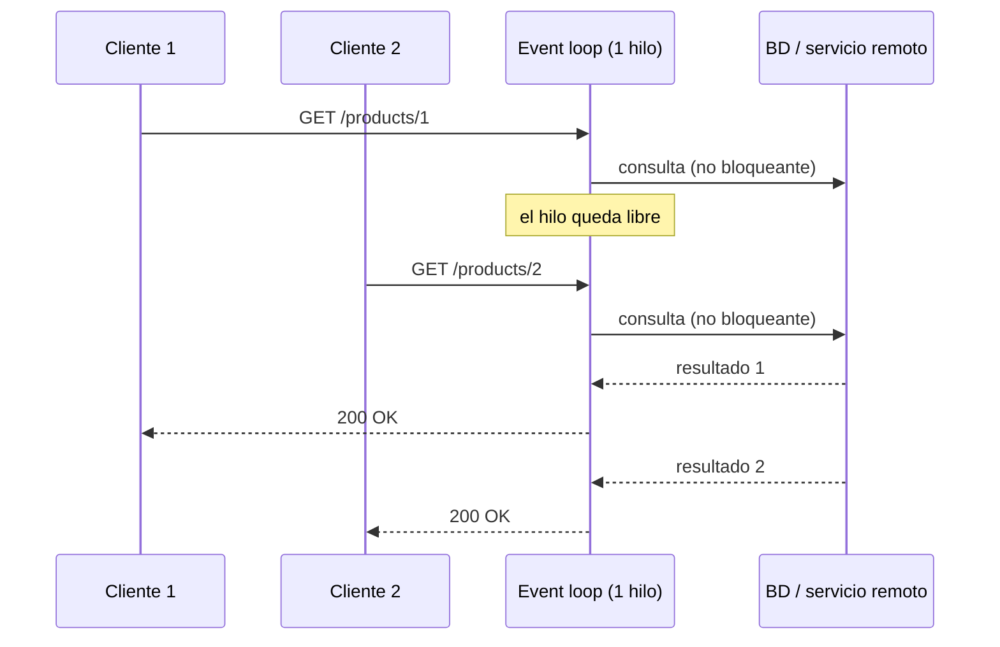

# 1. Spring WebFlux: visión general

> Temario: **Spring WebFlux: visión general** · Duración: 50 min
> Referencia oficial: [Spring WebFlux — Overview](https://docs.spring.io/spring-framework/reference/web/webflux/new-framework.html)

## 1.1 ¿Qué es Spring WebFlux?

Spring WebFlux es el **framework web reactivo** de Spring Framework (módulo `spring-webflux`), disponible
desde Spring 5 y que convive con Spring MVC (`spring-webmvc`). Sus características:

- **No bloqueante de extremo a extremo**: ningún hilo se queda esperando por E/S (red, disco, base de datos).
- **Basado en Reactive Streams** con *backpressure*: el consumidor controla el ritmo del productor.
- Usa **Project Reactor** (`Mono`, `Flux`) como biblioteca reactiva, pero es interoperable con otras
  (RxJava, corrutinas de Kotlin…).
- Ofrece **dos modelos de programación**: controladores anotados (como MVC) y *functional endpoints*.
- Se ejecuta sobre **Reactor Netty** (por defecto), Tomcat, Jetty o cualquier contenedor Servlet 6.1+
  (a través de su API de E/S no bloqueante).

## 1.2 ¿Por qué se creó?

La documentación oficial da dos motivos:

1. **Concurrencia con pocos hilos.** Una pila web no bloqueante puede atender muchas conexiones con un
   número pequeño y fijo de hilos, y escalar con menos recursos hardware. La API Servlet clásica es síncrona
   (`Filter`, `Servlet`) o bloqueante (`getParameter`, `getPart`), así que hacía falta una API nueva.
2. **Programación funcional.** Las lambdas de Java 8 permiten APIs declarativas para componer lógica
   asíncrona (al estilo `CompletableFuture` o ReactiveX), y también las *functional endpoints*.

## 1.3 Modelo bloqueante vs. no bloqueante

### Thread-per-request (Spring MVC sobre Tomcat clásico)

Cada petición ocupa **un hilo** durante toda su vida. Si la petición espera 200 ms a una base de datos,
el hilo queda bloqueado esos 200 ms sin hacer nada útil.

```text
Petición 1 ──► [hilo-1] ── consulta BD ····· espera ····· ── respuesta
Petición 2 ──► [hilo-2] ── llamada HTTP ···· espera ····· ── respuesta
Petición N ──► [hilo-N]   (pool de ~200 hilos; si se agota, las peticiones hacen cola)
```

### Event loop (WebFlux sobre Netty)

Unos pocos hilos (en Reactor Netty, por defecto **uno por núcleo de CPU, mínimo 4**, llamados `reactor-http-nio-*`) atienden
**todas** las conexiones. Cuando una operación de E/S se inicia, el hilo **no espera**: registra qué hacer
cuando llegue el resultado (un *callback*) y pasa a atender otro evento.



**Consecuencia crítica:** como hay muy pocos hilos, **bloquear uno de ellos es gravísimo**. Un
`Thread.sleep`, una llamada JDBC o un `block()` dentro del *event loop* deja sin atender a todas las
conexiones que dependen de ese hilo.

> 🔬 **Demostración en el ejemplo** (`examples/day-01`, clase `demo/ThreadingDemoController`):
>
> | Endpoint | Qué hace | Qué observar |
> |---|---|---|
> | `GET /api/demo/non-blocking?ms=2000` | `Mono.delay` | responde en otro hilo (`parallel-*`); el hilo de la petición quedó libre |
> | `GET /api/demo/blocking?ms=2000` | `Thread.sleep` en el event loop (**antipatrón**) | con muchas peticiones concurrentes el servidor deja de responder |
> | `GET /api/demo/offloaded?ms=2000` | bloqueo aislado con `subscribeOn(boundedElastic())` | el trabajo bloqueante se ejecuta en `boundedElastic-*` |
>
> Con [hey](https://github.com/rakyll/hey): `hey -n 100 -c 50 "http://localhost:8080/api/demo/blocking?ms=1000"`
> y comparar con `/non-blocking`.

## 1.4 ¿Qué significa "reactivo"?

Según la documentación de Spring, "reactivo" se refiere a modelos de programación **construidos para
reaccionar a cambios**: componentes de red que reaccionan a eventos de E/S, interfaces que reaccionan a
eventos del ratón, etc. En ese sentido, *no bloqueante* es reactivo: en vez de esperar, se reacciona a
notificaciones cuando hay datos o una operación termina.

El segundo pilar es la **backpressure no bloqueante**. En código imperativo, una llamada bloqueante frena
de forma natural al que llama. En código no bloqueante hay que controlar explícitamente el ritmo, para
que un productor rápido no desborde a un consumidor lento. De eso se encarga
[Reactive Streams](https://www.reactive-streams.org/) (lo vemos en el bloque 2).

> El [Manifiesto Reactivo](https://www.reactivemanifesto.org/es) describe los *sistemas* reactivos
> (responsivos, resilientes, elásticos, orientados a mensajes). La programación reactiva es una de las
> técnicas para construirlos, pero no son lo mismo.

## 1.5 Arquitectura: qué comparten y qué no MVC y WebFlux

```text
┌──────────────────────────────┐     ┌──────────────────────────────┐
│         Spring MVC           │     │        Spring WebFlux        │
│  @Controller, RestClient,    │     │  @Controller, WebClient,     │
│  RouterFunction (MVC.fn)     │     │  RouterFunction (WebFlux.fn) │
├──────────────────────────────┤     ├──────────────────────────────┤
│  DispatcherServlet           │     │  DispatcherHandler           │
├──────────────────────────────┤     ├──────────────────────────────┤
│  Servlet API (bloqueante)    │     │  HttpHandler / WebHandler    │
│  Tomcat, Jetty               │     │  (spring-web, no bloqueante) │
│                              │     │  Netty, Tomcat, Jetty        │
└──────────────────────────────┘     └──────────────────────────────┘
        Comunes: anotaciones @RequestMapping, @PathVariable, @RequestBody…,
        codecs/conversores HTTP, validación, WebClient (usable desde MVC)
```

Ambos comparten las **anotaciones** de `spring-web`, por lo que un controlador WebFlux se parece mucho a
uno MVC. La diferencia visible: en WebFlux los métodos devuelven `Mono`/`Flux` y pueden recibir el cuerpo
como `Mono<T>`/`Flux<T>` (`@RequestBody` reactivo).

## 1.6 Servidores soportados

| Servidor | Cómo se integra | Notas |
|---|---|---|
| **Reactor Netty** | API nativa de Netty | Por defecto en `spring-boot-starter-webflux`. |
| Tomcat | API Servlet de E/S no bloqueante | Excluir `spring-boot-starter-reactor-netty` y añadir el de Tomcat. |
| Jetty | API Servlet de E/S no bloqueante | Ídem con el starter de Jetty. |

WebFlux **no usa** la API Servlet de forma bloqueante: incluso sobre Tomcat usa sus adaptadores no
bloqueantes a través de `HttpHandler`.

## 1.7 ¿MVC o WebFlux? Criterios de decisión

La documentación oficial insiste en que **no es una dicotomía**: ambos conviven y se complementan.

| Situación | Recomendación |
|---|---|
| Aplicación Spring MVC que funciona bien | **No migrar.** El código imperativo es más fácil de escribir, entender y depurar. |
| Dependencias bloqueantes (JPA, JDBC, SDKs síncronos) | Spring MVC (o MVC + hilos virtuales, Java 21+). |
| Muchas conexiones concurrentes con E/S lenta (gateways, agregadores de APIs, *streaming*) | **WebFlux.** |
| *Streaming* de datos al cliente (SSE, NDJSON, WebSockets) con gran concurrencia | **WebFlux.** |
| Microservicio ligero con estilo funcional | WebFlux con *functional endpoints*. |
| Equipo sin experiencia reactiva y plazos ajustados | MVC; la curva de aprendizaje de lo reactivo es real. |
| Solo necesitas un cliente HTTP no bloqueante | MVC + `WebClient` (se puede usar desde MVC). |

> **¿Y los hilos virtuales (Java 21, Project Loom)?** Permiten escribir código bloqueante que escala
> mucho mejor en Spring MVC (`spring.threads.virtual.enabled=true`,
> [doc de Spring Boot](https://docs.spring.io/spring-boot/reference/features/spring-application.html#features.spring-application.virtual-threads)).
> Reducen la necesidad de WebFlux para *escalar con E/S bloqueante*, pero no aportan *backpressure*,
> composición declarativa de flujos asíncronos ni *streaming*, que siguen siendo el terreno de WebFlux.
> El curso usa Java 17, así que no los usaremos en los ejemplos.

## 1.8 Rendimiento: expectativas realistas

La documentación oficial lo deja claro: **reactivo no significa "más rápido"**. Una petición concreta
no se resuelve antes (incluso puede haber algo más de sobrecarga). La ventaja es **escalar con un número
pequeño y fijo de hilos y menos memoria**, y comportarse de forma más predecible bajo carga, sobre todo
cuando hay latencia en la red.

## 1.9 Modelo de concurrencia: resumen

- **Spring MVC**: se asume que el código puede bloquear; el contenedor usa un pool grande de hilos.
- **WebFlux**: se asume que el código **no bloquea**; Netty usa un número pequeño de hilos de *event loop*.
- Para invocar APIs bloqueantes desde WebFlux: `publishOn`/`subscribeOn` con `Schedulers.boundedElastic()`.
- **Estado mutable**: en Reactor rara vez se necesita `synchronized`; los operadores se ejecutan de forma
  secuencial para cada flujo (aunque puedan cambiar de hilo). Evita estado compartido mutable entre flujos.
- Hilos que verás en los logs: `reactor-http-nio-*` (event loop de Netty), `parallel-*` (CPU, `Mono.delay`,
  `interval`), `boundedElastic-*` (trabajo bloqueante aislado).

## 1.10 Primer contacto: arranque de la aplicación

```bash
cd examples/day-01
./mvnw spring-boot:run
```

En el log verás `Netty started on port 8080`. Solo con añadir `spring-boot-starter-webflux`, Spring Boot:

1. Arranca Reactor Netty.
2. Configura WebFlux (equivalente a `@EnableWebFlux` + personalizaciones de Boot).
3. Registra el `DispatcherHandler` con el nombre de bean `webHandler`.
4. Configura los codecs (Jackson para JSON), la validación y el manejo de errores.

> ⚠️ Si en el classpath están **a la vez** `spring-boot-starter-web` y `spring-boot-starter-webflux`,
> Spring Boot arranca **Spring MVC** (y `WebClient` queda disponible). Se puede forzar con
> `spring.main.web-application-type=reactive`.
> Ref: [Spring Boot — Reactive Web Applications](https://docs.spring.io/spring-boot/reference/web/reactive.html)

## Referencias para ampliar

- Spring Framework — Overview (por qué WebFlux, aplicabilidad, servidores, rendimiento, concurrencia):
  <https://docs.spring.io/spring-framework/reference/web/webflux/new-framework.html>
- Spring Framework — Web on Reactive Stack (índice): <https://docs.spring.io/spring-framework/reference/web-reactive.html>
- Spring Boot — Reactive Web Applications: <https://docs.spring.io/spring-boot/reference/web/reactive.html>
- Reactor Netty — Reference Guide: <https://projectreactor.io/docs/netty/release/reference/>
- Netty: <https://netty.io/>
- Manifiesto Reactivo (en español): <https://www.reactivemanifesto.org/es>
- Guía oficial "Building a Reactive RESTful Web Service": <https://spring.io/guides/gs/reactive-rest-service>
- Spring MVC — Asynchronous Requests (comparativa de modelos de concurrencia MVC vs WebFlux):
  <https://docs.spring.io/spring-framework/reference/web/webmvc/mvc-ann-async.html>

➡️ Siguiente: [2. Bibliotecas reactivas](02-bibliotecas-reactivas.md)
