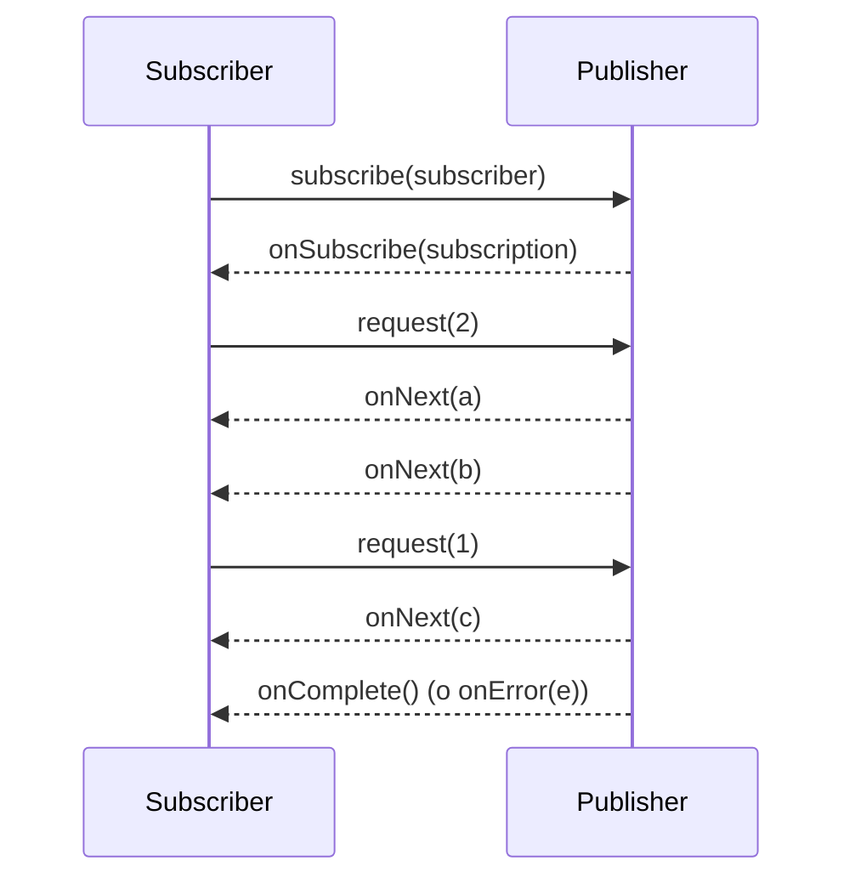

# 2. Bibliotecas reactivas (I): Reactive Streams y Project Reactor

> Temario: **Bibliotecas reactivas** · Duración: 60 min
> Referencias oficiales: [Spring — Reactive Libraries](https://docs.spring.io/spring-framework/reference/web/webflux-reactive-libraries.html) ·
> [Reactor Reference Guide](https://projectreactor.io/docs/core/release/reference/)
>
> Código: `examples/day-01/src/test/java/com/curso/webflux/day01/reactor/` (tests `A_` a `F_`, ejecutables uno a uno)

Este tema se adelanta al día 1 porque **todo WebFlux se expresa con `Mono` y `Flux`**. El día 4 se
retoma para interoperabilidad avanzada (RxJava, Kotlin, R2DBC).

## 2.1 Reactive Streams: el contrato

[Reactive Streams](https://www.reactive-streams.org/) es una especificación pequeña (4 interfaces, desde
Java 9 también en [`java.util.concurrent.Flow`](https://docs.oracle.com/en/java/javase/17/docs/api/java.base/java/util/concurrent/Flow.html))
que define cómo intercambian datos componentes asíncronos **con backpressure no bloqueante**.

```java
public interface Publisher<T> {
    void subscribe(Subscriber<? super T> s);
}
public interface Subscriber<T> {
    void onSubscribe(Subscription s);
    void onNext(T t);
    void onError(Throwable t);
    void onComplete();
}
public interface Subscription {
    void request(long n);   // <- backpressure: "envíame hasta n elementos más"
    void cancel();
}
public interface Processor<T, R> extends Subscriber<T>, Publisher<R> { }
```



Reglas clave de la especificación:

- Señales en orden: `onSubscribe` → `onNext`\* → (`onComplete` | `onError`). **Nunca ambas**.
- El `Publisher` **no puede emitir más elementos de los pedidos** con `request(n)`.
- Las señales se emiten **en serie** (nunca dos `onNext` a la vez para el mismo suscriptor).
- `null` no está permitido como elemento.

> **¿Y si el productor no puede frenar?** (p. ej., ticks de reloj o eventos de un sensor). Reactive Streams
> solo define el mecanismo; el productor debe decidir si **almacena (buffer)**, **descarta (drop)** o
> **falla (error)**. En Reactor: `onBackpressureBuffer`, `onBackpressureDrop`, `onBackpressureLatest`,
> `onBackpressureError`.

Reactive Streams es útil para **interoperar** entre bibliotecas, pero es demasiado bajo nivel para una
aplicación. Para eso están las bibliotecas reactivas: **Reactor**, RxJava, Mutiny…

## 2.2 Project Reactor: `Mono` y `Flux`

[Reactor](https://projectreactor.io/) es la biblioteca elegida por Spring WebFlux (desarrollada en
colaboración con el equipo de Spring). Aporta dos tipos que implementan `Publisher`:

| Tipo | Cardinalidad | Equivalente imperativo | Ejemplos en WebFlux |
|---|---|---|---|
| `Mono<T>` | 0 o 1 elemento | `Optional<T>` / `CompletableFuture<T>` | `findById`, `save`, `Mono<Void>` (solo "terminado") |
| `Flux<T>` | 0 a N elementos (puede ser infinito) | `List<T>` / `Stream<T>` | `findAll`, eventos SSE, líneas NDJSON |

### Regla n.º 1: *nothing happens until you subscribe*

Declarar un `Flux` **no ejecuta nada**: se construye una "receta" (un *pipeline* de operadores). El trabajo
empieza cuando alguien se suscribe. En WebFlux **quien se suscribe es el framework** al escribir la
respuesta HTTP; tu código **devuelve** el `Mono`/`Flux`, nunca llama a `subscribe()` ni a `block()`.

```java
Mono<Integer> mono = Mono.fromSupplier(calls::incrementAndGet);
// calls == 0: aún no se ha ejecutado nada
mono.subscribe();   // calls == 1
mono.subscribe();   // calls == 2  (publisher "frío": se re-ejecuta por suscriptor)
```

📄 `A_MonoFluxBasicsTest.nothingHappensUntilYouSubscribe`

### Creación

| Método | Uso |
|---|---|
| `Mono.just(v)` / `Flux.just(a, b, c)` | Valores ya conocidos (**evaluación inmediata**) |
| `Mono.empty()` / `Mono.error(e)` | Vacío / error |
| `Mono.justOrEmpty(nullable)` | De un valor posiblemente `null` |
| `Mono.fromSupplier(...)` / `Mono.fromCallable(...)` | Evaluación **perezosa**; `fromCallable` admite excepciones comprobadas |
| `Mono.defer(() -> ...)` / `Flux.defer(...)` | Construir el publisher en el momento de la suscripción |
| `Flux.fromIterable(list)` / `Flux.range(1, 10)` | Colecciones y rangos |
| `Flux.interval(Duration)` | Secuencia infinita temporizada (usa el scheduler `parallel`) |
| `Flux.generate(...)` / `Flux.create(...)` / `Sinks` | Emisión programática |
| `Mono.fromFuture(cf)` | Desde `CompletableFuture` |

> ⚠️ `Mono.just(llamadaCara())` ejecuta `llamadaCara()` **al construir**, no al suscribirse.
> Usa `Mono.fromCallable(() -> llamadaCara())` o `Mono.defer(...)`. 📄 `A_MonoFluxBasicsTest.justIsEagerDeferIsLazy`

### Probar con `StepVerifier`

`StepVerifier` (módulo `reactor-test`) se suscribe al publisher y verifica, paso a paso, las señales:

```java
StepVerifier.create(Flux.range(1, 5))
        .expectNext(1, 2)
        .expectNextCount(2)
        .expectNext(5)
        .verifyComplete();   // verify* dispara la suscripción; sin él, el test no comprueba nada
```

Referencia: [Reactor — Testing](https://projectreactor.io/docs/core/release/reference/testing.html)

## 2.3 Operadores esenciales

Los operadores devuelven **un publisher nuevo** (son inmutables): hay que encadenarlos o reasignar.

| Operador | Qué hace | Cuándo |
|---|---|---|
| `map(f)` | Transformación **síncrona** 1→1 | Convertir entidad a DTO |
| `filter(p)` | Deja pasar los que cumplen | Filtrar por categoría |
| `flatMap(f)` | Cada elemento → `Publisher`; se suscribe **concurrentemente**; **no conserva orden** | Llamada asíncrona por elemento (BD, HTTP) |
| `concatMap(f)` | Igual pero **de uno en uno**; conserva orden | Cuando el orden importa o hay que serializar |
| `flatMapSequential(f)` | Concurrente pero reordena a la salida | Rendimiento + orden |
| `switchIfEmpty(pub)` / `defaultIfEmpty(v)` | Alternativa si no hay elementos | `findById` → 404 |
| `zip(a, b)` / `zipWith` | Combina elementos por pares; espera a todos | Agregar varias llamadas en paralelo |
| `merge` / `concat` | Une flujos intercalando / en secuencia | Varias fuentes |
| `take(n)`, `skip(n)`, `distinct()` | Recortar | Paginación simple, flujos infinitos |
| `collectList()`, `reduce`, `count()` | `Flux` → `Mono` | Totales, agregados |
| `doOnNext`, `doOnError`, `doFinally`, `log()` | **Efectos secundarios** (logs, métricas) sin alterar el flujo | Depuración |
| `then()` / `thenReturn(v)` | Ignora los elementos y encadena al terminar | Tras un `delete` |

```java
// Del ejemplo: ProductService.update
return findById(id)                                         // Mono<Product> (o error 404)
        .flatMap(existing -> repository.save(request.toProduct(existing.id())));  // Mono<Product>
```

> **`map` vs `flatMap`**: si la función devuelve un valor → `map`. Si devuelve un `Mono`/`Flux` → `flatMap`
> (con `map` obtendrías un `Mono<Mono<T>>`).

📄 `B_OperatorsTest` (compara `flatMap`, `concatMap` y `flatMapSequential` con latencias distintas).

¿No sabes qué operador usar? → [Which operator do I need?](https://projectreactor.io/docs/core/release/reference/apdx-operatorChoice.html)
Los *diagramas de canicas* de cada operador están en el [Javadoc de Reactor](https://projectreactor.io/docs/core/release/api/).

## 2.4 Gestión de errores

En Reactor un error es una **señal terminal** (`onError`). Tras un error, la secuencia **termina**.
Un `try/catch` alrededor de la declaración del flujo **no captura nada** (aún no se ha ejecutado).

| Operador | Equivalente imperativo |
|---|---|
| `onErrorReturn(valor)` | `catch` → devolver valor por defecto |
| `onErrorResume(e -> otroPublisher)` | `catch` → ruta alternativa (caché, *fallback*) |
| `onErrorMap(e -> nuevaExcepcion)` | `catch` → relanzar envuelta |
| `doOnError(e -> log...)` | `catch` → log y relanzar |
| `doFinally(signal -> ...)` | `finally` |
| `retry(n)` / `retryWhen(Retry.backoff(...))` | Reintentar (se **re-suscribe** al origen) |
| `timeout(Duration)` | Error `TimeoutException` si no llega nada a tiempo |

```java
Mono<String> primary = Mono.error(new IllegalStateException("servicio caído"));
primary.onErrorResume(IllegalStateException.class, e -> Mono.just("respuesta de caché"));
```

📄 `C_ErrorHandlingTest` · Ref: [Reactor — Handling Errors](https://projectreactor.io/docs/core/release/reference/coreFeatures/error-handling.html)

## 2.5 Backpressure en la práctica

```java
Flux.range(1, 100).subscribe(new BaseSubscriber<Integer>() {
    protected void hookOnSubscribe(Subscription s) { request(2); }   // pido 2
    protected void hookOnNext(Integer v) { if (v == 2) cancel(); }    // y cancelo
});
```

Con `.log()` verás en consola las señales reales: `onSubscribe`, `request(2)`, `onNext(1)`, `onNext(2)`,
`cancel()`. Otras herramientas:

- `limitRate(n)`: el operador pide al origen en lotes de `n`.
- `onBackpressureDrop()` / `Buffer()` / `Latest()`: estrategias cuando el origen no puede frenar.
- En WebFlux la *backpressure* llega hasta la red: si el cliente HTTP lee despacio, Netty deja de pedir
  datos al `Flux` de la respuesta.

📄 `D_BackpressureAndSchedulersTest`

## 2.6 Schedulers: ¿en qué hilo se ejecuta mi código?

Reactor es **agnóstico de la concurrencia**: por defecto, el código se ejecuta en el hilo que emite la
señal (en WebFlux, normalmente un hilo del *event loop*). Se cambia con:

| Operador | Efecto |
|---|---|
| `publishOn(scheduler)` | Los operadores **posteriores** se ejecutan en ese scheduler |
| `subscribeOn(scheduler)` | La **suscripción al origen** (y la emisión) ocurre en ese scheduler, **da igual dónde se coloque** |

| Scheduler | Uso |
|---|---|
| `Schedulers.parallel()` | Trabajo de CPU no bloqueante (nº hilos = nº núcleos) |
| `Schedulers.boundedElastic()` | **Aislar trabajo bloqueante** (JDBC, ficheros, SDKs síncronos) |
| `Schedulers.single()` | Un único hilo reutilizable |
| `Schedulers.immediate()` | Hilo actual |

```java
// Patrón para envolver una llamada bloqueante inevitable
Mono.fromCallable(() -> legacyJdbcDao.findById(id))
    .subscribeOn(Schedulers.boundedElastic());
```

> 🛠️ [BlockHound](https://github.com/reactor/BlockHound) detecta llamadas bloqueantes en hilos no
> bloqueantes y lanza una excepción. Lo usaremos en el día 4 (pruebas).

📄 `D_BackpressureAndSchedulersTest.publishOnSwitchesThreadForDownstream` y `subscribeOnAffectsTheSourceWherever`
· Ref: [Reactor — Threading and Schedulers](https://projectreactor.io/docs/core/release/reference/coreFeatures/schedulers.html)

## 2.7 Publishers fríos y calientes

- **Frío** (*cold*): genera los datos **por cada suscriptor**, desde el principio. La mayoría: `Flux.range`,
  `fromIterable`, una consulta a BD, una petición `WebClient`.
- **Caliente** (*hot*): emite independientemente de los suscriptores; quien llega tarde se pierde lo
  anterior. Ejemplos: `Sinks.many().multicast()`, `share()`, eventos de un socket.

Los `Sinks` son la forma recomendada de **emitir manualmente** hacia un `Flux` (útil para notificaciones,
SSE o WebSockets, que veremos el día 4).

📄 `E_HotColdVirtualTimeTest` · Ref: [Reactor — Hot vs Cold](https://projectreactor.io/docs/core/release/reference/advancedFeatures/reactor-hotCold.html)

### Tiempo virtual

`StepVerifier.withVirtualTime(...)` permite probar flujos basados en tiempo (`interval`, `delay`) sin
esperar realmente: una hora de *ticks* se verifica en milisegundos.

## 2.8 Otras bibliotecas: `ReactiveAdapterRegistry`

WebFlux requiere Reactor, pero **acepta otras bibliotecas reactivas**. Como regla general, las APIs de
WebFlux aceptan un `Publisher` cualquiera como entrada, lo adaptan internamente a Reactor y devuelven
`Mono`/`Flux`. En los controladores anotados, la adaptación es transparente gracias a
`ReactiveAdapterRegistry`: puedes devolver `CompletableFuture`, tipos de RxJava 3 (`Single`, `Flowable`…),
SmallRye Mutiny o usar corrutinas de Kotlin.

```java
ReactiveAdapter adapter = ReactiveAdapterRegistry.getSharedInstance().getAdapter(CompletableFuture.class);
Publisher<Object> publisher = adapter.toPublisher(CompletableFuture.completedFuture("hola"));
```

📄 `F_ReactiveAdaptersTest` (incluye la interoperabilidad con `java.util.concurrent.Flow` mediante `JdkFlowAdapter`).

## Ejercicios (en el laboratorio)

Ver [06-laboratorio.md — Parte A](06-laboratorio.md#parte-a--reactor-20-min).

## Referencias para ampliar

- Spring — Reactive Libraries: <https://docs.spring.io/spring-framework/reference/web/webflux-reactive-libraries.html>
- Reactive Streams — especificación y reglas: <https://github.com/reactive-streams/reactive-streams-jvm/blob/master/README.md>
- `java.util.concurrent.Flow` (Java 17): <https://docs.oracle.com/en/java/javase/17/docs/api/java.base/java/util/concurrent/Flow.html>
- Reactor — Introduction to Reactive Programming: <https://projectreactor.io/docs/core/release/reference/reactiveProgramming.html>
- Reactor — `Flux`: <https://projectreactor.io/docs/core/release/reference/coreFeatures/flux.html> ·
  `Mono`: <https://projectreactor.io/docs/core/release/reference/coreFeatures/mono.html>
- Reactor — Creating sequences programmatically (`generate`, `create`, `Sinks`):
  <https://projectreactor.io/docs/core/release/reference/coreFeatures/programmatically-creating-sequence.html>
- Reactor — Debugging: <https://projectreactor.io/docs/core/release/reference/debugging.html>
- Reactor — Context: <https://projectreactor.io/docs/core/release/reference/advancedFeatures/context.html>
- Reactor — Learn (recursos oficiales): <https://projectreactor.io/learn>
- Ejercicios Lite Rx API Hands-on: <https://github.com/reactor/lite-rx-api-hands-on>
- BlockHound: <https://github.com/reactor/BlockHound>

➡️ Siguiente: [3. Núcleo reactivo](03-nucleo-reactivo.md)
