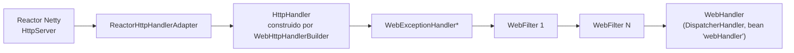

# 3. Núcleo reactivo (Reactive Core)

> Temario: **Núcleo reactivo** · Duración: 45 min
> Referencia oficial: [Spring WebFlux — Reactive Core](https://docs.spring.io/spring-framework/reference/web/webflux/reactive-spring.html)
>
> Código: `core/RawHttpHandlerServer.java`, `core/TimingWebFilter.java`

El módulo `spring-web` contiene la base reactiva sobre la que se construye WebFlux. En el servidor hay
**dos niveles**:

| Nivel | Contrato | Propósito |
|---|---|---|
| Bajo | `HttpHandler` | Abstracción mínima sobre distintos servidores HTTP (Netty, Tomcat, Jetty…) |
| Medio | **WebHandler API** (`WebHandler`, `WebFilter`, `WebExceptionHandler`, `ServerWebExchange`) | API web de propósito general: sesión, atributos, formularios, multipart, `Principal`, `Locale`… |
| Alto | `DispatcherHandler` + controladores anotados / *functional endpoints* | Modelos de programación (bloques 4 y 5) |

Y, tanto para cliente como servidor, los **codecs** para (de)serializar el cuerpo de las peticiones.



## 3.1 `HttpHandler`

Contrato con un único método. Su **único objetivo** es abstraer las diferentes APIs de servidor:

```java
public interface HttpHandler {
    Mono<Void> handle(ServerHttpRequest request, ServerHttpResponse response);
}
```

`Mono<Void>` significa "avísame cuando hayas terminado de escribir la respuesta (o si falla)".

| Servidor | API usada | Adaptador de Spring |
|---|---|---|
| Netty | API de Netty (vía Reactor Netty) | `ReactorHttpHandlerAdapter` |
| Tomcat | E/S no bloqueante de Servlet + API de Tomcat | `TomcatHttpHandlerAdapter` |
| Jetty | API *core* de Jetty 12 | `JettyCoreHttpHandlerAdapter` |
| Contenedor Servlet (WAR) | E/S no bloqueante de Servlet | `ServletHttpHandlerAdapter` (vía `AbstractReactiveWebInitializer`) |

Ejemplo con Reactor Netty **sin Spring Boot** (así arranca Boot el servidor por debajo):

```java
HttpHandler rawHandler = (request, response) -> {
    response.getHeaders().setContentType(MediaType.TEXT_PLAIN);
    DataBuffer buffer = response.bufferFactory().wrap("Hola".getBytes(StandardCharsets.UTF_8));
    return response.writeWith(Mono.just(buffer));   // el cuerpo es un Publisher<DataBuffer>
};
HttpServer.create().host("localhost").port(8081)
          .handle(new ReactorHttpHandlerAdapter(rawHandler))
          .bindNow();
```

> 🔬 **Demo**: ejecuta `core/RawHttpHandlerServer` (botón *Run* del IDE o
> `mvnw compile exec:java -Dexec.mainClass=com.curso.webflux.day01.core.RawHttpHandlerServer`) y prueba
> `curl -i http://localhost:8081/hola`. Observa el hilo `reactor-http-nio-*` en la respuesta.

### `DataBuffer`

Los cuerpos viajan como `Publisher<DataBuffer>`. `DataBuffer` abstrae los distintos buffers de bytes
(`ByteBuf` de Netty, `java.nio.ByteBuffer`…). Normalmente **no se manipulan a mano**: de eso se encargan los
codecs. Si lo haces, cuidado con liberar los buffers (*pooled*) para evitar fugas de memoria.
Ref: [Data Buffers and Codecs](https://docs.spring.io/spring-framework/reference/core/databuffer-codec.html).

## 3.2 WebHandler API

Paquete `org.springframework.web.server`. Construye sobre `HttpHandler` una cadena de procesamiento:
**N `WebExceptionHandler` → N `WebFilter` → 1 `WebHandler`**. `WebHttpHandlerBuilder` la monta, bien
registrando componentes a mano, bien detectándolos en un `ApplicationContext` (lo que hace Spring Boot).

### `ServerWebExchange`

Es el "contexto" de una petición HTTP (equivalente a `HttpServletRequest` + `HttpServletResponse` + extras):

| Método | Devuelve |
|---|---|
| `getRequest()` / `getResponse()` | `ServerHttpRequest` / `ServerHttpResponse` |
| `getAttributes()` | Atributos de la petición (mapa mutable) |
| `getSession()` | `Mono<WebSession>` |
| `getPrincipal()` | `Mono<Principal>` (usuario autenticado; día 3) |
| `getFormData()` | `Mono<MultiValueMap<String, String>>` (`application/x-www-form-urlencoded`) |
| `getMultipartData()` | `Mono<MultiValueMap<String, Part>>` |
| `getLogPrefix()` | Identificador de la petición para correlacionar logs (`[b78eceb2-6]`) |
| `mutate()` | Crear una copia modificada (p. ej., añadir cabeceras a la petición en un filtro) |

Fíjate en que todo lo que puede requerir E/S (**sesión, formulario, principal**) devuelve `Mono`.

### Beans especiales que detecta `WebHttpHandlerBuilder`

| Nombre del bean | Tipo | Cuántos | Descripción |
|---|---|---|---|
| *(cualquiera)* | `WebExceptionHandler` | 0..N | Gestiona excepciones de los filtros y del `WebHandler` |
| *(cualquiera)* | `WebFilter` | 0..N | Lógica de interceptación antes/después del resto de la cadena |
| `webHandler` | `WebHandler` | **1** | El manejador de la petición (en WebFlux, el `DispatcherHandler`) |
| `webSessionManager` | `WebSessionManager` | 0..1 | Gestión de `WebSession` (por defecto `DefaultWebSessionManager`) |
| `serverCodecConfigurer` | `ServerCodecConfigurer` | 0..1 | Lectores para formularios y multipart |
| `localeContextResolver` | `LocaleContextResolver` | 0..1 | Resolución del `Locale` (por defecto por cabecera `Accept-Language`) |
| `forwardedHeaderTransformer` | `ForwardedHeaderTransformer` | 0..1 | Procesa cabeceras `Forwarded`/`X-Forwarded-*` (detrás de un proxy) |

Ejemplo de montaje manual (en `RawHttpHandlerServer`, puerto 8082):

```java
WebHandler webHandler = exchange -> { /* escribir respuesta */ };
WebFilter poweredBy = (exchange, chain) -> {
    exchange.getResponse().getHeaders().add("X-Powered-By", "WebHandler API");
    return chain.filter(exchange);
};
HttpHandler httpHandler = WebHttpHandlerBuilder.webHandler(webHandler).filter(poweredBy).build();
```

Spring Boot hace lo mismo con `WebHttpHandlerBuilder.applicationContext(context).build()`.

## 3.3 `WebFilter`

Intercepta **todas** las peticiones (controladores anotados, *functional endpoints*, recursos estáticos),
antes de que lleguen al `DispatcherHandler`. Con Spring Boot basta con declararlo como bean; el orden se
indica con `@Order` o implementando `Ordered`.

```java
@Component
@Order(Ordered.HIGHEST_PRECEDENCE)
public class TimingWebFilter implements WebFilter {
    public Mono<Void> filter(ServerWebExchange exchange, WebFilterChain chain) {
        long start = System.nanoTime();
        exchange.getResponse().beforeCommit(() -> {          // antes de enviar cabeceras
            exchange.getResponse().getHeaders().add("X-Response-Time", ...);
            return Mono.empty();
        });
        return chain.filter(exchange)                         // "continuar la cadena" también es asíncrono
                .doFinally(signal -> log.debug(...));         // después: cuando la respuesta termina
    }
}
```

Puntos importantes:

- `chain.filter(exchange)` devuelve un `Mono<Void>`: el código "posterior" se encadena con operadores
  (`doFinally`, `then`…), **no** se escribe después de la llamada como en un `Filter` de Servlet.
- Las cabeceras de respuesta deben modificarse **antes del *commit***: usa `beforeCommit`.
- Usos típicos: logging, métricas, cabeceras de seguridad, correlación de trazas, autenticación
  (Spring Security reactivo es una cadena de `WebFilter`, día 3), CORS (`CorsWebFilter`, día 2).
- Spring ofrece además `UrlHandlerFilter` para tratar la barra final de las URLs (`/home/` vs `/home`).

## 3.4 `WebExceptionHandler`

Gestiona excepciones que escapan de los filtros y del `WebHandler`. Implementaciones incluidas:

| Manejador | Qué hace |
|---|---|
| `ResponseStatusExceptionHandler` | Traduce `ResponseStatusException` a su código HTTP |
| `WebFluxResponseStatusExceptionHandler` | Además, tiene en cuenta `@ResponseStatus` en la clase de la excepción |
| `DefaultErrorWebExceptionHandler` (Spring Boot) | Genera el JSON de error por defecto (`timestamp`, `path`, `status`, `error`, `requestId`) |

En el ejemplo, `ProductNotFoundException` lleva `@ResponseStatus(NOT_FOUND)` → 404. El día 2 veremos el
manejo de errores a nivel de controlador (`@ExceptionHandler`, `@ControllerAdvice`, `ProblemDetail`).

## 3.5 Codecs

Los codecs (de)serializan el contenido **sin bloquear y respetando backpressure**:

| Contrato | Nivel |
|---|---|
| `Encoder` / `Decoder` (spring-core) | Bajo nivel, independiente de HTTP |
| `HttpMessageWriter` / `HttpMessageReader` (spring-web) | Codifican/decodifican mensajes HTTP (usan cabeceras, *media types*) |

Incluidos: `byte[]`, `ByteBuffer`, `DataBuffer`, `Resource`, `String`, **Jackson JSON** y Smile, JAXB2,
Protocol Buffers, formularios, multipart y **Server-Sent Events**. Se configuran con
`ServerCodecConfigurer` / `ClientCodecConfigurer` (día 2, Configuración de WebFlux).

### Jackson y *streaming*

> ℹ️ Spring Boot 4 / Spring Framework 7 usan **Jackson 3** (paquete `tools.jackson`) con
> `JacksonJsonEncoder` / `JacksonJsonDecoder`.

Cómo se escribe un `Flux` según el *media type* pedido:

| `Accept` | Comportamiento del encoder | Uso |
|---|---|---|
| `application/json` | `collectToList()` y serializa **un array** al final | APIs REST clásicas |
| `application/x-ndjson` | Escribe y **hace *flush* de cada elemento** según llega (un JSON por línea) | *Streaming* entre servicios |
| `text/event-stream` | Cada elemento se envía como evento SSE (`data:...`) | *Streaming* al navegador (`EventSource`) |

Para decodificar (`@RequestBody Flux<T>`), Jackson usa su parser **asíncrono**: agrupa los bytes en
`TokenBuffer` y crea cada objeto en cuanto tiene uno completo. Acepta arrays JSON y formatos
delimitados por línea (NDJSON, JSON Lines).

### Límites de memoria

Los codecs que necesitan agregar el cuerpo en memoria tienen un límite, **256 KB por defecto**
(`maxInMemorySize`). Si se supera → `DataBufferLimitException`. En Boot:
`spring.http.codecs.max-in-memory-size=1MB` (en Boot 3 era `spring.codec.max-in-memory-size`). Para cuerpos grandes, mejor *streaming* (`Flux<DataBuffer>`,
`Flux<PartEvent>`).

## 3.6 Logging

- Cada petición tiene un **ID** (`exchange.getLogPrefix()`) que aparece en los logs de Spring
  (`[b78eceb2-6] HTTP GET "/api/products"`). Como una petición salta entre hilos, el nombre del hilo **no
  sirve** para correlacionar; el ID sí.
- En el ejemplo, `logging.level.org.springframework.web.reactive.DispatcherHandler=DEBUG` muestra cada
  petición despachada.
- Los datos sensibles (cuerpos, cabeceras) no se registran por defecto: `spring.http.codecs.log-request-details=true`
  para activarlos en desarrollo.

## Referencias para ampliar

- Reactive Core (HttpHandler, WebHandler API, filtros, excepciones, codecs, logging):
  <https://docs.spring.io/spring-framework/reference/web/webflux/reactive-spring.html>
- Codecs: <https://docs.spring.io/spring-framework/reference/web/webflux/reactive-spring.html#webflux-codecs>
- Data Buffers and Codecs (spring-core): <https://docs.spring.io/spring-framework/reference/core/databuffer-codec.html>
- Reactor Netty — HTTP Server: <https://projectreactor.io/docs/netty/release/reference/>
- Especificación de Server-Sent Events (WHATWG): <https://html.spec.whatwg.org/multipage/server-sent-events.html>
- Especificación NDJSON: <https://github.com/ndjson/ndjson-spec>

➡️ Siguiente: [4. DispatcherHandler](04-dispatcherhandler.md)
