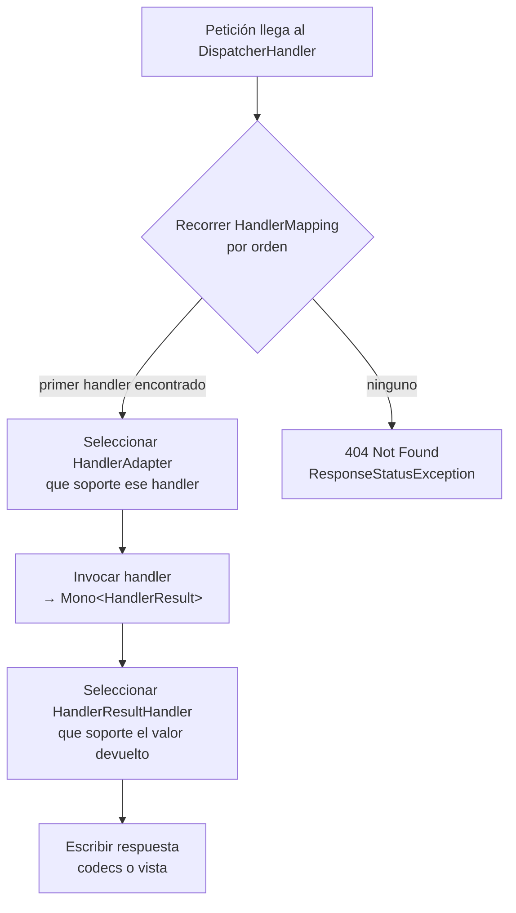

# 4. DispatcherHandler

> Temario: **DispatcherHandler** · Duración: 30 min
> Referencia oficial: [Spring WebFlux — DispatcherHandler](https://docs.spring.io/spring-framework/reference/web/webflux/dispatcher-handler.html)
>
> Código: `core/DispatcherInfoController.java` → `GET http://localhost:8080/internals/dispatcher`

## 4.1 El patrón *front controller*

Igual que Spring MVC con el `DispatcherServlet`, WebFlux se organiza alrededor de un **controlador frontal**:
un `WebHandler` central, el **`DispatcherHandler`**, que implementa el algoritmo común de procesamiento y
delega el trabajo real en componentes configurables.

- Es un bean de Spring (implementa `ApplicationContextAware`) y descubre sus delegados en el contexto.
- Se declara con el nombre de bean **`webHandler`**, y así lo detecta `WebHttpHandlerBuilder` para montar la
  cadena `WebExceptionHandler → WebFilter → WebHandler` vista en el bloque anterior.
- Spring Boot lo configura automáticamente (a través de la configuración de WebFlux).

```java
ApplicationContext context = ...;
HttpHandler handler = WebHttpHandlerBuilder.applicationContext(context).build();
// handler se adapta al servidor (ReactorHttpHandlerAdapter para Netty)
```

## 4.2 Beans especiales

| Tipo | Responsabilidad | Implementaciones principales |
|---|---|---|
| **`HandlerMapping`** | Encontrar el *handler* para la petición | `RequestMappingHandlerMapping` (`@RequestMapping`), `RouterFunctionMapping` (*functional endpoints*), `SimpleUrlHandlerMapping` (patrones de URL → `WebHandler`, p. ej. recursos estáticos o WebSockets) |
| **`HandlerAdapter`** | Invocar el *handler*, sea cual sea su tipo, y devolver un `HandlerResult` | `RequestMappingHandlerAdapter`, `HandlerFunctionAdapter`, `SimpleHandlerAdapter`, `WebSocketHandlerAdapter` |
| **`HandlerResultHandler`** | Procesar el resultado y completar la respuesta | ver tabla 4.4 |

El `HandlerAdapter` aísla al `DispatcherHandler` de los detalles de invocación: por ejemplo, para un
controlador anotado hay que resolver los argumentos (`@PathVariable`, `@RequestBody`…); para una
`HandlerFunction` basta con llamarla.

> 🔬 **Demo**: `GET /internals/dispatcher` lista los beans reales de la aplicación con su orden.
> Resultado (resumido) en el ejemplo del día:
>
> ```text
> HandlerMapping:   WebFluxEndpointHandlerMapping (-100, Actuator) · RouterFunctionMapping (-1)
>                   RequestMappingHandlerMapping (0) · RouterFunctionMapping (1) · SimpleUrlHandlerMapping (MAX-1)
> HandlerAdapter:   WebSocketHandlerAdapter · RequestMappingHandlerAdapter · HandlerFunctionAdapter · SimpleHandlerAdapter
> ResultHandler:    ResponseEntityResultHandler (0) · ServerResponseResultHandler (0)
>                   ResponseBodyResultHandler (100) · ViewResolutionResultHandler (MAX)
> ```
>
> También `GET /actuator/mappings` muestra todas las rutas registradas en cada `HandlerMapping`.

## 4.3 Procesamiento de una petición



1. Se pregunta a cada `HandlerMapping` (por orden) si tiene un *handler*; **se usa el primero** que responda.
2. El *handler* se ejecuta a través del `HandlerAdapter` adecuado, que expone el valor de retorno como
   **`HandlerResult`**.
3. El `HandlerResult` se entrega al primer `HandlerResultHandler` que lo soporte, que **escribe la respuesta
   directamente** (codecs) o **renderiza una vista**.

Todo el proceso es **una cadena de `Mono`**: ningún paso bloquea y la suscripción la dispara el servidor.

### Ejemplo: `GET /api/products/1`

| Paso | Componente | Detalle |
|---|---|---|
| 0 | `TimingWebFilter` | Anota el instante de inicio |
| 1 | `RequestMappingHandlerMapping` | Encuentra `ProductController#findById(String)` |
| 2 | `RequestMappingHandlerAdapter` | Resuelve `@PathVariable id = "1"`, invoca el método → `Mono<Product>` |
| 3 | `ResponseBodyResultHandler` | Clase `@RestController` → negocia *media type* → `JacksonJsonEncoder` |
| 4 | Netty | Escribe los bytes; el filtro añade `X-Response-Time` en `beforeCommit` |

## 4.4 Gestión del resultado (*Result Handling*)

| `HandlerResultHandler` | Valores de retorno | Orden por defecto |
|---|---|---|
| `ResponseEntityResultHandler` | `ResponseEntity` (típico en `@Controller`) | 0 |
| `ServerResponseResultHandler` | `ServerResponse` (*functional endpoints*) | 0 |
| `ResponseBodyResultHandler` | Métodos `@ResponseBody` o clases `@RestController` | 100 |
| `ViewResolutionResultHandler` | `CharSequence`, `View`, `Model`, `Map`, `Rendering` u otro objeto (atributo del modelo) | `Integer.MAX_VALUE` |

El `ViewResolutionResultHandler` es el "último recurso" y resuelve **vistas HTML** (Thymeleaf, FreeMarker…):
lo veremos el día 4 en *Tecnologías para las vistas*.

## 4.5 Excepciones

- Un `HandlerAdapter` puede gestionar internamente las excepciones del *handler*, aunque si el *handler*
  devuelve un valor asíncrono, el error puede llegar **más tarde** (como señal `onError` del `Mono`).
- Para ello expone un `DispatchExceptionHandler` en el `HandlerResult`; el `DispatcherHandler` lo aplica
  también al procesar el resultado. Así funcionan `@ExceptionHandler` y `@ControllerAdvice` (día 2).
- Si nada lo gestiona, la excepción sale del `DispatcherHandler` y la tratan los `WebExceptionHandler`
  (bloque 3.4).

## 4.6 Configuración

Se pueden declarar a mano los beans de infraestructura, pero lo habitual es partir de la **configuración de
WebFlux** (`@EnableWebFlux` + `WebFluxConfigurer`), que declara todo lo necesario y ofrece *callbacks* para
personalizarlo. Spring Boot la aplica automáticamente y añade opciones propias
(`spring.webflux.*`). Se estudia en detalle el día 2.

> ⚠️ En Spring Boot, añadir `@EnableWebFlux` **desactiva** la autoconfiguración de WebFlux de Boot. Para
> personalizar sin perderla, declara un bean `WebFluxConfigurer` **sin** `@EnableWebFlux`.

## Referencias para ampliar

- DispatcherHandler (beans especiales, procesamiento, resultados, excepciones, vistas):
  <https://docs.spring.io/spring-framework/reference/web/webflux/dispatcher-handler.html>
- WebFlux Config: <https://docs.spring.io/spring-framework/reference/web/webflux/config.html>
- Spring Boot — Spring WebFlux Framework (autoconfiguración): <https://docs.spring.io/spring-boot/reference/web/reactive.html>
- Actuator — endpoint `mappings`: <https://docs.spring.io/spring-boot/reference/actuator/endpoints.html>

➡️ Siguiente: [5. Controladores anotados (I)](05-controladores-anotados.md)
