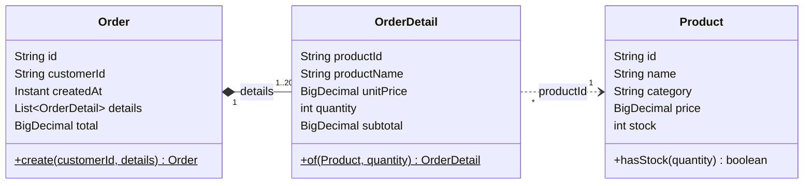
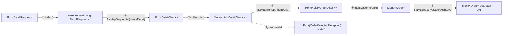

# 2. Caso práctico: pedidos con validación reactiva vs. imperativa

> Temario: **Controladores anotados** (validación) aplicada con **Bibliotecas reactivas** (composición con Reactor) · Duración: 55 min
> Referencias oficiales: [Reactor — Which operator do I need?](https://projectreactor.io/docs/core/release/reference/apdx-operatorChoice.html) ·
> [WebFlux — Validation](https://docs.spring.io/spring-framework/reference/web/webflux/controller/ann-validation.html)
>
> Código: `orders/Order.java`, `orders/OrderDetail.java`, `orders/OrderRequest.java`, `orders/DetailCheck.java`,
> `orders/OrderService.java` · Tests: `orders/OrderServiceTest.java`, `orders/OrderRoutesTest.java`

El catálogo del día 1 solo tenía una entidad. Hoy añadimos **pedidos**: un pedido tiene líneas y cada línea
apunta a un producto. Al crear un pedido hay que **validar cada producto contra el catálogo**, y eso es E/S:
el ejemplo perfecto para ver cómo se escribe una validación con programación funcional reactiva y qué
ganamos (y qué perdemos) frente a la versión imperativa de Spring MVC.

## 2.1 El dominio



```java
public record Order(String id, String customerId, Instant createdAt, List<OrderDetail> details, BigDecimal total) {
    public static Order create(String customerId, List<OrderDetail> details) { /* total = Σ subtotales */ }
}

public record OrderDetail(String productId, String productName, BigDecimal unitPrice, int quantity,
                          BigDecimal subtotal) {
    public static OrderDetail of(Product product, int quantity) {
        return new OrderDetail(product.id(), product.name(), product.price(), quantity,
                product.price().multiply(BigDecimal.valueOf(quantity)));
    }
}
```

**¿Por qué la línea guarda `productId` y no un `Product`?**

- `Product` pertenece a otro agregado (el catálogo) y cambia con el tiempo (precio, stock). El pedido guarda
  una **foto** de lo que importa en el momento de la compra (`productName`, `unitPrice`): si mañana sube el
  precio, el importe del pedido no cambia.
- Es lo mismo que haríamos en una base de datos: `order_detail.product_id` → clave ajena a `product.id`.
- `OrderDetail.of(product, quantity)` **solo se puede construir a partir de un `Product` que existe**: si el
  código llega a crear una línea, la validación ya ha pasado.

## 2.2 Qué hay que validar

| Regla | Tipo | ¿Necesita E/S? | Dónde | Si falla |
|---|---|---|---|---|
| JSON bien formado, sin campos desconocidos | Sintaxis | No | Jackson (codec) | 400 |
| `customerId` no vacío | Estructural | No | Bean Validation (`@NotBlank`) | 400 |
| Al menos una línea, como mucho 20 | Estructural | No | `@NotEmpty @Size(max = 20)` | 400 |
| `quantity > 0` en cada línea | Estructural | No | `@Positive` (con `List<@Valid DetailRequest>`) | 400 |
| Sin productos repetidos | Estructural | No | `@AssertTrue isWithoutRepeatedProducts()` | 400 |
| **El producto existe** | **Negocio** | **Sí** (catálogo) | `OrderService` | **422** |
| **Hay stock suficiente** | **Negocio** | **Sí** (catálogo) | `OrderService` | **422** |

La validación estructural se resuelve igual en MVC y en WebFlux (anotaciones). La diferencia está en las dos
últimas filas: **cada línea exige una consulta al catálogo**, que en el ejemplo tarda 50 ms
(`ProductRepository.findById` usa `delayElement`, como haría una base de datos).

Requisitos de negocio:

1. Si alguna línea falla, el pedido **no** se crea y el cliente recibe **todos** los errores a la vez.
2. Si todas son válidas, se descuenta el stock y se guarda el pedido.

## 2.3 Versión imperativa (Spring MVC)

Así se escribiría con Spring MVC y un repositorio bloqueante (JDBC/JPA):

```java
@RestController
public class OrderController {

    @PostMapping("/api/orders")
    public ResponseEntity<Order> create(@Valid @RequestBody OrderRequest request, UriComponentsBuilder uriBuilder) {
        Order order = service.create(request);               // el hilo espera aquí hasta que todo termina
        URI location = uriBuilder.path("/api/orders/{id}").buildAndExpand(order.id()).toUri();
        return ResponseEntity.created(location).body(order);
    }
}

@Service
public class OrderService {

    @Transactional
    public Order create(OrderRequest request) {
        List<DetailError> errors = new ArrayList<>();
        List<OrderDetail> details = new ArrayList<>();

        for (int line = 0; line < request.details().size(); line++) {
            DetailRequest detail = request.details().get(line);
            Optional<Product> product = products.findById(detail.productId());   // ⏳ BLOQUEA 50 ms
            if (product.isEmpty()) {
                errors.add(new DetailError(line, detail.productId(), "el producto no existe"));
            } else if (!product.get().hasStock(detail.quantity())) {
                errors.add(new DetailError(line, detail.productId(), "stock insuficiente: solicitadas "
                        + detail.quantity() + ", disponibles " + product.get().stock()));
            } else {
                details.add(OrderDetail.of(product.get(), detail.quantity()));
            }
        }
        if (!errors.isEmpty()) {
            throw new OrderRejectedException(errors);          // corta el método -> @ExceptionHandler -> 422
        }

        Order order = Order.create(request.customerId(), details);
        for (OrderDetail detail : order.details()) {
            products.decreaseStock(detail.productId(), detail.quantity());      // ⏳ BLOQUEA
        }
        return orders.save(order);                                               // ⏳ BLOQUEA
    }
}
```

Se lee de arriba abajo y cualquier programador Java lo entiende. Pero observa el **hilo**:

```text
hilo http-nio-8080-exec-7 (1 de ~200 del pool de Tomcat)
│ findById(1) ██████ 50 ms esperando
│ findById(2)       ██████ 50 ms esperando
│ findById(3)             ██████ ...
│ findById(4)                   ██████
│ findById(5)                         ██████        → 250 ms con el hilo BLOQUEADO sin hacer nada
│ decreaseStock × 5, save                     ████
```

Y si quisiéramos lanzar las 5 consultas **en paralelo**, en MVC tendríamos que gestionar la concurrencia a mano:

```java
// Paralelizar en imperativo: pool de hilos propio + futuros + join (que vuelve a bloquear)
List<CompletableFuture<Optional<Product>>> futures = request.details().stream()
        .map(d -> CompletableFuture.supplyAsync(() -> products.findById(d.productId()), executor))
        .toList();
List<Optional<Product>> found = futures.stream().map(CompletableFuture::join).toList();
// ...y después el mismo bucle de validación sobre "found", cuidando de no perder el índice de cada línea
```

## 2.4 Versión reactiva (WebFlux), paso a paso

```java
// orders/OrderService.java
public Mono<Order> create(OrderRequest request) {
    return Flux.fromIterable(request.details())
            .index()                                                      // ① (posición, línea)
            .flatMapSequential(indexed ->                                 // ② consultas EN PARALELO,
                    checkDetail(indexed.getT1().intValue(), indexed.getT2())) //    resultados EN ORDEN
            .collectList()                                                // ③ List<DetailCheck>
            .flatMap(OrderService::rejectIfAnyInvalid)                    // ④ error 422 o List<OrderDetail>
            .map(details -> Order.create(request.customerId(), details))  // ⑤ construir el pedido
            .flatMap(this::reserveStockAndSave);                          // ⑥ efectos: stock + guardar
}
```

> 🔑 Al llamar a `create(...)` **no se ejecuta nada**: el método devuelve la *descripción* del proceso
> (un `Mono`). Se ejecuta cuando WebFlux se suscribe para escribir la respuesta (día 1: *nothing happens until
> you subscribe*).



| Paso | Operador | Recibe → emite | Por qué este operador |
|---|---|---|---|
| ① | `index()` | `DetailRequest` → `Tuple2<Long, DetailRequest>` | Conservar la posición de cada línea para informar del error |
| ② | `flatMapSequential` | cada línea → `Mono<DetailCheck>` | La función devuelve un `Publisher` (hay E/S) → familia `flatMap`. *Sequential*: se suscribe a todas **a la vez** pero entrega los resultados **en el orden original** |
| ③ | `collectList()` | `Flux<DetailCheck>` → `Mono<List<DetailCheck>>` | Necesitamos ver **todas** las líneas antes de decidir |
| ④ | `flatMap` | `List<DetailCheck>` → `Mono<List<OrderDetail>>` o `Mono.error` | La decisión puede ser un **error**: se devuelve un `Mono` |
| ⑤ | `map` | `List<OrderDetail>` → `Order` | Transformación síncrona, pura, sin E/S |
| ⑥ | `flatMap` | `Order` → `Mono<Order>` | Guardar es E/S asíncrona |

### ② Validar una línea: convertir cada caso en un **valor**

```java
private Mono<DetailCheck> checkDetail(int line, DetailRequest request) {
    return products.findById(request.productId())                        // Mono<Product> (vacío si no existe)
            .map(product -> product.hasStock(request.quantity())
                    ? new DetailCheck.Valid(OrderDetail.of(product, request.quantity()))
                    : invalid(line, request, "stock insuficiente: solicitadas " + request.quantity()
                            + ", disponibles " + product.stock()))
            .defaultIfEmpty(invalid(line, request, "el producto no existe"));   // Mono vacío -> Invalid
}
```

```java
// orders/DetailCheck.java — interfaz sellada (Java 17): solo hay dos posibilidades
public sealed interface DetailCheck {
    record Valid(OrderDetail detail) implements DetailCheck { }
    record Invalid(DetailError error) implements DetailCheck { }
    record DetailError(int line, String productId, String message) { }
}
```

Si `checkDetail` devolviera `Mono.error(...)` en la primera línea incorrecta, el flujo se **cancelaría** y
perderíamos el resto de errores. Al devolver un **valor** (`Valid` o `Invalid`) todas las líneas llegan al
paso ③. Es la idea de los tipos *Either* / *Validation* de la programación funcional.

> ℹ️ "No existe" no es un `null` ni una excepción: es un **`Mono` vacío**, y `defaultIfEmpty` le da un valor.
> (El argumento de `defaultIfEmpty` se construye siempre; si fuera caro, se usaría
> `switchIfEmpty(Mono.fromSupplier(...))`, que es perezoso.)

### ④ Decidir: una función pura

```java
private static Mono<List<OrderDetail>> rejectIfAnyInvalid(List<DetailCheck> checks) {
    List<DetailError> errors = checks.stream()
            .flatMap(check -> check instanceof DetailCheck.Invalid invalid
                    ? Stream.of(invalid.error()) : Stream.<DetailError>empty())
            .toList();
    if (!errors.isEmpty()) {
        return Mono.error(new OrderRejectedException(errors));   // señal onError, no "throw"
    }
    return Mono.just(checks.stream().map(check -> ((DetailCheck.Valid) check).detail()).toList());
}
```

No hay E/S ni estado compartido: recibe una lista y devuelve un resultado. Se puede probar sin Spring y sin
Reactor. `OrderRejectedException` extiende `ErrorResponseException`, así que ya lleva su `ProblemDetail` (422).

### ⑥ Efectos secundarios, solo al final

```java
private Mono<Order> reserveStockAndSave(Order order) {
    return Flux.fromIterable(order.details())
            .concatMap(detail -> products.update(detail.productId(),
                    product -> product.withStock(product.stock() - detail.quantity())))
            .then(orders.save(order));        // "cuando termine lo anterior, haz esto" (descarta sus valores)
}
```

Si el paso ④ emitió un error, los pasos ⑤ y ⑥ **no se ejecutan**: la señal `onError` atraviesa el resto del
*pipeline* hasta WebFlux, que la convierte en la respuesta 422. No hace falta ningún `if`.

Y el hilo durante todo esto:

```text
reactor-http-nio-3: recibe la petición, lanza 5 consultas y QUEDA LIBRE (atiende otras peticiones)
                    ... 50 ms después llegan las 5 respuestas (en paralelo) ...
parallel-2:         collectList → decidir → reservar → guardar → escribir la respuesta
                                                         → 50 ms en total y ningún hilo bloqueado
```

## 2.5 Traducción imperativo → reactivo

| Imperativo (MVC) | Reactivo (WebFlux) |
|---|---|
| `for (x : lista)` | `Flux.fromIterable(lista)` |
| `for (int i = 0; ...)` (necesito el índice) | `.index()` |
| `T r = repo.find(id)` (bloquea) | `repo.find(id)` devuelve `Mono<T>` → `.flatMap(...)` |
| llamadas una detrás de otra | `concatMap` |
| llamadas en paralelo (`CompletableFuture` + `join`) | `flatMap` / `flatMapSequential` |
| `Optional.isEmpty()` / `null` | `Mono` vacío → `switchIfEmpty` / `defaultIfEmpty` |
| `lista.add(...)` + `return lista` | `collectList()` |
| `throw new XxxException()` | `Mono.error(new XxxException())` (o `Mono.error(() -> ...)`, perezoso) |
| `try { ... } catch (X e) { ... }` | `onErrorResume(X.class, e -> ...)` / `onErrorMap` |
| `return valor` | `map(...)` |
| "cuando termine A, haz B" (instrucciones seguidas) | `a.then(b)` |
| `@Transactional` (estado en `ThreadLocal`) | `@Transactional` reactivo o `TransactionalOperator` (estado en el `Context` de Reactor) |

## 2.6 Dos estrategias: acumular errores vs. *fail-fast*

`OrderService` incluye una segunda versión para comparar: se detiene en el **primer** error.

```java
public Mono<Order> createFailFast(OrderRequest request) {
    return Flux.fromIterable(request.details())
            .index()
            .concatMap(indexed -> {                                  // de una en una, en orden
                int line = indexed.getT1().intValue();
                DetailRequest detail = indexed.getT2();
                return products.findById(detail.productId())
                        .switchIfEmpty(Mono.error(() -> rejected(line, detail, "el producto no existe")))
                        .filter(product -> product.hasStock(detail.quantity()))
                        .switchIfEmpty(Mono.error(() -> rejected(line, detail, "stock insuficiente")))
                        .map(product -> OrderDetail.of(product, detail.quantity()));
            })
            .collectList()
            .map(details -> Order.create(request.customerId(), details))
            .flatMap(this::reserveStockAndSave);
}
```

| | `create` (acumular) | `createFailFast` |
|---|---|---|
| Operador clave | `flatMapSequential` + valores `DetailCheck` | `concatMap` + `Mono.error` |
| Consultas | Todas, **en paralelo** | Una detrás de otra; se paran en el primer error |
| Tiempo con 5 líneas válidas | **50 ms** | 250 ms |
| Errores devueltos | Todos | Solo el primero |
| Cuándo conviene | Formularios / APIs para personas | Consultas caras o con efectos, o cuando un error invalida el resto |

Los tiempos no son una suposición: los comprueban `OrderServiceTest` con **tiempo virtual** (día 1):

```java
@Test
void createQueriesTheCatalogConcurrently() {
    StepVerifier.withVirtualTime(() -> service.create(fiveDetails()))
            .expectSubscription()
            .expectNoEvent(Duration.ofMillis(49))    // a los 49 ms aún no hay respuesta...
            .thenAwait(Duration.ofMillis(1))         // ...a los 50 ms sí: las 5 consultas fueron simultáneas
            .expectNextCount(1)
            .verifyComplete();
}

@Test
void createFailFastQueriesTheCatalogSequentially() {
    StepVerifier.withVirtualTime(() -> service.createFailFast(fiveDetails()))
            .expectSubscription()
            .expectNoEvent(Duration.ofMillis(249))   // 5 × 50 ms
            .thenAwait(Duration.ofMillis(1))
            .expectNextCount(1)
            .verifyComplete();
}
```

> 🔬 **Demo:** cambia `flatMapSequential` por `concatMap` en `create` y ejecuta `OrderServiceTest`: el test
> `createQueriesTheCatalogConcurrently` falla. Cambia por `flatMap`: los tiempos se mantienen, pero el orden de
> los resultados deja de estar garantizado.

## 2.7 Probarlo

```bash
# 201: descuenta stock y devuelve Location absoluta
curl -i -X POST http://localhost:8080/api/orders -H "Content-Type: application/json" \
  -d '{"customerId":"c1","details":[{"productId":"1","quantity":2},{"productId":"3","quantity":1}]}'

# 422: TODOS los errores de negocio a la vez
curl -i -X POST http://localhost:8080/api/orders -H "Content-Type: application/json" \
  -d '{"customerId":"c1","details":[{"productId":"99","quantity":2},{"productId":"4","quantity":50},{"productId":"2","quantity":1}]}'
```

```http
HTTP/1.1 422 Unprocessable Entity
Content-Type: application/problem+json

{"detail":"El pedido tiene 2 línea(s) no válida(s)","instance":"/api/orders","status":422,
 "title":"Pedido rechazado","type":"https://curso-webflux.example/problems/order-rejected",
 "errors":[{"line":0,"productId":"99","message":"el producto no existe"},
           {"line":1,"productId":"4","message":"stock insuficiente: solicitadas 50, disponibles 5"}]}
```

```bash
# 400: validación estructural (antes de consultar nada)
curl -i -X POST http://localhost:8080/api/orders -H "Content-Type: application/json" \
  -d '{"customerId":"","details":[{"productId":"1","quantity":0},{"productId":"1","quantity":2}]}'
```

```json
{"detail":"La petición contiene 3 error(es) de validación","instance":"/api/orders","status":400,
 "title":"Datos no válidos","type":"https://curso-webflux.example/problems/validation",
 "errors":{"details[0].quantity":"debe ser mayor que 0","customerId":"no debe estar vacío",
           "withoutRepeatedProducts":"no puede haber productos repetidos en el pedido"}}
```

## 2.8 Ventajas e inconvenientes

| Aspecto | Imperativo (Spring MVC) | Reactivo (Spring WebFlux) |
|---|---|---|
| **Lectura** | ✅ Lineal, de arriba abajo; lo entiende cualquiera | ⚠️ Declarativa; hay que conocer los operadores y saber elegir entre `map` / `flatMap` / `concatMap`... |
| **Hilos** | ❌ Un hilo bloqueado por petición mientras espera la E/S (250 ms en el ejemplo) | ✅ Ningún hilo espera; el *event loop* atiende otras peticiones |
| **Paralelizar la E/S** | ⚠️ Posible, pero con código extra (`CompletableFuture`, *executors*, `join`) | ✅ Cambiar un operador (`concatMap` ↔ `flatMapSequential`) |
| **Acumular errores** | ✅ Una lista mutable y `if/else` | ✅ Valores (`DetailCheck`) + `collectList`, sin estado mutable compartido |
| **Control de flujo del error** | `throw` corta el método; `try/catch` | La señal `onError` salta los pasos siguientes; `onErrorResume`/`onErrorMap` |
| **"No encontrado"** | `Optional` / `null` | `Mono` vacío (`switchIfEmpty`, `defaultIfEmpty`) |
| **Transacciones** | ✅ `@Transactional` (JPA/JDBC), muy maduro | ⚠️ Posibles (`@Transactional` reactivo, `TransactionalOperator`), pero requieren drivers reactivos (R2DBC) |
| **Ecosistema de datos** | ✅ JDBC, JPA/Hibernate, todas las librerías | ⚠️ Solo drivers reactivos (R2DBC, MongoDB/Redis/Cassandra reactivos, `WebClient`); una llamada bloqueante lo estropea todo |
| **Depuración** | ✅ Trazas de pila claras | ❌ Trazas llenas de operadores; ayudas: `checkpoint()`, `log()`, *Reactor debug agent* |
| **Contexto por petición** (MDC, seguridad, transacción) | `ThreadLocal`, transparente | `Context` de Reactor; el `ThreadLocal` no sirve porque la petición cambia de hilo |
| **Pruebas** | JUnit directo | `StepVerifier` (con ventajas: tiempo virtual) |
| **Rendimiento con poca carga** | ✅ Igual o mejor (menos sobrecarga) | ⚠️ Sobrecarga de los operadores |
| **Escalabilidad con mucha E/S concurrente** | ⚠️ Limitada por el pool de hilos (mejor con hilos virtuales, Java 21+) | ✅ Alta con pocos hilos y *backpressure* |
| **Errores típicos** | Olvidar un `@Transactional`, N+1 consultas | Bloquear el *event loop*, `subscribe()` dentro del servicio, `map` en vez de `flatMap` (`Mono<Mono<T>>`), olvidar devolver el `Mono` |

### ¿Y los hilos virtuales?

Con Java 21+ y `spring.threads.virtual.enabled=true`, Spring MVC ejecuta cada petición en un **hilo virtual**:
bloquear deja de ser caro porque el hilo virtual se "aparca" sin ocupar un hilo del sistema. Eso elimina buena
parte de la ventaja de escalabilidad de WebFlux **para el caso bloqueante sencillo**, conservando el código
imperativo. WebFlux sigue aportando lo que los hilos virtuales no dan por sí solos: composición declarativa de
concurrencia (paralelo, *timeouts*, reintentos), *streaming* (SSE, NDJSON) y *backpressure*.

### Criterio práctico

- **WebFlux** cuando la aplicación **orquesta mucha E/S** (llamadas a otros servicios, *streaming*, muchas
  conexiones concurrentes) y todo el camino puede ser no bloqueante.
- **MVC** (con hilos virtuales si se puede) cuando el acceso a datos es JDBC/JPA, la lógica es mayoritariamente
  secuencial o el equipo no domina Reactor.

## 2.9 Errores frecuentes al escribir validaciones reactivas

```java
// ❌ map con una función que devuelve Mono -> Mono<Mono<Product>> (la consulta nunca se ejecuta)
products.findById(id).map(p -> products.update(...));
// ✅ flatMap "aplana" y se suscribe a la consulta interna
products.findById(id).flatMap(p -> products.update(...));

// ❌ Mono.error(new X()) construye la excepción SIEMPRE (con su traza), aunque no haga falta
.switchIfEmpty(Mono.error(new ProductNotFoundException(id)))
// ✅ Versión perezosa con Supplier
.switchIfEmpty(Mono.error(() -> new ProductNotFoundException(id)))

// ❌ Suscribirse dentro del servicio: la operación queda "suelta", sin backpressure ni gestión de errores
products.update(...).subscribe();
// ✅ Encadenar y devolver: quien se suscribe es el framework
return products.update(...).then(orders.save(order));

// ❌ Bloquear para "sacar el valor"
Product p = products.findById(id).block();   // IllegalStateException en un hilo del event loop
// ✅ Seguir dentro del pipeline con flatMap / map

// ❌ Validar con Mono.error en cada línea cuando se quieren TODOS los errores (el primero cancela el resto)
// ✅ Convertir cada resultado en un valor (DetailCheck) y decidir después de collectList()
```

> ⚠️ **Concurrencia (en los dos modelos):** entre validar el stock y descontarlo, otra petición podría
> consumir las mismas unidades. Con una base de datos real se resolvería con una transacción y un
> `UPDATE ... SET stock = stock - ? WHERE id = ? AND stock >= ?`. En el ejemplo, `ProductRepository.update`
> es atómico por producto, pero la validación y la reserva siguen siendo dos pasos.

## Referencias para ampliar

- Reactor — Which operator do I need?: <https://projectreactor.io/docs/core/release/reference/apdx-operatorChoice.html>
- Reactor — Debugging Reactor: <https://projectreactor.io/docs/core/release/reference/debugging.html>
- Reactor — `Flux` (Javadoc, diagramas de `flatMapSequential`, `concatMap`, `collectList`...): <https://projectreactor.io/docs/core/release/api/reactor/core/publisher/Flux.html>
- Spring Framework — Programmatic Transaction Management (`TransactionalOperator`): <https://docs.spring.io/spring-framework/reference/data-access/transaction/programmatic.html>
- Spring Boot — Virtual threads (`spring.threads.virtual.enabled`): <https://docs.spring.io/spring-boot/reference/features/spring-application.html#features.spring-application.virtual-threads>
- JEP 444 — Virtual Threads: <https://openjdk.org/jeps/444>
- Spring Framework — WebFlux: *Applicability* (cuándo elegir MVC o WebFlux): <https://docs.spring.io/spring-framework/reference/web/webflux/new-framework.html#webflux-framework-choice>

➡️ Siguiente: [3. Puntos finales funcionales](03-puntos-finales-funcionales.md)
