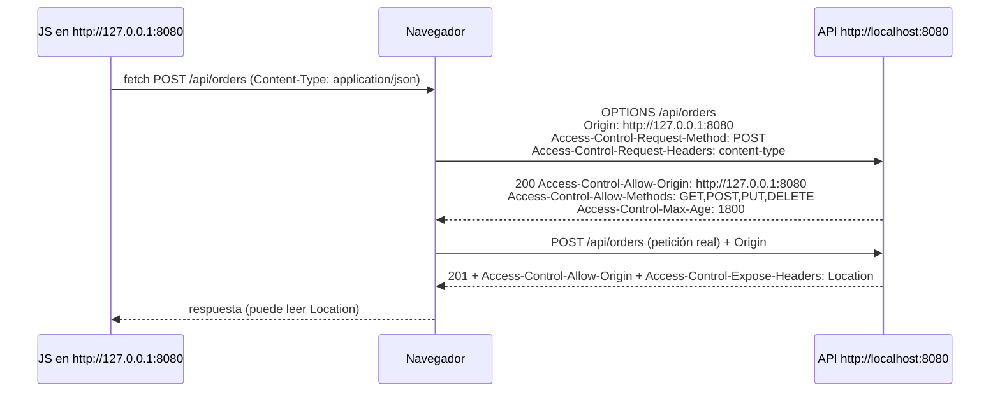

# 5. CORS

> Temario: **CORS** · Duración: 25 min
> Referencia oficial: [Spring WebFlux — CORS](https://docs.spring.io/spring-framework/reference/web/webflux-cors.html)
>
> Código: `config/WebConfig.addCorsMappings`, `@CrossOrigin` en `catalog/ProductController.java`,
> `static/cors.html` · Tests: `config/CorsTest.java`

## 5.1 El problema: la política del mismo origen

Un **origen** es la combinación **esquema + host + puerto**. Por seguridad, el navegador no deja que el
JavaScript de una página lea respuestas de **otro** origen, salvo que el servidor lo autorice con cabeceras
CORS (*Cross-Origin Resource Sharing*).

| Página | Petición a | ¿Mismo origen? |
|---|---|---|
| `http://localhost:8080/index.html` | `http://localhost:8080/api/products` | ✅ Sí |
| `http://127.0.0.1:8080/cors.html` | `http://localhost:8080/api/products` | ❌ No (cambia el host) |
| `http://localhost:5173` (SPA con Vite) | `http://localhost:8080/api/products` | ❌ No (cambia el puerto) |
| `https://localhost:8080` | `http://localhost:8080/api/products` | ❌ No (cambia el esquema) |

> ℹ️ CORS lo aplica **el navegador**. `curl`, Postman o un servidor que llama a otro servidor no están
> sujetos a CORS. Por eso CORS **no es un mecanismo de seguridad del servidor**: la autenticación y la
> autorización (día 3) siguen siendo necesarias.

## 5.2 Peticiones simples y *preflight*



- **Petición simple** (GET/HEAD/POST sin cabeceras propias y con `Content-Type` de formulario o texto): el
  navegador la envía directamente con `Origin` y comprueba `Access-Control-Allow-Origin` en la respuesta.
- **Con *preflight***: cualquier otra (JSON, `PUT`/`DELETE`, cabeceras como `API-Version`...). Antes, el
  navegador pregunta con `OPTIONS`. Si el servidor no lo autoriza, **la petición real no se envía**.

| Cabecera de respuesta | Significado |
|---|---|
| `Access-Control-Allow-Origin` | Origen autorizado |
| `Access-Control-Allow-Methods` | Métodos autorizados (en el *preflight*) |
| `Access-Control-Allow-Headers` | Cabeceras de petición autorizadas (en el *preflight*) |
| `Access-Control-Expose-Headers` | Cabeceras de respuesta que el JS puede leer (además de las básicas) |
| `Access-Control-Allow-Credentials` | Si se permiten cookies/credenciales |
| `Access-Control-Max-Age` | Segundos que el navegador puede cachear el *preflight* |

## 5.3 CORS en WebFlux

Cada `HandlerMapping` (el de controladores anotados **y** el de endpoints funcionales) consulta la configuración
CORS de la ruta: responde él mismo a los *preflight* y añade las cabeceras a las peticiones reales. Si el origen
o el método no están permitidos, responde **403** y no se ejecuta el *handler*.

### Configuración global (`WebFluxConfigurer`)

```java
// config/WebConfig.java
@Override
public void addCorsMappings(CorsRegistry registry) {
    registry.addMapping("/api/**")
            .allowedOrigins("http://127.0.0.1:8080")
            .allowedMethods("GET", "POST", "PUT", "DELETE")
            .allowedHeaders("Content-Type", "API-Version")
            .exposedHeaders("Location", "X-Response-Time")   // cabeceras que el JS puede leer
            .maxAge(1800);                                    // segundos que el navegador cachea el preflight
}
```

Valores por defecto de `addMapping` si no se indican: todos los orígenes, métodos `GET`, `HEAD` y `POST`,
todas las cabeceras, sin credenciales y `maxAge` de 30 minutos.

### Por controlador o método: `@CrossOrigin`

```java
@RestController
@RequestMapping("/api/products")
@CrossOrigin(origins = "http://localhost:5173", maxAge = 3600)
public class ProductController { ... }
```

Por defecto `@CrossOrigin` permite todos los orígenes, todas las cabeceras y los métodos del propio *mapping*.
Si hay configuración global y anotación, **se combinan**: en el ejemplo, `/api/products/**` acepta
`http://127.0.0.1:8080` (global) **y** `http://localhost:5173` (anotación); `/api/orders` solo el primero.

### `CorsWebFilter`

Alternativa a nivel de `WebFilter` (antes del `DispatcherHandler`):

```java
@Bean
CorsWebFilter corsWebFilter() {
    CorsConfiguration config = new CorsConfiguration();
    config.addAllowedOrigin("http://127.0.0.1:8080");
    config.addAllowedMethod("*");
    UrlBasedCorsConfigurationSource source = new UrlBasedCorsConfigurationSource();
    source.registerCorsConfiguration("/api/**", config);
    return new CorsWebFilter(source);
}
```

Úsalo cuando la petición deba resolverse **antes** de llegar al `DispatcherHandler`: por ejemplo, con Spring
Security (día 3), cuyos filtros podrían rechazar el *preflight* `OPTIONS` (que no lleva credenciales) antes de
que el `HandlerMapping` lo vea. Spring Security tiene su propia integración: `http.cors(...)`.

### Credenciales

Con `allowCredentials(true)` (cookies, cabecera `Authorization`), la especificación **prohíbe**
`Access-Control-Allow-Origin: *`. Hay que enumerar los orígenes o usar `allowedOriginPatterns("https://*.midominio.com")`.

## 5.4 Probarlo

**En el navegador:** abre <http://127.0.0.1:8080/cors.html> con DevTools → *Network*:

| Botón | Qué observar |
|---|---|
| `GET /api/products/count` | Petición simple: sin `OPTIONS`; respuesta con `Access-Control-Allow-Origin` |
| `POST /api/orders` | `OPTIONS` + `POST`; el JS lee la cabecera `Location` porque está en `exposedHeaders` |
| `GET` con `API-Version: 2.0` | Cabecera propia → *preflight* |
| `PATCH /api/products/1` | `PATCH` no está permitido → el *preflight* falla y la consola muestra *"blocked by CORS policy"* |

**Con curl** (simulando al navegador):

```bash
curl -i -X OPTIONS http://localhost:8080/api/orders \
     -H "Origin: http://127.0.0.1:8080" \
     -H "Access-Control-Request-Method: POST" \
     -H "Access-Control-Request-Headers: content-type"
# HTTP/1.1 200 OK
# Access-Control-Allow-Origin: http://127.0.0.1:8080
# Access-Control-Allow-Methods: GET,POST,PUT,DELETE
# Access-Control-Allow-Headers: content-type
# Access-Control-Expose-Headers: Location, X-Response-Time
# Access-Control-Max-Age: 1800

curl -i -X OPTIONS http://localhost:8080/api/orders \
     -H "Origin: http://evil.example" -H "Access-Control-Request-Method: POST"
# HTTP/1.1 403 Forbidden
```

📄 `config/CorsTest.java` automatiza estas comprobaciones con `WebTestClient`.

## Referencias para ampliar

- CORS (WebFlux): <https://docs.spring.io/spring-framework/reference/web/webflux-cors.html>
- `@CrossOrigin` (Javadoc): <https://docs.spring.io/spring-framework/docs/current/javadoc-api/org/springframework/web/bind/annotation/CrossOrigin.html>
- MDN — Cross-Origin Resource Sharing (CORS): <https://developer.mozilla.org/en-US/docs/Web/HTTP/Guides/CORS>
- MDN — Política del mismo origen: <https://developer.mozilla.org/es/docs/Web/Security/Same-origin_policy>
- Fetch Standard — CORS protocol: <https://fetch.spec.whatwg.org/#http-cors-protocol>
- Spring Security — CORS: <https://docs.spring.io/spring-security/reference/reactive/integrations/cors.html>

➡️ Siguiente: [6. Configuración de WebFlux](06-configuracion-webflux.md)
