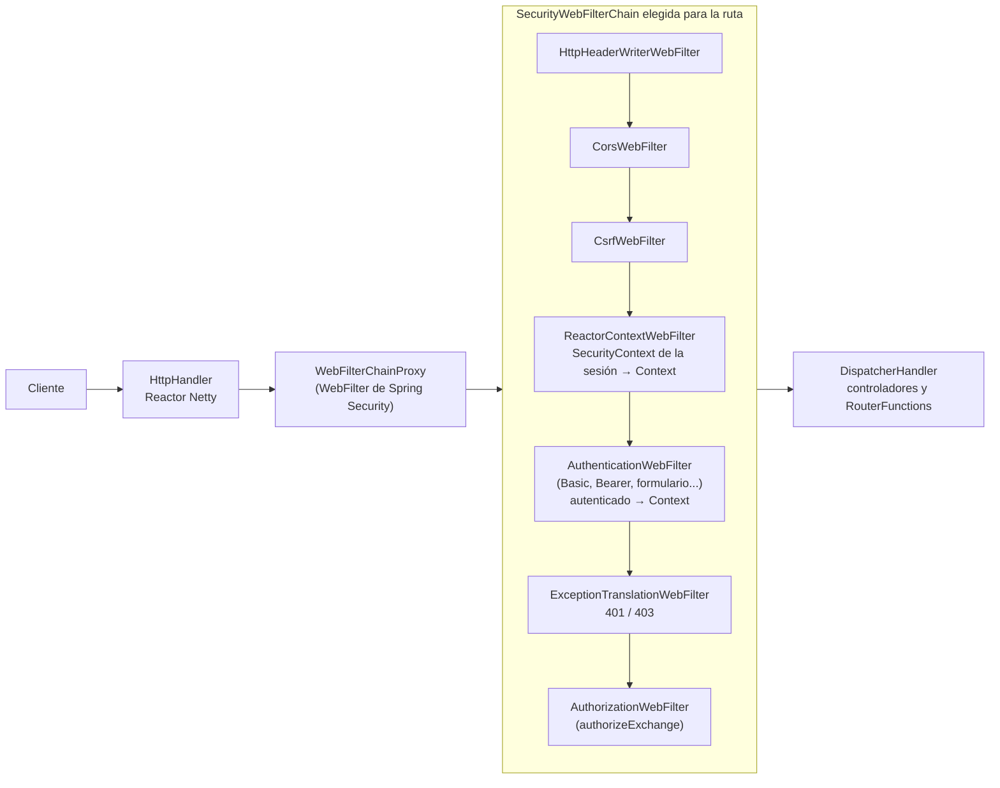
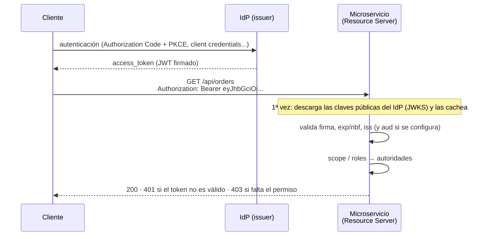

# 1. Seguridad web con Spring Security reactivo

> Temario: **Seguridad web** · Duración: 50 min
> Referencia oficial: [Spring WebFlux — Web Security](https://docs.spring.io/spring-framework/reference/web/webflux/security.html) ·
> [Spring Security — Reactive Applications](https://docs.spring.io/spring-security/reference/reactive/index.html)
>
> Código: **solo documentación**. El ejemplo del día no incluye Spring Security para no mezclar temas en las
> demos de WebClient. Todos los fragmentos de este documento se han **compilado y probado** con Spring Boot 4.1.1
> / Spring Security 7.1.1 contra una copia de `examples/day-03` con los *starters* de seguridad.

Este bloque prepara el siguiente: al final de él sabrás **dónde vive la identidad del usuario** en una aplicación
WebFlux (en el `Context` de Reactor, no en un `ThreadLocal`), y eso es lo que permite pasarla de un microservicio
a otro sin bloquear ([2. Identidad entre microservicios](02-identidad-entre-microservicios.md)).

## 1.1 Qué cambia respecto a Spring MVC

Spring Security tiene **dos integraciones web**: una para Servlet (Spring MVC) y otra para WebFlux. Los
conceptos son los mismos; cambian las clases porque en WebFlux no hay `Filter` de Servlet ni un hilo por petición.

| Concepto | Spring MVC (Servlet) | Spring WebFlux (reactivo) |
|---|---|---|
| Activar la seguridad web | `@EnableWebSecurity` | `@EnableWebFluxSecurity` |
| Cadena de filtros | `SecurityFilterChain` (`jakarta.servlet.Filter`) | `SecurityWebFilterChain` (`WebFilter`) |
| DSL de configuración | `HttpSecurity` | `ServerHttpSecurity` |
| Reglas por URL | `authorizeHttpRequests(...).requestMatchers(...)` | `authorizeExchange(...).pathMatchers(...)` |
| Usuarios | `UserDetailsService` | `ReactiveUserDetailsService` (devuelve `Mono<UserDetails>`) |
| Usuario actual | `SecurityContextHolder` (**`ThreadLocal`**) | `ReactiveSecurityContextHolder` (**`Context` de Reactor**) |
| Seguridad en métodos | `@EnableMethodSecurity` | `@EnableReactiveMethodSecurity` |
| Resource Server JWT | `JwtDecoder` | `ReactiveJwtDecoder` |
| Cliente OAuth2 para llamadas salientes | `OAuth2ClientHttpRequestInterceptor` (`RestClient`) | `ServerOAuth2AuthorizedClientExchangeFilterFunction` (`WebClient`) |

> ⚠️ La diferencia de la fila "Usuario actual" es la más importante del día. En MVC el usuario se guarda en el
> hilo que atiende la petición. En WebFlux una petición pasa por **varios hilos** y cada hilo atiende **muchas
> peticiones**: un `ThreadLocal` devolvería el usuario equivocado. Por eso el `SecurityContext` viaja en el
> [`Context` de Reactor](https://projectreactor.io/docs/core/release/reference/advancedFeatures/context.html),
> asociado a la **suscripción**.

## 1.2 Arquitectura: un `WebFilter` delante de todo



- Spring Security se registra como **un `WebFilter` más** (`WebFilterChainProxy`), así que protege por igual a
  controladores anotados y a endpoints funcionales: todo pasa por él **antes** del `DispatcherHandler`.
- Puede haber varias `SecurityWebFilterChain`; cada una declara con `securityMatcher(...)` qué rutas atiende y
  se prueba en orden (`@Order`).
- Con solo añadir la dependencia, Spring Boot aplica una configuración por defecto: **todo** requiere
  autenticación, se crea un usuario `user` con contraseña aleatoria (se ve en el log) y se activan HTTP Basic y
  formulario de login.

```xml
<dependency>
    <groupId>org.springframework.boot</groupId>
    <artifactId>spring-boot-starter-security</artifactId>
</dependency>
<!-- Para tokens JWT (sección 1.9) -->
<dependency>
    <groupId>org.springframework.boot</groupId>
    <artifactId>spring-boot-starter-security-oauth2-resource-server</artifactId>
</dependency>
<dependency>
    <groupId>org.springframework.boot</groupId>
    <artifactId>spring-boot-starter-security-test</artifactId>
    <scope>test</scope>
</dependency>
```

> ⚠️ **Novedad de Spring Boot 4**: los *starters* de OAuth2 se han renombrado con el prefijo `security-`:
>
> | Spring Boot 3 | Spring Boot 4 |
> |---|---|
> | `spring-boot-starter-oauth2-resource-server` | `spring-boot-starter-security-oauth2-resource-server` |
> | `spring-boot-starter-oauth2-client` | `spring-boot-starter-security-oauth2-client` |
> | `spring-security-test` (dependencia directa) | `spring-boot-starter-security-test` |
>
> Los tutoriales y respuestas anteriores a noviembre de 2025 usan los nombres antiguos.

## 1.3 Autenticación con usuarios propios (`ReactiveUserDetailsService`)

Útil para aplicaciones pequeñas, consolas de administración o para entender el modelo antes de usar un IdP:

```java
@Bean
MapReactiveUserDetailsService users() {
    PasswordEncoder encoder = PasswordEncoderFactories.createDelegatingPasswordEncoder();   // {bcrypt}...
    UserDetails ana = User.withUsername("ana").password(encoder.encode("ana")).roles("USER").build();
    UserDetails admin = User.withUsername("admin").password(encoder.encode("admin")).roles("USER", "ADMIN").build();
    return new MapReactiveUserDetailsService(ana, admin);
}
```

Con usuarios en una base de datos se implementa `ReactiveUserDetailsService.findByUsername(String)` devolviendo
un `Mono<UserDetails>` desde un repositorio **reactivo** (R2DBC, MongoDB reactivo...). Si el repositorio fuera
bloqueante (JPA), habría que aislarlo con `subscribeOn(Schedulers.boundedElastic())`.

## 1.4 Autorización por rutas (`SecurityWebFilterChain`)

La configuración de una API REST protegida con tokens JWT (sección 1.8) sobre las rutas del ejemplo del día:

```java
@Configuration
@EnableWebFluxSecurity
@EnableReactiveMethodSecurity                                  // para @PreAuthorize (sección 1.5)
public class SecurityConfig {

    @Bean
    SecurityWebFilterChain api(ServerHttpSecurity http) {
        return http
                .csrf(ServerHttpSecurity.CsrfSpec::disable)    // API sin sesión ni cookies (sección 1.6)
                .cors(Customizer.withDefaults())                // reutiliza la configuración CORS (día 2)
                .authorizeExchange(exchanges -> exchanges
                        .pathMatchers(HttpMethod.OPTIONS, "/**").permitAll()             // preflight CORS
                        .pathMatchers("/actuator/health", "/index.html").permitAll()
                        .pathMatchers(HttpMethod.GET, "/api/products/**").permitAll()   // catálogo público
                        .pathMatchers("/api/products/**").hasAuthority("SCOPE_catalog.write")
                        .pathMatchers("/api/orders/**", "/api/bff/**").hasAuthority("SCOPE_orders")
                        .anyExchange().authenticated())                                  // el resto: con token
                .oauth2ResourceServer(resourceServer -> resourceServer.jwt(Customizer.withDefaults()))
                .build();
    }
}
```

- Las reglas se evalúan **en orden** y gana la primera que coincide: de lo más concreto a lo más general.
- `permitAll()` para `OPTIONS`: el navegador envía el *preflight* CORS **sin credenciales**; si la seguridad lo
  rechazase, la petición real nunca llegaría (ver [día 2 — CORS](../day-02/05-cors.md)).
- `hasRole("ADMIN")` equivale a `hasAuthority("ROLE_ADMIN")`. Los *scopes* de un JWT llegan como autoridades
  `SCOPE_xxx`.

Resultado (verificado con `WebTestClient`):

| Petición | Resultado |
|---|---|
| `GET /api/products/1` sin token | `200` (pública) |
| `GET /api/orders` sin token | `401 Unauthorized` + `WWW-Authenticate: Bearer` |
| `GET /api/orders` con un token sin el *scope* `orders` | `403 Forbidden` |
| `GET /api/orders` con *scope* `orders` | `200` |
| `DELETE /api/products/5` con *scope* `catalog.write` | `204` |

> **401 frente a 403.** 401 = "no sé quién eres" (falta el token, está caducado o la firma no es válida).
> 403 = "sé quién eres, pero no tienes permiso".

## 1.5 Autorización en métodos (`@PreAuthorize`)

Las reglas por ruta son gruesas. Para reglas que dependen de los datos se usa la seguridad de métodos:

```java
@PreAuthorize("hasRole('ADMIN')")
public Mono<Void> delete(String id) { ... }

// El cliente solo ve sus pedidos; un ADMIN ve los de cualquiera
@PreAuthorize("#customerId == authentication.name or hasRole('ADMIN')")
public Flux<Order> findByCustomer(String customerId) { ... }
```

- Con `@EnableReactiveMethodSecurity`, los métodos anotados **deben devolver un `Publisher`** (`Mono`/`Flux`): la
  comprobación se hace de forma reactiva al suscribirse, leyendo el usuario del `Context`.
- También existen `@PostAuthorize`, `@PreFilter` y `@PostFilter`; `@PostFilter` sobre un `Flux` filtra elemento a
  elemento sin materializar la colección.

## 1.6 Acceder al usuario autenticado

```java
// En un controlador: inyección directa del principal (aquí, el JWT validado)
@GetMapping("/api/me")
public Mono<String> me(@AuthenticationPrincipal Jwt jwt) {
    return Mono.just(jwt.getSubject() + " " + jwt.getClaimAsString("email"));
}

// En cualquier otra capa: se LEE DEL CONTEXT de Reactor
public Mono<String> currentUser() {
    return ReactiveSecurityContextHolder.getContext()
            .map(SecurityContext::getAuthentication)
            .map(Authentication::getName);
}
```

`ReactiveSecurityContextHolder.getContext()` es un `Mono` que lee el `Context` de la suscripción actual. Lo
escribieron allí los filtros de la cadena: `ReactorContextWebFilter` (si había sesión) o el
`AuthenticationWebFilter` al validar el token, con `contextWrite(ReactiveSecurityContextHolder.withSecurityContext(...))`. **Nunca** se debe llamar desde un hilo
creado a mano, desde un `subscribe()` suelto o desde un `block()`: fuera de la cadena reactiva no hay `Context`.

🔬 **Demo del mismo mecanismo sin Spring Security:** `core/CorrelationIdWebFilter` escribe un `X-Request-Id` en el
`Context` y `client/CorrelationIdPropagation` lo lee en cada llamada saliente de `WebClient` (ver
[3. WebClient](03-webclient.md#37-context-propagar-datos-sin-threadlocal)).

## 1.7 CSRF

Un ataque CSRF engaña al navegador de la víctima para que envíe una petición a tu API con **las cookies que el
navegador añade solo**. Spring Security lo activa por defecto y exige un token en los métodos que modifican
(`POST`, `PUT`, `PATCH`, `DELETE`).

| Tipo de cliente | Credencial | CSRF |
|---|---|---|
| API REST con `Authorization: Bearer ...` | La añade el JS o el servicio, el navegador **no** la envía solo | **Desactivar**: `csrf(CsrfSpec::disable)` |
| Aplicación con sesión/cookie (login de formulario, BFF con cookie) | Cookie que el navegador envía siempre | **Mantener** |
| SPA contra un BFF con cookie | Cookie de sesión | Token en cookie legible por JS: `CookieServerCsrfTokenRepository.withHttpOnlyFalse()` |

```java
.csrf(csrf -> csrf.csrfTokenRepository(CookieServerCsrfTokenRepository.withHttpOnlyFalse()))
// la SPA lee la cookie XSRF-TOKEN y la devuelve en la cabecera X-XSRF-TOKEN
```

## 1.8 Cabeceras de seguridad

Spring Security añade por defecto (verificado en el ejemplo):

```text
Cache-Control: no-cache, no-store, max-age=0, must-revalidate
Pragma: no-cache
Expires: 0
X-Content-Type-Options: nosniff
X-Frame-Options: DENY
X-XSS-Protection: 0
Referrer-Policy: no-referrer
Strict-Transport-Security: ...          (solo en respuestas HTTPS)
```

- Las tres primeras **desactivan la caché**, la opción segura si no se sabe qué contiene la respuesta. Si el
  controlador fija su propio `Cache-Control` (como `ProductController.findById` en [4. Caché HTTP](04-cache-http.md)),
  Spring Security **no lo sobrescribe** (comprobado: la respuesta conserva `Cache-Control: no-cache` + `ETag`).
- Se personalizan con `headers(...)`:

```java
.headers(headers -> headers
        .contentSecurityPolicy(csp -> csp.policyDirectives("default-src 'self'"))
        .referrerPolicy(referrer -> referrer.policy(ReferrerPolicy.SAME_ORIGIN)))
```

## 1.9 OAuth2 Resource Server con JWT

En una arquitectura de microservicios los servicios **no gestionan contraseñas**: la autenticación la hace un
**proveedor de identidad** (IdP: Keycloak, Auth0, Okta, Microsoft Entra ID, Spring Authorization Server...) que
emite **tokens de acceso**. Cada microservicio es un **Resource Server**: recibe `Authorization: Bearer <token>`
y lo valida.



Configuración en Spring Boot:

```properties
# Con issuer-uri, Boot descubre el resto (jwks_uri) en {issuer}/.well-known/openid-configuration
spring.security.oauth2.resourceserver.jwt.issuer-uri=https://idp.midominio.com/realms/curso
# Rechaza tokens emitidos para OTRO servicio (claim "aud"): imprescindible entre microservicios
spring.security.oauth2.resourceserver.jwt.audiences=orders-service
# Opcional: tomar las autoridades del claim "roles" en lugar de "scope"
spring.security.oauth2.resourceserver.jwt.authorities-claim-name=roles
spring.security.oauth2.resourceserver.jwt.authority-prefix=ROLE_
```

Lo que contiene un token de acceso típico (el *payload* de un JWT, sin la firma):

```json
{
  "iss": "https://idp.midominio.com/realms/curso",   // quién lo emitió
  "sub": "4f1c...e9",                                 // el usuario (identificador estable)
  "aud": ["orders-service"],                          // para quién es
  "azp": "web-spa",                                   // qué cliente lo pidió
  "scope": "openid orders",
  "roles": ["USER"],
  "exp": 1790755200,                                  // caduca (normalmente 5-15 min)
  "iat": 1790754900
}
```

- **La validación es local**: con las claves públicas cacheadas, el Resource Server no llama al IdP en cada
  petición. Por eso los tokens de acceso **caducan pronto**: no se pueden "revocar" una vez emitidos.
- La alternativa son los **tokens opacos** (`opaqueToken(...)`), que se validan preguntando al IdP en cada
  petición (*introspection*, RFC 7662): revocables al instante, pero con una llamada remota más.

## 1.10 Probar la seguridad

`spring-security-test` permite simular un token **sin IdP**:

```java
import static org.springframework.security.test.web.reactive.server.SecurityMockServerConfigurers.mockJwt;

client.get().uri("/api/orders").exchange()
        .expectStatus().isUnauthorized()
        .expectHeader().valueEquals("WWW-Authenticate", "Bearer");

client.mutateWith(mockJwt().authorities(new SimpleGrantedAuthority("SCOPE_orders")))
        .get().uri("/api/orders").exchange()
        .expectStatus().isOk();

client.mutateWith(mockJwt().jwt(jwt -> jwt.claim("scope", "orders catalog.write")))
        .delete().uri("/api/products/5").exchange()
        .expectStatus().isNoContent();
```

Para la seguridad de métodos en tests unitarios con `StepVerifier` existen `@WithMockUser` y
`@WithUserDetails`, que también funcionan con `@EnableReactiveMethodSecurity`.

## Referencias para ampliar

- Spring Framework — Web Security (WebFlux): <https://docs.spring.io/spring-framework/reference/web/webflux/security.html>
- Spring Security — Reactive Applications: <https://docs.spring.io/spring-security/reference/reactive/index.html>
- Spring Security — Reactive Authorization (`authorizeExchange`): <https://docs.spring.io/spring-security/reference/reactive/authorization/authorize-http-requests.html>
- Spring Security — EnableReactiveMethodSecurity: <https://docs.spring.io/spring-security/reference/reactive/authorization/method.html>
- Spring Security — OAuth2 Resource Server JWT (reactivo): <https://docs.spring.io/spring-security/reference/reactive/oauth2/resource-server/jwt.html>
- Spring Security — CSRF (reactivo): <https://docs.spring.io/spring-security/reference/reactive/exploits/csrf.html>
- Spring Security — Security HTTP Response Headers (reactivo): <https://docs.spring.io/spring-security/reference/reactive/exploits/headers.html>
- Spring Security — Testing (WebTestClient): <https://docs.spring.io/spring-security/reference/reactive/test/web/index.html>
- Spring Boot — Security: <https://docs.spring.io/spring-boot/reference/web/spring-security.html>
- RFC 9068 — JWT Profile for OAuth 2.0 Access Tokens: <https://www.rfc-editor.org/rfc/rfc9068>
- Reactor — Adding a Context to a Reactive Sequence: <https://projectreactor.io/docs/core/release/reference/advancedFeatures/context.html>

➡️ Siguiente: [2. Identidad entre microservicios: gateway, IdP y brokers](02-identidad-entre-microservicios.md)
