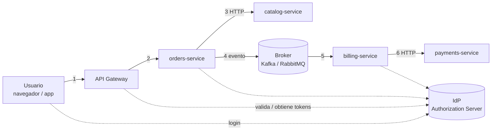
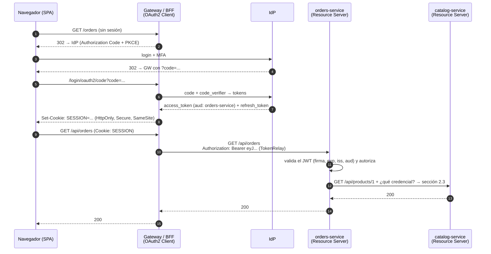
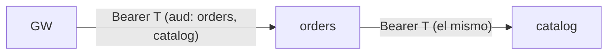
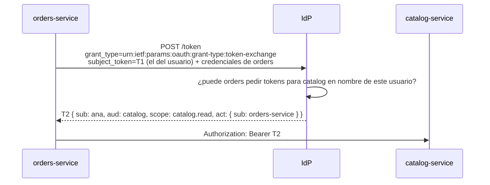
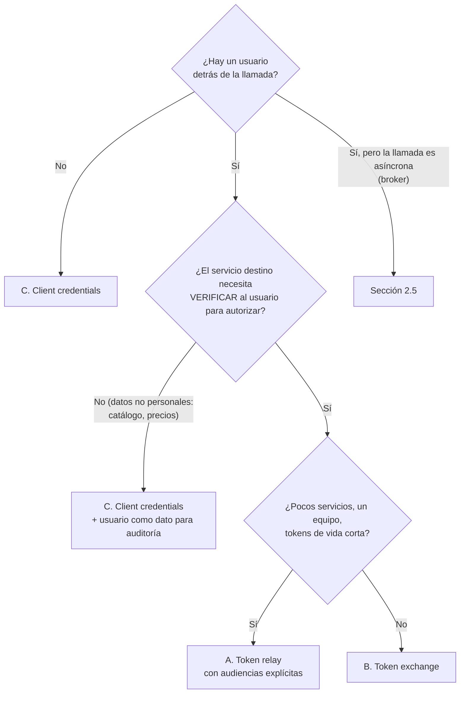
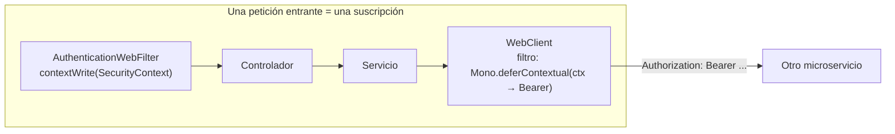
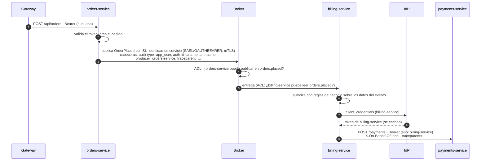

# 2. Identidad entre microservicios: gateway, IdP y brokers

> Temario: **Seguridad web** (II) · Duración: 65 min
> Referencias oficiales: [RFC 8693 — OAuth 2.0 Token Exchange](https://www.rfc-editor.org/rfc/rfc8693) ·
> [RFC 9700 — OAuth 2.0 Security Best Current Practice](https://www.rfc-editor.org/rfc/rfc9700) ·
> [Spring Cloud Gateway — TokenRelay](https://docs.spring.io/spring-cloud-gateway/reference/spring-cloud-gateway-server-webflux/gatewayfilter-factories/tokenrelay-factory.html)
>
> Código: **solo documentación** (los fragmentos Java compilan con Spring Security 7.1.1). El mecanismo reactivo
> en el que se apoya todo, pasar un dato por el `Context` de Reactor hasta un `WebClient`, sí está en el ejemplo:
> `core/CorrelationIdWebFilter` + `client/CorrelationIdPropagation` (ver [3. WebClient](03-webclient.md)).

## 2.1 El problema

En el [bloque anterior](01-seguridad-web.md) un único servicio recibía un token y lo validaba. En un sistema real
la petición del usuario **atraviesa varios servicios**, y a veces continúa de forma **asíncrona** a través de un
broker de mensajería:



En cada salto, el servicio que recibe la llamada tiene que responder **dos preguntas distintas**:

| Pregunta | Se llama | Ejemplo |
|---|---|---|
| ¿**Qué servicio** me está llamando? | Identidad del servicio (*workload identity*) | "Es `orders-service`" |
| ¿**En nombre de qué usuario**? | Identidad del usuario (identidad delegada) | "Actúa en nombre de `ana`, cliente del *tenant* `acme`" |

Principio de partida (*zero trust*): **la red interna no es de confianza**. Cada servicio valida lo que recibe.
"Si ha llegado hasta aquí, ya lo validó la gateway" no es un control de seguridad.

## 2.2 Los actores y su papel

| Actor | Qué hace | Qué **no** debe hacer |
|---|---|---|
| **IdP** (*Authorization Server*: Keycloak, Entra ID, Okta, Auth0, Spring Authorization Server...) | Autentica usuarios (login, MFA). Emite tokens con **audiencia** (`aud`), *scopes* y caducidad. Publica sus claves públicas (JWKS). Ofrece *client credentials*, *token exchange*, *introspection* y revocación. | Conocer las reglas de negocio de cada servicio |
| **API Gateway** (Spring Cloud Gateway, que está construido **sobre WebFlux**) | Punto de entrada único: TLS, enrutado, *rate limiting*. **Valida** el token (o hace el login si actúa como BFF). Autorización **gruesa** ("¿puede entrar a `/orders`?"). **Elimina** cabeceras de identidad que vengan de fuera. Reenvía, traduce o intercambia el token. | Ser el **único** punto de autorización: los servicios también validan (defensa en profundidad) |
| **BFF** (*Backend For Frontend*) | Variante de gateway para una SPA: hace el login OAuth2, **guarda los tokens en el servidor** y da al navegador solo una cookie de sesión (`HttpOnly`, `Secure`, `SameSite`) | Entregar el *access token* al JavaScript |
| **Resource Server** (cada microservicio) | Valida firma, `exp`, `iss` y **`aud`**. Autorización **fina** (reglas por recurso: "¿este pedido es de este cliente?") | Aceptar tokens emitidos para otro servicio |
| **Broker** (Kafka, RabbitMQ...) | Autentica a productores y consumidores y aplica ACL por *topic*/cola | Transportar credenciales de usuario dentro de los mensajes |

### El flujo de extremo a extremo con una gateway que actúa como BFF

Es la arquitectura que recomienda el borrador del IETF *OAuth 2.0 for Browser-Based Applications* para SPAs: el
navegador **nunca ve** el *access token*.



Variante sin BFF (app móvil, cliente de terceros): el cliente obtiene el token y lo envía; la gateway actúa como
**Resource Server** (lo valida) y lo reenvía. En ambos casos, a partir del paso 12 el problema es el mismo:
**¿cómo llama `orders-service` a `catalog-service`?**

## 2.3 Alternativas para pasar la identidad entre servicios (HTTP)

### A. *Token relay* (reenviar el mismo token)

`orders-service` reenvía a `catalog-service` el mismo `Authorization: Bearer` que recibió.



- ✅ Lo más sencillo; no hay llamadas extra al IdP; el usuario llega intacto a todos los servicios.
- ❌ Para que `catalog` lo acepte, el token debe llevar **las dos audiencias**. Con 20 servicios, el token vale
  para los 20: si uno se ve comprometido, puede usar los tokens que recibe contra **cualquier** otro servicio
  (movimiento lateral). Además el token puede **caducar a mitad** de una cadena larga.
- Cuándo: pocos servicios, mismo equipo y mismo dominio de confianza, tokens de vida corta.

### B. *Token exchange* (RFC 8693): un token nuevo para cada salto

`orders-service` presenta el token recibido al IdP (`subject_token`) y obtiene **otro** token para
`catalog-service`: audiencia `catalog`, *scopes* reducidos y, opcionalmente, un claim `act` que deja constancia de
la delegación ("`orders-service` actuando en nombre de `ana`").



- ✅ **Mínimo privilegio** en cada salto; el IdP controla quién puede delegar en quién; auditoría completa de la
  cadena (`act` anidados).
- ❌ Una llamada más al IdP por salto (se cachea hasta que caduca T2) y el IdP tiene que soportarlo (Keycloak
  26.2+ de forma estándar; Microsoft Entra ID tiene una variante propia, el flujo *On-Behalf-Of*).
- Cuándo: la opción recomendada cuando el servicio de destino **necesita la identidad del usuario** para
  autorizar y el sistema tiene muchos servicios o varios equipos.

### C. *Client credentials*: el servicio llama con **su** identidad (y el usuario viaja como dato)

`orders-service` obtiene del IdP un token **propio** (`grant_type=client_credentials`, `sub: orders-service`) y,
si el destino necesita saber el usuario, lo envía como **dato** (un parámetro o una cabecera como
`X-On-Behalf-Of: ana`).

- ✅ Funciona **sin usuario**: procesos *batch*, tareas programadas, consumidores de eventos (sección 2.5). El
  token del servicio se cachea y se reutiliza.
- ❌ `catalog` **confía en lo que `orders` le dice** sobre el usuario: nadie firma ese dato. Si `orders` se ve
  comprometido, puede afirmar que actúa en nombre de cualquiera (*confused deputy*). El destino debe autorizar al
  **servicio** ("`orders` puede consultar stock") y no fiarse del usuario para decisiones sensibles.
- Cuándo: comunicación sistema a sistema; datos no ligados a un usuario (catálogo, precios, stock).

### D. Token interno emitido en el borde (*token translation*, *phantom token*)

Fuera circula un token **opaco** (o solo la cookie de sesión del BFF). La gateway lo valida por *introspection*
(RFC 7662) y lo **traduce** a un JWT interno, rico en claims, que solo circula dentro. Netflix lo llama
*Passport*; Curity, *phantom token*.

- ✅ El token externo no expone datos y se puede revocar al instante; el interno lleva todo lo que necesitan los
  servicios.
- ❌ La gateway (o el servicio que firma) se vuelve una pieza crítica; hay que gestionar sus claves.

### E. ❌ Cabeceras de identidad sin firmar (`X-User-Id: ana`) confiando en la red

La gateway valida el token y pasa hacia dentro solo `X-User-Id`. Cualquiera que llegue a la red interna (un
servicio comprometido, un pod mal configurado) puede enviar `X-User-Id: admin`. Solo es aceptable con controles
adicionales: la gateway **borra** esas cabeceras si vienen de fuera, y la red (políticas de red, *service mesh*
con mTLS) garantiza que **solo** la gateway puede llamar a los servicios. Aun así, es la opción más frágil.

### ➕ mTLS / *service mesh*: la identidad del **servicio** en el transporte

Istio, Linkerd o SPIFFE/SPIRE dan a cada servicio un certificado y cifran y autentican **todas** las conexiones
(mTLS). Eso responde a "¿qué servicio me llama?" sin tocar el código, pero **no** dice nada del usuario: se
**combina** con A, B o C.

### Comparación

| | A. Relay | B. Token exchange | C. Client credentials | D. Token interno | E. Cabecera sin firmar |
|---|---|---|---|---|---|
| ¿El destino puede **verificar** quién es el usuario? | ✅ | ✅ | ❌ (lo afirma el llamante) | ✅ | ❌ |
| Mínimo privilegio por salto | ❌ | ✅ | ✅ (permisos del servicio) | ⚠️ depende | ❌ |
| Llamadas extra al IdP | 0 | 1 por salto (cacheable) | 1 por servicio (cacheable) | *introspection* en el borde | 0 |
| Riesgo si un servicio intermedio se ve comprometido | Alto (reutiliza tokens) | Bajo | Medio | Medio | Muy alto |
| Funciona sin usuario (*batch*, eventos) | ❌ | ❌ | ✅ | ❌ | — |
| Complejidad | Baja | Media | Baja | Alta | Baja (engañosa) |

### Guía de decisión



En el ejemplo del curso (`bff → orders → catalog`): consultar un producto del catálogo no depende del usuario →
**C**; ver un pedido sí depende (solo el dueño o un ADMIN) → **B** (o **A** si el sistema es pequeño).

## 2.4 Cómo se implementa en WebFlux (sin bloquear)

Las tres opciones se implementan con un **`ExchangeFilterFunction`** en el `WebClient`: un filtro que, antes de
cada llamada, **lee la identidad del `Context` de Reactor** (donde la dejó Spring Security, ver
[1.6](01-seguridad-web.md#16-acceder-al-usuario-autenticado)) y añade la cabecera `Authorization`.



**A. Token relay** (el servicio es Resource Server y reenvía el JWT recibido):

```java
@Bean
WebClient catalogWithUserToken(WebClient.Builder builder) {
    return builder.baseUrl("http://catalog")
            .filter(new ServerBearerExchangeFilterFunction())   // lee el token del SecurityContext (Context de Reactor)
            .build();
}
```

**C. Client credentials** y **B. Token exchange** (el servicio es además **OAuth2 Client**; dependencia
`spring-boot-starter-security-oauth2-client`):

```java
@Bean
ReactiveOAuth2AuthorizedClientManager authorizedClientManager(ReactiveClientRegistrationRepository registrations,
                                                              ReactiveOAuth2AuthorizedClientService clients) {
    ReactiveOAuth2AuthorizedClientProvider provider = ReactiveOAuth2AuthorizedClientProviderBuilder.builder()
            .clientCredentials()                                             // C
            .provider(new TokenExchangeReactiveOAuth2AuthorizedClientProvider())   // B (RFC 8693)
            .build();
    var manager = new AuthorizedClientServiceReactiveOAuth2AuthorizedClientManager(registrations, clients);
    manager.setAuthorizedClientProvider(provider);
    return manager;
}

@Bean
WebClient catalogAsService(WebClient.Builder builder, ReactiveOAuth2AuthorizedClientManager manager) {
    var oauth2 = new ServerOAuth2AuthorizedClientExchangeFilterFunction(manager);
    oauth2.setDefaultClientRegistrationId("catalog-client");    // qué registro usar (ver propiedades)
    return builder.baseUrl("http://catalog").filter(oauth2).build();
}
```

```properties
# C. Client credentials: token del propio servicio (se pide una vez y se cachea hasta que caduca)
spring.security.oauth2.client.registration.catalog-client.client-id=orders-service
spring.security.oauth2.client.registration.catalog-client.client-secret=${ORDERS_CLIENT_SECRET}
spring.security.oauth2.client.registration.catalog-client.authorization-grant-type=client_credentials
spring.security.oauth2.client.registration.catalog-client.scope=catalog.read
spring.security.oauth2.client.provider.catalog-client.issuer-uri=https://idp.midominio.com/realms/curso

# B. Token exchange: mismo esquema, otro grant type. El subject_token es el JWT del usuario autenticado
#    spring.security.oauth2.client.registration.catalog-client.authorization-grant-type=urn:ietf:params:oauth:grant-type:token-exchange
```

**En la gateway** (Spring Cloud Gateway, que es una aplicación WebFlux), el filtro `TokenRelay` reenvía el token
del usuario que hizo login (`oauth2Login()`), o uno obtenido con un registro concreto si se indica su id:

```yaml
spring:
  cloud:
    gateway:
      server:
        webflux:
          routes:
            - id: orders
              uri: http://orders-service
              predicates:
                - Path=/api/orders/**
              filters:
                - TokenRelay=              # sin id: el access token del usuario de la sesión
```

### Por qué esto solo funciona si la cadena es reactiva de principio a fin

- El `SecurityContext` está en el `Context` de la **suscripción**. `ServerBearerExchangeFilterFunction` y
  `ServerOAuth2AuthorizedClientExchangeFilterFunction` lo leen con `Mono.deferContextual`.
- El `Context` sobrevive a los cambios de hilo (`publishOn`, `subscribeOn`, la respuesta de `WebClient` llega en
  otro hilo): **no depende del hilo**.
- Se **pierde** cuando se rompe la cadena: un `block()`, un `subscribe()` suelto dentro de un servicio, un
  `CompletableFuture` lanzado a mano... La llamada saldría **sin token** y el otro servicio respondería 401.

🔬 **Demo:** el ejemplo del día hace exactamente esto con un `X-Request-Id` en lugar de un token:
`CorrelationIdWebFilter` lo escribe en el `Context` y `CorrelationIdPropagation` (un `ExchangeFilterFunction`)
lo añade a cada llamada. 📄 `OrderSummaryControllerTest.propagatesTheCorrelationIdToEveryDownstreamCall` comprueba
que llega a las 4 llamadas salientes (1 a pedidos + 3 al catálogo).
Explicado paso a paso, con la comparación directa con el token: [3.2 — El recorrido en 3 pasos](03-webclient.md#el-recorrido-en-3-pasos-configuración-contexto-y-credenciales).

## 2.5 Identidad a través de un broker (Kafka, RabbitMQ...)

Cuando `orders-service` publica `OrderPlaced` y `billing-service` lo procesa, **no hay petición HTTP que
continuar**. Todo lo anterior cambia:

| En HTTP síncrono | En mensajería asíncrona |
|---|---|
| El token vive lo que dura la petición (segundos) | El mensaje se procesa segundos, horas o días después: el token **habrá caducado** |
| El token va a **un** destinatario (`aud`) | Un evento lo leen **N** consumidores, hoy y en el futuro |
| El token viaja y desaparece | El mensaje **se persiste**, se replica, se reprocesa y acaba en una DLQ: un token dentro es una **credencial almacenada** que cualquiera con acceso al *topic* puede reutilizar |
| Hay una cabecera `Authorization` | No hay cabecera `Authorization` estándar en un mensaje |

**Regla: no metas el *access token* del usuario dentro del mensaje.**

### Qué se hace en su lugar



1. **Productor y consumidor se autentican ante el broker con su identidad de servicio**: Kafka con
   SASL/OAUTHBEARER (un token de *client credentials*) o mTLS; RabbitMQ con su *plugin* OAuth 2.0. El broker
   aplica **ACL por *topic***: solo `orders-service` puede publicar en `orders.placed`. Esto es lo que da valor a
   la identidad que viaja en el mensaje: sabemos **quién** lo publicó.
2. **La identidad del usuario viaja como dato, no como credencial**: el mínimo necesario (`sub`, *tenant*, tipo
   de principal), en cabeceras del mensaje (Kafka *record headers*, cabeceras AMQP) o en el propio evento si es un
   dato de negocio ("el pedido es del cliente X"). Existe una extensión estándar de CloudEvents para esto:
   *Auth Context* (`authtype`, `authid`, `authclaims`). Evita datos personales innecesarios: el mensaje se
   almacena.
3. **Si hace falta garantizar la integridad del contexto** (broker compartido por muchos equipos, requisitos de
   auditoría o no repudio): el productor **firma** el contexto de identidad (un JWS de vida larga con
   `aud` = el *topic*, o un token emitido por el IdP para ese fin) y el consumidor verifica la firma con la clave
   pública del productor.
4. **El consumidor actúa con su propia identidad**: si necesita llamar a otros servicios, usa *client
   credentials* (alternativa C) y pasa el usuario como dato para auditoría. Si el destino exige un token **de
   usuario**, algunos IdP permiten un *token exchange* con suplantación (*impersonation*) a partir del `sub` del
   evento: es muy potente, así que debe estar muy restringido por política del IdP.
5. **Trazabilidad**: el mismo identificador de correlación (en el ejemplo, `X-Request-Id`; en producción la
   cabecera `traceparent` de W3C Trace Context, que Micrometer Tracing propaga sola) viaja en las cabeceras del
   mensaje para seguir la operación de punta a punta.
6. Si el evento se publica junto con un cambio en base de datos, el patrón *Transactional Outbox* guarda el
   evento **y su contexto de identidad** en la misma transacción.

Un evento con su contexto de identidad (formato CloudEvents con la extensión *Auth Context*):

```json
{
  "specversion": "1.0",
  "type": "com.curso.orders.OrderPlaced",
  "source": "/orders-service",
  "id": "5d1c0a7e-...",
  "time": "2026-09-30T10:15:00Z",
  "authtype": "app_user",
  "authid": "4f1c...e9",
  "authclaims": "{\"tenant\":\"acme\",\"roles\":[\"USER\"]}",
  "traceparent": "00-4bf92f3577b34da6a3ce929d0e0e4736-00f067aa0ba902b7-01",
  "data": { "orderId": "e2e1e1ce-...", "customerId": "c1", "total": 587.90 }
}
```

La propia especificación de *Auth Context* advierte que es **informativa y no protege el evento**: la confianza
la dan el paso 1 (quién puede publicar) y, si hace falta, el paso 3 (firma).

### Qué viaja y qué no

| ✅ Viaja en el mensaje | ❌ No viaja en el mensaje |
|---|---|
| Identificador del usuario (`sub`) o una referencia indirecta | *Access token* o *refresh token* del usuario |
| *Tenant*, tipo de principal, roles **relevantes** para el consumidor | Contraseñas, *client secrets*, claves API |
| Servicio productor | Datos personales que el consumidor no necesita |
| `traceparent` / identificador de correlación | Cabeceras HTTP copiadas "por si acaso" |
| Firma del contexto (opcional) | |

## 2.6 Resumen

- **IdP**: autentica y emite tokens con audiencia; es la única fuente de verdad sobre identidades.
- **Gateway**: punto de entrada; valida o hace el login (BFF), limpia cabeceras, reenvía o traduce tokens.
  **No** sustituye a la validación en cada servicio.
- **Entre servicios (HTTP)**: *token relay* si el sistema es pequeño; *token exchange* si el destino necesita al
  usuario y hay muchos servicios; *client credentials* cuando no hay usuario o el dato no es personal. Nunca
  cabeceras sin firmar confiando en la red.
- **A través de un broker**: servicios autenticados ante el broker + ACL; el usuario viaja como **dato**
  (opcionalmente firmado), nunca su token; el consumidor actúa con su propia identidad.
- **En WebFlux**: todo se apoya en el `Context` de Reactor y en `ExchangeFilterFunction`. Si la cadena se rompe
  (`block()`, `subscribe()` suelto), la identidad se pierde.

## Referencias para ampliar

- RFC 6749 — The OAuth 2.0 Authorization Framework: <https://www.rfc-editor.org/rfc/rfc6749>
- RFC 8693 — OAuth 2.0 Token Exchange: <https://www.rfc-editor.org/rfc/rfc8693>
- RFC 9700 — Best Current Practice for OAuth 2.0 Security: <https://www.rfc-editor.org/rfc/rfc9700>
- RFC 7662 — OAuth 2.0 Token Introspection: <https://www.rfc-editor.org/rfc/rfc7662>
- IETF draft — OAuth 2.0 for Browser-Based Applications (patrón BFF): <https://datatracker.ietf.org/doc/draft-ietf-oauth-browser-based-apps/>
- Spring Cloud Gateway — TokenRelay GatewayFilter: <https://docs.spring.io/spring-cloud-gateway/reference/spring-cloud-gateway-server-webflux/gatewayfilter-factories/tokenrelay-factory.html>
- Spring Security — OAuth2 Client (reactivo): <https://docs.spring.io/spring-security/reference/reactive/oauth2/client/index.html>
- Spring Security — Authorization Grant Support (client credentials, token exchange): <https://docs.spring.io/spring-security/reference/reactive/oauth2/client/authorization-grants.html#oauth2-client-token-exchange>
- Spring Security — Bearer tokens: propagación con `ServerBearerExchangeFilterFunction`: <https://docs.spring.io/spring-security/reference/reactive/oauth2/resource-server/bearer-tokens.html>
- Keycloak — Token exchange: <https://www.keycloak.org/securing-apps/token-exchange>
- Microsoft Entra ID — flujo On-Behalf-Of: <https://learn.microsoft.com/en-us/entra/identity-platform/v2-oauth2-on-behalf-of-flow>
- Curity — Phantom token pattern: <https://curity.io/resources/learn/phantom-token-pattern/>
- SPIFFE — identidad de servicios: <https://spiffe.io/docs/latest/spiffe-about/overview/>
- Apache Kafka — SASL/OAUTHBEARER: <https://kafka.apache.org/41/security/authentication-using-sasl/#authentication-using-sasloauthbearer>
- RabbitMQ — OAuth 2.0: <https://www.rabbitmq.com/docs/oauth2>
- CloudEvents — extensión Auth Context: <https://github.com/cloudevents/spec/blob/main/cloudevents/extensions/authcontext.md>
- W3C Trace Context: <https://www.w3.org/TR/trace-context/>
- Transactional Outbox: <https://microservices.io/patterns/data/transactional-outbox.html>

➡️ Siguiente: [3. WebClient: llamadas entre microservicios sin romper la reactividad](03-webclient.md)
