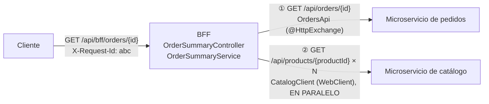
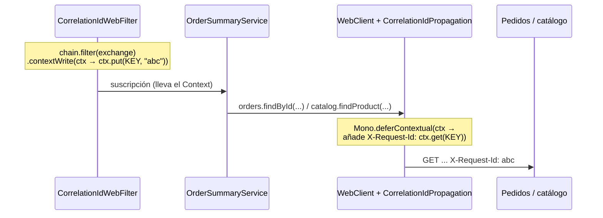

# 3. WebClient: llamadas entre microservicios sin romper la reactividad

> Temario: **WebClient** · Duración: 75 min
> Referencia oficial: [Spring WebFlux — WebClient](https://docs.spring.io/spring-framework/reference/web/webflux-webclient.html) ·
> [HTTP Service Client](https://docs.spring.io/spring-framework/reference/web/webflux-http-service-client.html)
>
> Código: `client/` (`CatalogClient`, `OrdersApi`, `ClientConfig`, `CorrelationIdPropagation`), `bff/`
> (`OrderSummaryService`, `OrderSummaryController`), `core/CorrelationIdWebFilter`
> · Tests: `bff/OrderSummaryControllerTest`, `bff/OrderSummaryTest`, `bff/FakeRemoteServices`

## 3.1 Qué es WebClient y cuándo usarlo

`WebClient` es el cliente HTTP **reactivo** de Spring: cada llamada devuelve un `Mono`/`Flux` y **no ocupa un hilo
mientras espera** la respuesta. Por debajo usa Reactor Netty, el mismo motor que el servidor.

| Cliente | Modelo | Úsalo en |
|---|---|---|
| `WebClient` | Reactivo, no bloqueante, *streaming* | Aplicaciones **WebFlux**; cualquier sitio donde haya que componer muchas llamadas concurrentes |
| `RestClient` (Spring 6.1+) | Síncrono, API fluida parecida a `WebClient` | Aplicaciones **Spring MVC** (con hilos virtuales, muy razonable) |
| `RestTemplate` | Síncrono, API antigua | Código existente. En Spring Framework 7 está **en retirada** en favor de `RestClient` |
| Interfaz `@HttpExchange` | Declarativo; por debajo usa `WebClient` o `RestClient` | Clientes de APIs con muchos *endpoints* (sección 3.9) |

> Regla del día: **en una aplicación WebFlux, las llamadas a otros servicios se hacen con `WebClient` (o con una
> interfaz `@HttpExchange` sobre `WebClient`)**. `RestClient` o `RestTemplate` bloquearían un hilo del *event
> loop*.

## 3.2 El ejemplo: un BFF que encadena dos microservicios



`GET /api/bff/orders/{id}` devuelve el pedido **enriquecido**: para cada línea, el precio de compra (del servicio
de pedidos) y el precio y la disponibilidad **actuales** (del servicio de catálogo).

- Se usa un **BFF** porque es el caso típico de composición: una pantalla necesita datos de varios servicios.
- En el curso los tres "microservicios" están en la misma aplicación, pero el BFF los llama **por HTTP** con URLs
  configurables (`application.properties`). En producción basta con cambiar las URLs.
- En los tests, los servicios remotos se simulan con un servidor Reactor Netty mínimo (`FakeRemoteServices`) que
  permite provocar latencia, 404, 500, 503 intermitentes y respuestas que no llegan a tiempo.

```bash
# con la aplicación arrancada (./mvnw spring-boot:run)
curl -s -X POST localhost:8080/api/orders -H "Content-Type: application/json" \
     -d '{"customerId":"c1","details":[{"productId":"1","quantity":1},{"productId":"3","quantity":2}]}'
curl -s localhost:8080/api/bff/orders/{id} -H "X-Request-Id: demo-1"
```

```json
{"orderId":"e2e1e1ce-...","customerId":"c1","createdAt":"2026-09-30T05:03:50.102Z",
 "lines":[{"productId":"1","productName":"Teclado mecánico","quantity":1,"priceAtPurchase":89.90,"currentPrice":89.90,"status":"AVAILABLE"},
          {"productId":"3","productName":"Monitor 27 pulgadas","quantity":2,"priceAtPurchase":249.00,"currentPrice":249.00,"status":"AVAILABLE"}],
 "totalAtPurchase":587.90,"totalAtCurrentPrices":587.90,"complete":true}
```

## 3.3 Crear y configurar un WebClient

> ⚠️ **Novedad de Spring Boot 4**: la autoconfiguración de `WebClient` está en su propio *starter*.
> `spring-boot-starter-webflux` ya **no** trae el `WebClient.Builder`:
>
> ```xml
> <dependency>
>     <groupId>org.springframework.boot</groupId>
>     <artifactId>spring-boot-starter-webclient</artifactId>
> </dependency>
> ```

Spring Boot publica un `WebClient.Builder` **prototype** (cada inyección recibe una copia) ya configurado con los
codecs de Jackson de la aplicación, métricas y trazas (Micrometer), los *timeouts* de `spring.http.clients.*` y
todos los `WebClientCustomizer` que haya en el contexto. **Construye siempre a partir de él**, no con
`WebClient.create()`:

```java
// client/ClientConfig.java
@Bean
WebClient catalogWebClient(WebClient.Builder builder, @Value("${app.services.catalog.base-url}") String baseUrl) {
    return builder.baseUrl(baseUrl).build();
}
```

```properties
# application.properties
app.services.catalog.base-url=http://localhost:${server.port}
# Timeouts por defecto de TODOS los clientes HTTP que crea Spring Boot
spring.http.clients.connect-timeout=2s
spring.http.clients.read-timeout=5s
```

Si hace falta ajustar el conector (pool de conexiones, *timeouts* de Netty, HTTP/2...):

```java
ConnectionProvider pool = ConnectionProvider.builder("catalog")
        .maxConnections(100)                               // conexiones simultáneas a ese servicio
        .pendingAcquireTimeout(Duration.ofSeconds(2))      // espera máxima por una conexión libre
        .maxIdleTime(Duration.ofSeconds(30))
        .build();
HttpClient httpClient = HttpClient.create(pool)
        .option(ChannelOption.CONNECT_TIMEOUT_MILLIS, 2_000)
        .responseTimeout(Duration.ofSeconds(3));
return builder
        .baseUrl("http://catalog")
        .defaultHeader("Accept", MediaType.APPLICATION_JSON_VALUE)
        .clientConnector(new ReactorClientHttpConnector(httpClient))
        .codecs(codecs -> codecs.defaultCodecs().maxInMemorySize(512 * 1024))   // por defecto, 256 KB
        .build();
```

## 3.4 `retrieve()` frente a `exchangeToMono()`

**`retrieve()`**: la forma habitual. Un 4xx/5xx se convierte en `WebClientResponseException` (con subclases por
código: `NotFound`, `ServiceUnavailable`...):

```java
// client/CatalogClient.java
return webClient.get()
        .uri("/api/products/{id}", id)                    // plantilla: el id se codifica
        .retrieve()
        .bodyToMono(ProductDto.class)
        .onErrorResume(WebClientResponseException.NotFound.class, e -> Mono.empty())   // 404 = "no existe"
        ...
```

Con `onStatus` se decide qué excepción produce un código concreto:

```java
.retrieve()
.onStatus(HttpStatus.CONFLICT::equals,
          response -> response.bodyToMono(String.class).map(IllegalStateException::new))
.bodyToMono(ProductDto.class);
```

**`exchangeToMono()` / `exchangeToFlux()`**: control total sobre la respuesta (estado, cabeceras y cuerpo). Eres
responsable de **consumir o liberar** el cuerpo en todos los casos:

```java
return webClient.get().uri("/api/products/{id}", id)
        .exchangeToMono(response -> {
            if (response.statusCode().is2xxSuccessful()) {
                return response.bodyToMono(ProductDto.class);
            }
            if (response.statusCode().isSameCodeAs(HttpStatus.NOT_FOUND)) {
                return response.releaseBody().then(Mono.empty());   // liberar la conexión
            }
            return response.createError();                          // WebClientResponseException
        });
```

> El antiguo `exchange()` (sin `ToMono`) ya no existe: permitía olvidarse de consumir el cuerpo y dejar
> conexiones bloqueadas en el pool.

Otras formas de leer la respuesta: `toEntity(ProductDto.class)` (estado + cabeceras + cuerpo),
`toBodilessEntity()`, `bodyToFlux(...)`.

## 3.5 Cuerpos

```java
// Enviar
webClient.post().uri("/api/orders")
        .contentType(MediaType.APPLICATION_JSON)
        .bodyValue(Map.of("customerId", "c1", "details", List.of(Map.of("productId", "1", "quantity", 1))))
        .retrieve()
        .toBodilessEntity();
// .body(flux, Product.class) para enviar un Publisher en streaming
// .body(BodyInserters.fromMultipartData(...)) para multipart

// Recibir en streaming: cada elemento se procesa en cuanto llega, sin esperar al final
Flux<ProductDto> products = webClient.get().uri("/api/products")
        .accept(MediaType.APPLICATION_NDJSON)
        .retrieve()
        .bodyToFlux(ProductDto.class);
```

**Contratos entre servicios: *tolerant reader*.** `ProductDto` y `OrderDto` son del BFF y solo declaran los
campos que usa; **no** se reutiliza `catalog.Product` (dos microservicios comparten el contrato JSON, no las
clases). Como la aplicación activa `fail-on-unknown-properties` para lo que **recibe de sus clientes**, los DTO de
cliente llevan `@JsonIgnoreProperties(ignoreUnknown = true)`: si el catálogo añade un campo, el BFF no se rompe.

## 3.6 Errores de otros servicios

| Situación | Excepción en el cliente | Qué hace el ejemplo |
|---|---|---|
| El servicio responde 404 | `WebClientResponseException.NotFound` | Producto → `Mono.empty()` (línea `DISCONTINUED`). Pedido → `OrderNotFoundException` (**nuestro** 404 `ProblemDetail`) |
| Responde 5xx | `WebClientResponseException` (`InternalServerError`, `ServiceUnavailable`...) | Producto → reintento y, si sigue fallando, línea `UNKNOWN`. Pedido → **502** |
| No hay conexión, *timeout* de lectura | `WebClientRequestException` | Igual que el caso anterior |
| El operador `timeout()` salta | `TimeoutException` | Igual que el caso anterior |

```java
// bff/OrderSummaryService.java: el 404 del OTRO servicio se traduce al error de NUESTRA API
return orders.findById(orderId)
        .onErrorMap(WebClientResponseException.NotFound.class, e -> new OrderNotFoundException(orderId));

// error/GlobalExceptionHandler.java: cualquier otro fallo de un servicio dependiente -> 502 sin detalles internos
@ExceptionHandler
public ProblemDetail handleUpstream(WebClientException ex) { ... HttpStatus.BAD_GATEWAY ... }
```

> No reenvíes al cliente el cuerpo de error del otro servicio: puede contener URLs internas, trazas o datos de
> otro dominio. Tradúcelo a un `ProblemDetail` propio.

## 3.7 Context: propagar datos sin ThreadLocal

En Spring MVC, datos como el usuario o un identificador de correlación se guardan en un `ThreadLocal`. En WebFlux
**no funciona**: una petición pasa por varios hilos (el de Netty que la recibe, el que recibe la respuesta del
catálogo...) y cada hilo atiende muchas peticiones. Reactor ofrece el **`Context`**: un mapa inmutable asociado a
la **suscripción**, que viaja con ella aunque cambie el hilo.



```java
// core/CorrelationIdWebFilter.java: ESCRIBIR en el Context (lo ve todo lo que hay "dentro" de la cadena)
return chain.filter(exchange)
        .contextWrite(context -> context.put(CorrelationId.CONTEXT_KEY, id));

// client/CorrelationIdPropagation.java: LEER del Context en cada llamada saliente
static final ExchangeFilterFunction FILTER = (request, next) -> Mono.deferContextual(context ->
        next.exchange(CorrelationId.from(context)
                .map(id -> ClientRequest.from(request).header(CorrelationId.HEADER, id).build())
                .orElse(request)));
```

- `CorrelationIdPropagation` es un `WebClientCustomizer`: Spring Boot lo aplica al `WebClient.Builder` **y** a los
  clientes de `@ImportHttpServices`. Un único punto para todas las llamadas salientes.
- Es **exactamente** lo que hace `ServerBearerExchangeFilterFunction` con el token del usuario
  ([2.4](02-identidad-entre-microservicios.md#24-cómo-se-implementa-en-webflux-sin-bloquear)).
- 📄 `OrderSummaryControllerTest.propagatesTheCorrelationIdToEveryDownstreamCall`: una petición con
  `X-Request-Id: curso-123` produce 4 llamadas salientes (1 a pedidos + 3 al catálogo) y las 4 llevan `curso-123`.
- En el log de la aplicación se ve el mismo id en la petición al BFF y en las que el BFF hace a pedidos y catálogo
  (`TimingWebFilter` lo imprime).

**Filtros y atributos.** Un `ExchangeFilterFunction` es el equivalente de un `WebFilter` en el cliente: sirve para
autenticación, *logging*, métricas... Los **atributos** son datos que se pasan **a los filtros** sin enviarlos al
servidor:

```java
static final ExchangeFilterFunction LOGGING = ExchangeFilterFunction.ofRequestProcessor(request -> {
    log.info("{} {} ({})", request.method(), request.url(), request.attribute("operation").orElse("-"));
    return Mono.just(request);
});

webClient.get().uri("/api/products/1")
        .attribute("operation", "catalog.findProduct")    // lo lee el filtro; no viaja en la petición
        .retrieve()...
```

## 3.8 Timeouts, reintentos y degradación

Una llamada remota **siempre** puede tardar o fallar. Hay tres niveles de protección:

| Nivel | Dónde | En el ejemplo |
|---|---|---|
| Conexión | `spring.http.clients.connect-timeout` / `ChannelOption.CONNECT_TIMEOUT_MILLIS` | `2s` |
| Respuesta (red) | `spring.http.clients.read-timeout` / `HttpClient.responseTimeout` | `5s` (global), `2s` para el grupo `orders` |
| Negocio, **por llamada** | operador `timeout(Duration)` de Reactor | `800 ms` por intento en `CatalogClient` |

```java
// client/CatalogClient.java
private static final Retry RETRY = Retry.backoff(2, Duration.ofMillis(100))   // 2 reintentos: ~100 ms y ~200 ms (+ jitter)
        .filter(CatalogClient::isTransient);

return webClient.get().uri("/api/products/{id}", id)
        .retrieve()
        .bodyToMono(ProductDto.class)
        .onErrorResume(WebClientResponseException.NotFound.class, e -> Mono.empty())
        .timeout(TIMEOUT)          // 800 ms por intento
        .retryWhen(RETRY);         // re-suscribirse = una petición HTTP NUEVA

private static boolean isTransient(Throwable error) {    // 5xx, timeout o conexión: sí; 400/401/404: nunca
    return error instanceof WebClientResponseException r && r.getStatusCode().is5xxServerError()
            || error instanceof TimeoutException
            || error instanceof WebClientRequestException;
}
```

- **Reintenta solo lo transitorio** y solo operaciones **idempotentes** (GET, PUT, DELETE). Reintentar un `POST`
  que crea un pedido puede crearlo dos veces.
- ***Backoff* exponencial con *jitter***: si 100 clientes fallan a la vez, no deben reintentar todos en el mismo
  milisegundo.
- Como `timeout` va **antes** de `retryWhen`, se aplica a cada intento. Puesto detrás limitaría el total.

**Degradación.** Si el catálogo falla, ¿debe fallar el resumen entero? En el ejemplo, no: la línea se marca
`UNKNOWN` y el resumen indica `complete: false`.

```java
// bff/OrderSummaryService.java
private Mono<LineView> enrich(LineDto line) {
    return catalog.findProduct(line.productId())
            .map(product -> LineView.of(line, product))          // AVAILABLE / OUT_OF_STOCK
            .defaultIfEmpty(LineView.discontinued(line))         // 404
            .onErrorResume(error -> Mono.just(LineView.unknown(line)));   // tras los reintentos
}
```

📄 `OrderSummaryControllerTest.degradesInsteadOfFailingWhenTheCatalogMisbehaves` (pedido `o-2` del servidor
simulado):

| Producto | Comportamiento simulado | Llamadas | Resultado |
|---|---|---|---|
| `p1` | 200 tras 300 ms | 1 | `AVAILABLE` |
| `gone` | 404 | 1 (un 404 no se reintenta) | `DISCONTINUED` |
| `slow` | Responde a los 3 s | 3 (intento + 2 reintentos) | `UNKNOWN` |
| `flaky` | 503 y, al reintentar, 200 | 2 | `AVAILABLE` |

> Para producción, Resilience4j (vía Spring Cloud Circuit Breaker) añade *circuit breaker* y *bulkhead* sobre
> `Mono`/`Flux`: si el catálogo falla continuamente, deja de llamarlo un tiempo en lugar de acumular *timeouts*.

## 3.9 HTTP Service Client (`@HttpExchange`)

El cliente se **declara** como una interfaz y Spring genera la implementación:

```java
// client/OrdersApi.java
@HttpExchange("/api/orders")
public interface OrdersApi {

    @GetExchange("/{id}")
    Mono<OrderDto> findById(@PathVariable String id);   // Mono -> NO bloqueante
}
```

Con Spring Framework 7 + Spring Boot 4 se registra con `@ImportHttpServices` y se configura por **grupos**:

```java
// client/ClientConfig.java
@Configuration
@ImportHttpServices(group = "orders", types = OrdersApi.class, clientType = HttpServiceGroup.ClientType.WEB_CLIENT)
public class ClientConfig { ... }
```

```properties
spring.http.serviceclient.orders.base-url=http://localhost:${server.port}
spring.http.serviceclient.orders.read-timeout=2s
```

> ⚠️ `clientType = WEB_CLIENT`: sin él, el grupo usa **`RestClient`** (bloqueante). Y los métodos deben devolver
> `Mono`/`Flux`: un método que devuelva `OrderDto` directamente bloquea hasta tener la respuesta.

Sin Spring Boot (o para crear el proxy a mano):

```java
WebClient webClient = builder.baseUrl("http://orders").build();
HttpServiceProxyFactory factory = HttpServiceProxyFactory.builderFor(WebClientAdapter.create(webClient)).build();
OrdersApi orders = factory.createClient(OrdersApi.class);
```

| | `WebClient` a mano (`CatalogClient`) | `@HttpExchange` (`OrdersApi`) |
|---|---|---|
| Código | Más, pero todo explícito | Mínimo |
| Control por llamada (`onStatus`, `exchangeToMono`) | Total | Limitado: la lógica va en quien lo usa (`OrderSummaryService.findOrder`) |
| Configuración | `WebClient.Builder` | Grupos `spring.http.serviceclient.<grupo>.*` |
| Ideal para | Pocas llamadas con lógica especial | APIs con muchos *endpoints* |

## 3.10 Uso síncrono (`block()`): solo fuera del *event loop*

`block()` suscribe y **espera** en el hilo actual. Es legítimo en un `main`, en un test, en un proceso *batch* o
en una aplicación Spring MVC (aunque ahí es mejor `RestClient`). **Nunca** dentro de una petición WebFlux:

```java
ProductDto product = webClient.get().uri("/api/products/1").retrieve().bodyToMono(ProductDto.class)
        .block(Duration.ofSeconds(5));   // siempre con un límite de tiempo
```

## 3.11 La cadena reactiva entre microservicios: qué hay que hacer para no romperla

### El código

```java
// bff/OrderSummaryService.java
public Mono<OrderSummary> summary(String orderId) {
    return findOrder(orderId)                                             // ① Mono<OrderDto>
            .flatMap(order -> Flux.fromIterable(order.details())
                    .flatMapSequential(this::enrich, CONCURRENCY)         // ② en paralelo, resultados EN ORDEN
                    .reduce(OrderSummary.start(order), OrderSummary::add)); // ③ acumular (sin collectList)
}

public Flux<LineView> lines(String orderId) {                             // la versión en streaming (NDJSON)
    return findOrder(orderId)
            .flatMapMany(order -> Flux.fromIterable(order.details()))
            .flatMap(this::enrich, CONCURRENCY);                          // orden de llegada
}
```

1. **① depende de nada, ② depende de ①** (necesita los `productId` del pedido) → ② va **dentro** del `flatMap`
   de ①. Nada espera: el `flatMap` se ejecuta cuando llega la respuesta de pedidos.
2. **Las N llamadas de ② son independientes entre sí** → van **en paralelo** con `flatMapSequential`, limitadas a
   `CONCURRENCY = 8` para no saturar al catálogo con un pedido de 20 líneas.
3. **③ `reduce` con un acumulador inmutable** (`OrderSummary.add`, el mismo patrón que `OrderValidation` del
   día 2): cada línea se suma según llega. No hay `List<LineView>` intermedia ni segundo recorrido para los totales.
4. **La versión `lines`** no acumula nada: cada línea se escribe en la respuesta NDJSON en cuanto responde el
   catálogo (`flatMap`, orden de llegada).
5. El método **devuelve** el `Mono`. No hay `subscribe()` ni `block()`: quien se suscribe es WebFlux, al escribir
   la respuesta. Y con esa suscripción viaja el `Context` (el `X-Request-Id`, o el token del usuario).

```mermaid
gantt
    title 1 pedido con 3 líneas (latencia de 300 ms por producto)
    dateFormat X
    axisFormat %L ms
    section En serie (concatMap o block)
    pedidos      :0, 20
    producto 1   :20, 320
    producto 2   :320, 620
    producto 3   :620, 920
    section En paralelo (flatMapSequential)
    pedidos      :0, 20
    producto 1   :20, 320
    producto 2   :20, 320
    producto 3   :20, 320
```



📄 `OrderSummaryControllerTest.callsTheCatalogInParallel`: con 3 productos a 300 ms, el resumen tarda **menos de
900 ms** (en serie serían ≥ 900 ms).

Si las llamadas independientes son **de distinto tipo** (por ejemplo, el pedido y el cliente), se combinan con
`Mono.zip`, que se suscribe a las dos a la vez:

```java
Mono.zip(ordersApi.findById(orderId), customersApi.findById(customerId))
        .map(tuple -> tuple.getT1().id() + " de " + tuple.getT2().name());
```

### El anti-patrón: escribirlo "como en Spring MVC"

```java
// bff/OrderSummaryService.summaryBlocking  ->  GET /api/bff/orders/{id}/blocking
OrderDto order = findOrder(orderId).block();                  // 💥
OrderSummary summary = OrderSummary.start(order);
for (LineDto line : order.details()) {                         // y además en serie
    summary = summary.add(enrich(line).block());
}
return Mono.just(summary);
```

```text
java.lang.IllegalStateException: block()/blockFirst()/blockLast() are blocking,
which is not supported in thread reactor-http-nio-8
```

Reactor detecta que el hilo actual es del *event loop* (hay tan pocos como núcleos de CPU) y se niega a esperar.
Si no lo impidiera, unas pocas peticiones lentas dejarían el servidor **sin hilos** para atender a nadie; y si un
servicio se llama a sí mismo (como el BFF del curso), el hilo que espera la respuesta podría ser el mismo que
tiene que producirla: **bloqueo permanente**. 📄 `blockingInsideTheEventLoopIsRejected` → 500.

### Checklist

| ✅ Haz | ❌ Evita |
|---|---|
| Devuelve `Mono`/`Flux` desde servicios y clientes | `block()`, `blockFirst()`, `toFuture().get()` en una petición |
| Encadena lo dependiente con `flatMap` | `subscribe()` dentro de un servicio ("dispara y olvida"): pierde errores, *backpressure* y `Context` |
| Paraleliza lo independiente: `flatMap(f, n)`, `flatMapSequential(f, n)`, `Mono.zip` | `concatMap` o bucles cuando el orden de ejecución no importa |
| Limita la concurrencia hacia cada servicio | `flatMap` sin límite sobre listas grandes (por defecto 256 a la vez) |
| `timeout` + reintento **solo de lo transitorio** + degradación | Reintentar un 400/401/404 o un `POST` no idempotente |
| Transmite en *streaming* (`bodyToFlux`, NDJSON) o acumula con `reduce` | `collectList()` "por costumbre" |
| Propaga datos con el `Context` de Reactor | `ThreadLocal`, MDC sin integración, variables estáticas |
| Aísla lo bloqueante inevitable: `Mono.fromCallable(...).subscribeOn(Schedulers.boundedElastic())` | JDBC, SDKs bloqueantes o `Thread.sleep` en un hilo del *event loop* |
| Construye los clientes con el `WebClient.Builder` de Boot | `WebClient.create()` (sin codecs de la app, sin trazas ni *timeouts*) |
| Detecta bloqueos en los tests con BlockHound (día 4) | Descubrirlos en producción |

```java
// Una librería que SOLO existe en versión bloqueante (SDK legado): se ejecuta en otro pool de hilos
Mono<BigDecimal> price = Mono.fromCallable(() -> legacySdk.price(productId))
        .subscribeOn(Schedulers.boundedElastic());
```

## 3.12 Probarlo

```bash
cd examples/day-03
./mvnw spring-boot:run
```

`requests.http`, sección 2: crear un pedido y pedir su resumen (`/api/bff/orders/{id}`), en *streaming*
(`/lines`), la versión bloqueante (`/blocking` → 500) y un pedido inexistente (404 `ProblemDetail`). Observa en el
log el mismo `X-Request-Id` en las tres peticiones de cada resumen.

Tests (`./mvnw test -Dtest='OrderSummary*'`):

| Test | Qué demuestra |
|---|---|
| `composesOrderAndCatalogInOneResponse` | Composición de dos servicios; `flatMapSequential` conserva el orden |
| `callsTheCatalogInParallel` | Las llamadas al catálogo se hacen a la vez |
| `propagatesTheCorrelationIdToEveryDownstreamCall` | El `Context` llega a todas las llamadas salientes |
| `degradesInsteadOfFailingWhenTheCatalogMisbehaves` | 404, *timeout*, reintento y degradación |
| `streamsEnrichedLinesAsNdjson` | La misma cadena en *streaming* |
| `translatesRemoteErrorsToOwnProblemDetails` | 404 remoto → 404 propio; 500 remoto → 502 |
| `blockingInsideTheEventLoopIsRejected` | `block()` en el *event loop* → `IllegalStateException` |
| `OrderSummaryTest` | El acumulador del `reduce`, sin Spring ni HTTP |

## Referencias para ampliar

- WebClient: <https://docs.spring.io/spring-framework/reference/web/webflux-webclient.html>
- WebClient — Configuration: <https://docs.spring.io/spring-framework/reference/web/webflux-webclient/client-builder.html>
- WebClient — `retrieve()`: <https://docs.spring.io/spring-framework/reference/web/webflux-webclient/client-retrieve.html>
- WebClient — Exchange: <https://docs.spring.io/spring-framework/reference/web/webflux-webclient/client-exchange.html>
- WebClient — Filters: <https://docs.spring.io/spring-framework/reference/web/webflux-webclient/client-filter.html>
- WebClient — Attributes y Context: <https://docs.spring.io/spring-framework/reference/web/webflux-webclient/client-attributes.html> · <https://docs.spring.io/spring-framework/reference/web/webflux-webclient/client-context.html>
- WebClient — Synchronous Use: <https://docs.spring.io/spring-framework/reference/web/webflux-webclient/client-synchronous.html>
- HTTP Service Client: <https://docs.spring.io/spring-framework/reference/web/webflux-http-service-client.html>
- Spring Boot — Calling REST Services (WebClient, HTTP Service Clients): <https://docs.spring.io/spring-boot/reference/io/rest-client.html>
- Reactor — Context: <https://projectreactor.io/docs/core/release/reference/advancedFeatures/context.html>
- Reactor — Retry (Javadoc): <https://projectreactor.io/docs/core/release/api/reactor/util/retry/Retry.html>
- Reactor Netty — HTTP Client: <https://projectreactor.io/docs/netty/release/reference/http-client.html>
- Reactor — ¿Cómo envuelvo una llamada bloqueante?: <https://projectreactor.io/docs/core/release/reference/faq.html#faq.wrap-blocking>
- Martin Fowler — Tolerant Reader: <https://martinfowler.com/bliki/TolerantReader.html>

➡️ Siguiente: [4. Caché HTTP](04-cache-http.md)
