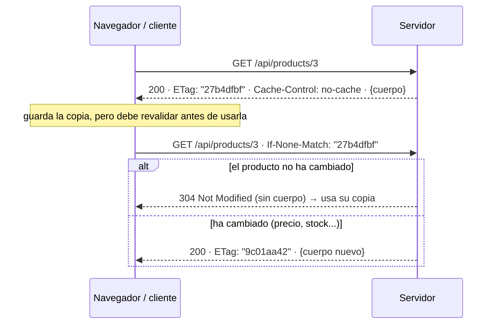

# 4. Caché HTTP

> Temario: **Caché HTTP** · Duración: 35 min
> Referencia oficial: [Spring WebFlux — HTTP Caching](https://docs.spring.io/spring-framework/reference/web/webflux/caching.html)
>
> Código: `catalog/ProductController.java` (`findById`, `image`), `orders/OrderHandler.java` (`findById`),
> `application.properties` (`spring.web.resources.cache.*`) · Tests: `caching/HttpCachingTest.java`

## 4.1 Para qué sirve

La respuesta más rápida es la que **no se pide**, y la segunda más rápida es la que se pide pero **no se vuelve a
enviar**. HTTP define ambas cosas:

| Mecanismo | Cabeceras | Efecto |
|---|---|---|
| **Frescura** | `Cache-Control: max-age=...` | Durante ese tiempo el navegador (o un proxy/CDN) reutiliza la copia **sin preguntar** al servidor |
| **Validación** | `ETag` / `Last-Modified` en la respuesta; `If-None-Match` / `If-Modified-Since` en la petición | Pasado ese tiempo el cliente pregunta "¿ha cambiado?" y, si no, el servidor responde **304 Not Modified sin cuerpo** |

Entre microservicios también importa: menos bytes, menos CPU de serialización y menos carga en los servicios de
detrás.

## 4.2 `Cache-Control`

| Directiva | Significado |
|---|---|
| `max-age=600` | Fresca durante 600 s |
| `no-cache` | Se puede guardar, pero **hay que revalidar** antes de cada uso (¡no significa "no cachear"!) |
| `no-store` | No se guarda en ningún sitio (datos sensibles) |
| `private` | Solo la caché del navegador del usuario; un proxy o CDN compartido **no** debe guardarla |
| `public` | Cualquier caché puede guardarla |
| `s-maxage=...` | `max-age` solo para cachés compartidas (CDN) |
| `must-revalidate` | Cuando caduque, no se puede usar sin revalidar (ni siquiera si el servidor está caído) |
| `immutable` | No cambiará nunca mientras sea fresca: el navegador no revalida ni al recargar |
| `stale-while-revalidate=60` | Se puede servir caducada mientras se revalida en segundo plano |

En Spring se construye con `CacheControl`:

```java
CacheControl.noCache()                                             // no-cache
CacheControl.maxAge(Duration.ofHours(1)).cachePrivate()            // max-age=3600, private
CacheControl.maxAge(Duration.ofDays(365)).cachePublic().immutable()
CacheControl.noStore()
```

> Con Spring Security, las respuestas llevan por defecto `Cache-Control: no-cache, no-store, max-age=0,
> must-revalidate`. Si el controlador fija su propio `Cache-Control`, Spring Security lo respeta (ver
> [1.8](01-seguridad-web.md#18-cabeceras-de-seguridad)).

## 4.3 Validadores y peticiones condicionales



- **`ETag`**: un identificador de la **versión** del recurso (un *hash* del contenido, un número de versión de la
  base de datos...). Se compara con `If-None-Match`.
- **`Last-Modified`**: fecha de la última modificación (resolución de **segundos**). Se compara con
  `If-Modified-Since`. Si hay ambos, manda el `ETag`.
- `If-Match` / `If-Unmodified-Since` sirven para lo contrario: **concurrencia optimista** en un `PUT` ("actualiza
  solo si nadie lo ha cambiado desde que lo leí"; si no, `412 Precondition Failed`).

### En un controlador anotado: `ResponseEntity`

Basta con poner el `ETag` y/o la fecha en la `ResponseEntity`: `ResponseEntityResultHandler` compara con las
cabeceras condicionales de la petición y responde **304** sin que tengas que escribir nada.

```java
// catalog/ProductController.java — un recurso que CAMBIA: revalidar siempre
@GetMapping(path = "/{id}", version = "1.0")
public Mono<ResponseEntity<Product>> findById(@PathVariable String id) {
    return service.findById(id)
            .map(product -> ResponseEntity.ok()
                    .eTag(etag(product))                          // "27b4dfbf": cambia si cambia el producto
                    .cacheControl(CacheControl.noCache())        // guárdalo, pero pregunta antes de usarlo
                    .body(product));
}

private static String etag(Product p) {
    // Objects.hash da el mismo valor en cualquier JVM: todas las réplicas generan el mismo ETag
    return Integer.toHexString(Objects.hash(p.id(), p.name(), p.category(), p.price(), p.stock()));
}
```

### En un endpoint funcional: `ServerResponse`

`ServerResponse` hace la misma comprobación al escribirse:

```java
// orders/OrderHandler.java — un recurso INMUTABLE: un pedido no cambia una vez creado
return service.findById(request.pathVariable("id"))
        .flatMap(order -> ServerResponse.ok()
                .eTag(order.id())                                // el id identifica la versión
                .lastModified(order.createdAt())
                .cacheControl(CacheControl.maxAge(Duration.ofHours(1)).cachePrivate())
                .bodyValue(order));
```

### A mano: `ServerWebExchange.checkNotModified`

Cuando calcular la respuesta es caro y el validador se conoce **antes**, se puede cortar al principio:

```java
@GetMapping("/{id}/report")
public Mono<Report> report(@PathVariable String id, ServerWebExchange exchange) {
    return versionOf(id)                                           // barato: solo la versión
            .flatMap(version -> exchange.checkNotModified(version)
                    ? Mono.empty()                                 // 304: el informe ni se calcula
                    : buildExpensiveReport(id));
}
```

> WebFlux **no** tiene un equivalente de `ShallowEtagHeaderFilter` de Spring MVC (que calcula el ETag a partir del
> cuerpo ya generado): en un modelo de *streaming* habría que acumular el cuerpo entero para calcularlo. El
> validador hay que obtenerlo del dominio.

## 4.4 Recursos estáticos

Spring Boot sirve `src/main/resources/static` y se configura con propiedades:

```properties
# Cache-Control: max-age=600, public  (Last-Modified se envía por defecto: use-last-modified=true)
spring.web.resources.cache.cachecontrol.max-age=10m
spring.web.resources.cache.cachecontrol.cache-public=true
```

Para ficheros que cambian con cada despliegue (JS, CSS), la técnica es el ***cache busting***: incluir un *hash*
del contenido en la URL (`app-3c1f9e2a.js`) y cachearlos "para siempre". Spring lo hace con la *resource chain*:

```properties
spring.web.resources.chain.strategy.content.enabled=true
spring.web.resources.chain.strategy.content.paths=/js/**,/css/**
spring.web.resources.cache.cachecontrol.max-age=365d
```

## 4.5 *Range requests*

Con `Range`, el cliente pide **solo una parte** del recurso: reanudar una descarga, saltar a un minuto de un
vídeo, descargar en paralelo por trozos. WebFlux lo soporta para recursos estáticos y para cualquier respuesta cuyo
cuerpo sea un **`Resource`**:

```java
// catalog/ProductController.java — antes devolvía byte[]; con Resource se atiende Range sin más código
@GetMapping("/{id}/image")
public Mono<ResponseEntity<Resource>> image(@PathVariable String id) {
    return images.find(id)
            .map(image -> ResponseEntity.ok()
                    .contentType(image.contentType())
                    .cacheControl(CacheControl.maxAge(Duration.ofMinutes(10)))
                    .<Resource>body(new ByteArrayResource(image.bytes())))
            .defaultIfEmpty(ResponseEntity.notFound().build());
}
```

```bash
curl -F "file=@src/test/resources/teclado.png;type=image/png" localhost:8080/api/products/2/image
curl -i -H "Range: bytes=0-9" localhost:8080/api/products/2/image
# HTTP/1.1 206 Partial Content
# Content-Range: bytes 0-9/1988
# Content-Length: 10
```

La respuesta completa anuncia `Accept-Ranges: bytes`. Un rango imposible (más allá del final) responde
`416 Range Not Satisfiable`.

## 4.6 ¿Y la caché en el lado del cliente (WebClient)?

`WebClient` **no** implementa una caché HTTP: no guarda respuestas ni envía `If-None-Match` por sí solo. Opciones:

- Cachear el **resultado** en el servicio: `Mono.cache(Duration)` para un valor global (una configuración, un
  catálogo de países), o una caché asíncrona (Caffeine `AsyncCache`) por clave.
- Poner una caché HTTP compartida delante (un proxy o una CDN) que respete `Cache-Control`.
- En Spring Cloud Gateway: el filtro `LocalResponseCache`.

## 4.7 Probarlo

```bash
curl -i localhost:8080/api/products/3                              # ETag + Cache-Control: no-cache
curl -i localhost:8080/api/products/3 -H 'If-None-Match: "<etag>"' # 304
curl -i localhost:8080/api/orders/{id}                             # max-age=3600, private + ETag + Last-Modified
curl -i localhost:8080/index.html                                  # max-age=600, public + Last-Modified
```

En Chrome (DevTools → *Network*), al recargar `index.html` se ve `304` o `(disk cache)`.

📄 `HttpCachingTest`:

| Test | Qué comprueba |
|---|---|
| `mutableProductIsRevalidatedWithETag` | `no-cache` + `ETag`; `If-None-Match` → 304 sin cuerpo; ETag distinto → 200 |
| `immutableOrderIsCacheableAndConditional` | Endpoint funcional: `max-age=3600, private`; 304 por `If-None-Match` y por `If-Modified-Since` |
| `staticResourcesUseBootCacheProperties` | `max-age=600, public` y `Last-Modified` en `index.html`; 304 |
| `imageSupportsRangeRequests` | `Accept-Ranges: bytes`; `Range: bytes=0-9` → 206 + `Content-Range` + 10 bytes (firma PNG) |

## Referencias para ampliar

- Spring WebFlux — HTTP Caching: <https://docs.spring.io/spring-framework/reference/web/webflux/caching.html>
- Spring WebFlux — Static Resources (config): <https://docs.spring.io/spring-framework/reference/web/webflux/config.html#webflux-config-static-resources>
- Spring Boot — Static Content: <https://docs.spring.io/spring-boot/reference/web/reactive.html#web.reactive.webflux.static-content>
- RFC 9111 — HTTP Caching: <https://www.rfc-editor.org/rfc/rfc9111>
- RFC 9110 — Conditional Requests (sección 13) y Range Requests (sección 14): <https://www.rfc-editor.org/rfc/rfc9110>
- MDN — HTTP caching: <https://developer.mozilla.org/en-US/docs/Web/HTTP/Guides/Caching>
- MDN — Cache-Control: <https://developer.mozilla.org/en-US/docs/Web/HTTP/Reference/Headers/Cache-Control>
- MDN — HTTP range requests: <https://developer.mozilla.org/en-US/docs/Web/HTTP/Guides/Range_requests>

➡️ Siguiente: [5. HTTP/2](05-http2.md)
