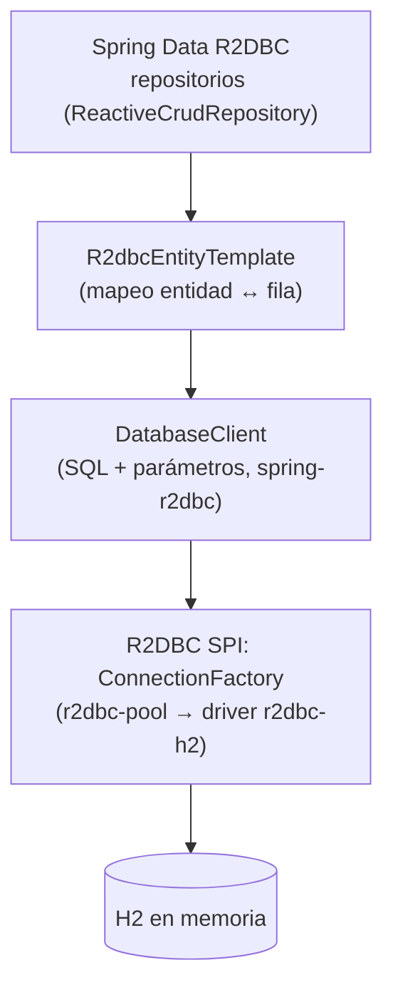
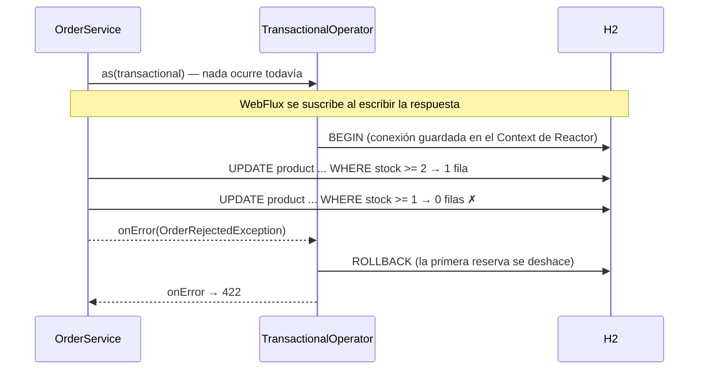

# 1. Acceso a datos reactivo: R2DBC y H2

> Temario: **Bibliotecas reactivas** (II) — caso práctico de acceso a datos · Duración: 65 min
> Referencia oficial: [Spring Framework — Data Access with R2DBC](https://docs.spring.io/spring-framework/reference/data-access/r2dbc.html) ·
> [Spring Data R2DBC](https://docs.spring.io/spring-data/relational/reference/r2dbc.html)
>
> Código: `catalog/Product.java`, `catalog/ProductRepository.java`, `catalog/ProductService.java`,
> `orders/OrderRepository.java`, `orders/OrderService.java`, `schema.sql`, `data.sql`, `application.properties`
> · Tests: `data/ProductRepositoryTest`, `data/OrderPersistenceTest`, `orders/OrderServiceTest`

## 1.1 El eslabón que faltaba

Hasta ayer los "repositorios" eran mapas en memoria con `delayElement` para simular latencia. En una aplicación real
los datos están en una base de datos y ahí aparece la pregunta clave: **¿sirve de algo tener un servidor
no bloqueante si la consulta a la base de datos bloquea el hilo?**

| | JDBC (JPA, `JdbcTemplate`) | R2DBC |
|---|---|---|
| Modelo | Bloqueante: el hilo espera a la respuesta de la BD | No bloqueante: la respuesta llega como señal (`Publisher`) |
| API | `ResultSet`, `List<T>` | `Mono<T>`, `Flux<T>` (Reactive Streams) |
| Backpressure | No | Sí: las filas se piden según se consumen |
| Transacciones | `ThreadLocal` (`@Transactional` clásico) | `Context` de Reactor (`TransactionalOperator`, `@Transactional` reactivo) |
| ORM | JPA/Hibernate (relaciones, *lazy loading*, caché de primer nivel) | **No hay ORM**: mapeo sencillo de filas a objetos, sin relaciones |
| En WebFlux | Hay que aislarlo en `boundedElastic` (y limita la escalabilidad) | Encaja de forma natural |

**R2DBC** (*Reactive Relational Database Connectivity*) es una especificación, como JDBC, con drivers para
PostgreSQL, MySQL/MariaDB, SQL Server, Oracle y H2. Spring la usa en tres niveles:



En el ejemplo se usan los dos extremos: un **repositorio de Spring Data** para el catálogo y **`DatabaseClient`**
para los pedidos (un agregado en dos tablas).

> **Sobre H2.** En el curso usamos H2 en memoria: no hay que instalar nada y cada arranque parte de datos limpios.
> H2 embebido no hace E/S de red (la base de datos está dentro de la JVM), así que sirve para aprender la API y para
> tests, pero **no** para medir rendimiento. En producción se cambia el driver (`r2dbc-postgresql`...) y la URL; el
> código no cambia.

## 1.2 Configuración con Spring Boot

```xml
<dependency>
    <groupId>org.springframework.boot</groupId>
    <artifactId>spring-boot-starter-data-r2dbc</artifactId>   <!-- Spring Data R2DBC + r2dbc-pool + transacciones -->
</dependency>
<dependency>
    <groupId>io.r2dbc</groupId>
    <artifactId>r2dbc-h2</artifactId>                          <!-- el driver (trae H2) -->
    <scope>runtime</scope>
</dependency>
```

```properties
# Sin spring.r2dbc.url, Boot crea una BD H2 EMBEBIDA. Nombre aleatorio por contexto (tests aislados).
spring.r2dbc.generate-unique-name=true
# Con una BD real:
#   spring.r2dbc.url=r2dbc:postgresql://localhost:5432/catalogo
#   spring.r2dbc.username=... / spring.r2dbc.password=...
#   spring.r2dbc.pool.max-size=20
# schema.sql y data.sql se ejecutan al arrancar ("embedded": solo en BD embebidas)
spring.sql.init.mode=embedded
logging.level.org.springframework.r2dbc.core=DEBUG      # ver el SQL
```

Con esto Boot crea el `ConnectionFactory` (con *pool*), el `DatabaseClient`, el `R2dbcEntityTemplate`, los
repositorios, el `R2dbcTransactionManager` y un `TransactionalOperator`.

`schema.sql` crea tres tablas: `product` (con una columna `version`), `customer_order` (`order` es palabra
reservada) y `order_detail`. `data.sql` inserta los 5 productos de siempre.

## 1.3 La entidad: un `record` con tres anotaciones

```java
// catalog/Product.java
@Table
public record Product(@Id String id, String name, String category, BigDecimal price, int stock,
                      @Version @JsonIgnore Long version) {

    @PersistenceCreator
    public Product { }                                      // el que usa Spring Data para leer filas

    public Product(String id, String name, String category, BigDecimal price, int stock) {
        this(id, name, category, price, stock, null);       // "aún no guardado"
    }

    public Product withVersion(Long newVersion) { ... }     // Spring Data crea COPIAS, no modifica el objeto
}
```

| Anotación | Para qué |
|---|---|
| `@Table` | Entidad mapeada a una tabla (nombre deducido: `PRODUCT`) |
| `@Id` | Clave primaria |
| `@Version` | Bloqueo optimista (1.7) y, de paso, "¿es nueva?": `version == null` → `INSERT`, si no → `UPDATE` |

> ⚠️ **Gotcha**: con `@Table("product")` la aplicación falla con `Table "product" not found (candidates are:
> "PRODUCT")`. Spring Data pone entre comillas los nombres en el SQL y, entre comillas, H2 (y PostgreSQL, Oracle...)
> distingue mayúsculas. Deja que lo deduzca (`@Table`) o escríbelo como lo guarda la BD.

> ¿Por qué `version`? Con un **id asignado por la aplicación** (UUID), Spring Data no puede saber si `save()` debe
> insertar o actualizar mirando el id (no es `null`). `@Version` resuelve las dos cosas. Otra opción es implementar
> `Persistable<ID>` con un método `isNew()`.

## 1.4 El repositorio: solo una interfaz

```java
public interface ProductRepository extends ReactiveCrudRepository<Product, String>,
        ReactiveSortingRepository<Product, String> {

    Flux<Product> findByCategoryIgnoreCaseOrderById(String category);       // derivada del nombre

    Flux<Product> findAllByOrderByPriceDesc(Limit limit);                   // ORDER BY ... LIMIT

    @Query("SELECT * FROM product ORDER BY RAND() LIMIT 1")
    Mono<Product> findRandom();                                              // SQL explícito

    @Modifying
    @Query("UPDATE product SET stock = stock - :quantity, version = version + 1 WHERE id = :id AND stock >= :quantity")
    Mono<Integer> reserveStock(String id, int quantity);                     // filas modificadas
}
```

| Tipo de método | Ejemplo | SQL que genera / ejecuta |
|---|---|---|
| Heredado | `findById`, `findAll(Sort)`, `save`, `delete`, `count` | `SELECT ... WHERE ID = $1`, `INSERT`/`UPDATE` |
| Derivado | `findByCategoryIgnoreCaseOrderById` | `WHERE UPPER(CATEGORY) = UPPER($1) ORDER BY ID` |
| Derivado con `Limit` | `findAllByOrderByPriceDesc(Limit.of(3))` | `ORDER BY PRICE DESC LIMIT 3` |
| `@Query` | `findRandom` | el SQL escrito |
| `@Modifying @Query` | `reserveStock` | `UPDATE` → `Mono<Integer>` (o `Long`, `Boolean`, `Void`) con las filas afectadas |

El **contrato no cambia** respecto al repositorio en memoria (`Mono` vacío si no existe, `Flux` que emite fila a
fila), así que `ProductService` apenas cambia y los controladores, las vistas, el BFF y los WebSockets **no se
tocan**. 🔬 Demo: los 64 tests heredados del día 3 pasan contra H2 sin modificarlos.

Dos mejoras que salen solas al tener una base de datos:

```java
// Día 3: se traía todo el catálogo a una lista para elegir uno al azar
.concatMap(tick -> repository.findAll().collectList()) ...
// Día 4: lo elige la BD
.concatMap(tick -> repository.findRandom())

// Día 3: sort + take en memoria. Día 4: ORDER BY + LIMIT en la BD
public Flux<Product> top(int limit) {
    return repository.findAllByOrderByPriceDesc(Limit.of(limit));
}
```

## 1.5 Un agregado en dos tablas con `DatabaseClient`

Spring Data R2DBC **no gestiona relaciones**: no hay `@OneToMany`, ni carga *lazy*, ni cascada. Un `Order` con sus
`OrderDetail` se guarda y se lee a mano. `DatabaseClient` es SQL con parámetros con nombre y resultado reactivo:

```java
// orders/OrderRepository.java — guardar: cabecera y después las líneas, en orden
public Mono<Order> save(Order order) {
    Order toSave = order.id() == null ? order.withId(UUID.randomUUID().toString()) : order;
    Mono<Long> header = db.sql("""
                    INSERT INTO customer_order (id, customer_id, created_at, total)
                    VALUES (:id, :customerId, :createdAt, :total)""")
            .bind("id", toSave.id())
            .bind("customerId", toSave.customerId())
            .bind("createdAt", toSave.createdAt())
            .bind("total", toSave.total())
            .fetch().rowsUpdated();
    Flux<Long> lines = Flux.fromIterable(toSave.details())
            .index()
            .concatMap(line -> insertDetail(toSave.id(), line.getT1().intValue(), line.getT2()));
    return header.thenMany(lines).then(Mono.just(toSave));
}
```

Para leer, **una** consulta con `JOIN` (una fila por línea) ordenada por pedido, y las filas se agrupan al vuelo:

```java
private static Flux<Order> toOrders(DatabaseClient.GenericExecuteSpec query) {
    return query.map(OrderRepository::toRow).all()       // Flux<OrderRow>: una fila por LÍNEA
            .bufferUntilChanged(OrderRow::orderId)        // Flux<List<OrderRow>>: las filas de UN pedido
            .map(OrderRepository::toOrder);               // Flux<Order>
}
```

```text
filas del JOIN (ordenadas)            bufferUntilChanged(orderId)        map(toOrder)
o-1 | Teclado  | 1                ─┐
o-1 | Monitor  | 2                ─┴─►  [o-1 Teclado, o-1 Monitor] ─►  Order o-1 (2 líneas)
o-2 | Ratón    | 1                ───►  [o-2 Ratón]               ─►  Order o-2 (1 línea)
```

`bufferUntilChanged` es la única "materialización" y está **acotada**: las líneas de un pedido (máximo 20), que el
`record Order` necesita completas. Los pedidos se siguen emitiendo de uno en uno: la tabla nunca está entera en
memoria.

> Alternativa: dos consultas (pedidos y, para cada uno, sus líneas con `flatMapSequential`). Es el problema N+1:
> con 100 pedidos, 101 consultas. El `JOIN` hace una.

## 1.6 Transacciones reactivas

El día 2 dejamos escrito un aviso en `OrderService`: *"entre la validación y la reserva otra petición podría consumir
el mismo stock"*. Con la base de datos se resuelve con dos herramientas:

1. **La reserva es un `UPDATE` condicional**: comprobar y descontar en una sola sentencia atómica.
   `WHERE stock >= :quantity` → si devuelve 0 filas, otro pedido se adelantó.
2. **Todo en una transacción**: si falla una reserva o el `INSERT` del pedido, se deshacen también las reservas ya
   hechas.

```java
// orders/OrderService.java
private Mono<Order> reserveStockAndSave(Order order) {
    return Flux.fromIterable(order.details())
            .index()
            .concatMap(indexed -> reserve(indexed.getT1().intValue(), indexed.getT2()))
            .then(orders.save(order))
            .as(transactions::transactional);            // TransactionalOperator
}

private Mono<Integer> reserve(int line, OrderDetail detail) {
    return products.reserveStock(detail.productId(), detail.quantity())
            .filter(updated -> updated == 1)
            .switchIfEmpty(Mono.error(() -> new OrderRejectedException(List.of(new DetailError(line,
                    detail.productId(), "stock insuficiente: otro pedido ha reservado las unidades")))));
}
```



| Forma | Cómo | Cuándo |
|---|---|---|
| `TransactionalOperator` | `.as(transactions::transactional)` o `transactions.execute(status -> ...)` | Control explícito de qué tramo del pipeline va en la transacción |
| `@Transactional` | En un método público de un bean que devuelve `Mono`/`Flux` | Igual que en MVC; Spring detecta el tipo reactivo y usa el `ReactiveTransactionManager` |

> ⚠️ La transacción vive en el **`Context` de Reactor**, no en un `ThreadLocal`. Todo lo que deba ir dentro tiene
> que formar parte del **mismo pipeline**. Un `subscribe()` suelto dentro del servicio (o un `block()`) se
> ejecutaría **fuera** de la transacción, con otra conexión.

📄 `OrderPersistenceTest`:

| Test | Qué comprueba |
|---|---|
| `savesAndReloadsTheWholeAggregate` | El pedido releído (JOIN + `bufferUntilChanged`) es igual, campo a campo, al creado |
| `rollsBackTheStockReservationWhenSavingFails` | El `INSERT` falla (`customer_id` de 100 caracteres) **después** de reservar: el stock vuelve a su valor |
| `concurrentOrdersNeverOversell` | 10 pedidos simultáneos de 1 unidad con 5 en stock: 5 creados, 5 rechazados, stock 0 (nunca negativo) |

## 1.7 Bloqueo optimista con `@Version` (y un `ETag` gratis)

Cada `UPDATE` que hace Spring Data sobre `Product` lleva `WHERE version = ?` e incrementa la versión. Si otro
guardó antes, el `UPDATE` no afecta a ninguna fila y se lanza `OptimisticLockingFailureException`:

```java
// catalog/ProductService.java — se conserva la versión LEÍDA
public Mono<Product> update(String id, ProductRequest request) {
    return findById(id)
            .flatMap(existing -> repository.save(request.toProduct(existing.id()).withVersion(existing.version())));
}

// error/GlobalExceptionHandler.java
@ExceptionHandler
public ProblemDetail handleConcurrentUpdate(OptimisticLockingFailureException ex) {
    return Problems.of(HttpStatus.CONFLICT, "concurrent-update", "Modificación concurrente", "...");   // 409
}
```

Y como la versión cambia con **cada** modificación (también las de `@Modifying`, que hacen `version = version + 1`),
es el `ETag` perfecto; el día 3 lo calculábamos con un *hash* del contenido:

```java
private static String etag(Product p) {
    return p.id() + "-v" + p.version();                  // "3-v7"
}
```

📄 `ProductRepositoryTest`: consultas derivadas, `INSERT` con versión 0, `reserveStock` que nunca deja stock
negativo y `staleVersionFailsWithOptimisticLocking` (dos lecturas de la misma versión: la segunda escritura falla).

## 1.8 Probar la persistencia

| Nivel | Herramienta | En el ejemplo |
|---|---|---|
| Unitario (sin BD) | Mockito: el repositorio es una interfaz | `OrderServiceTest` (ver [4. Pruebas](04-pruebas.md)) |
| *Slice* de datos | `@DataR2dbcTest`: solo R2DBC, repositorios y transacciones | `ProductRepositoryTest`, `OrderPersistenceTest` (+ `@Import` de lo que no es repositorio) |
| Integración | `@SpringBootTest` + `WebTestClient` | Todos los tests de controladores, ahora contra H2 |

> ⚠️ `@DataR2dbcTest` **no deshace** los cambios al acabar cada test (el TestContext de Spring no gestiona
> transacciones reactivas). Diseña los tests para no depender del orden: cada uno usa sus propios datos.

## 1.9 Para llevar

- Si la aplicación es reactiva, la base de datos también debe serlo; si no, aísla JDBC en `boundedElastic`.
- R2DBC no es JPA: sin relaciones ni *lazy loading*. Los agregados se cargan a mano (y así se ve el SQL).
- Operaciones atómicas en la BD (`UPDATE ... WHERE`), transacciones con `TransactionalOperator` o `@Transactional`,
  y bloqueo optimista con `@Version`.
- La transacción viaja en el `Context`: nunca rompas el pipeline con `subscribe()` o `block()`.

## Referencias para ampliar

- Spring Framework — Data Access with R2DBC: <https://docs.spring.io/spring-framework/reference/data-access/r2dbc.html>
- Spring Data R2DBC — Reference: <https://docs.spring.io/spring-data/relational/reference/r2dbc.html>
- Spring Data R2DBC — Repositories: <https://docs.spring.io/spring-data/relational/reference/r2dbc/repositories.html>
- Spring Data R2DBC — Query Methods: <https://docs.spring.io/spring-data/relational/reference/r2dbc/query-methods.html>
- Spring Boot — SQL Databases (R2DBC): <https://docs.spring.io/spring-boot/reference/data/sql.html>
- Spring Boot — Database Initialization: <https://docs.spring.io/spring-boot/how-to/data-initialization.html>
- Spring Framework — Programmatic Transaction Management (`TransactionalOperator`): <https://docs.spring.io/spring-framework/reference/data-access/transaction/programmatic.html>
- Spring Framework — `@Transactional` (reactivo): <https://docs.spring.io/spring-framework/reference/data-access/transaction/declarative/annotations.html>
- R2DBC — especificación y drivers: <https://r2dbc.io/>
- r2dbc-h2: <https://github.com/r2dbc/r2dbc-h2> · H2 Database: <https://www.h2database.com/html/main.html>

➡️ Siguiente: [2. Tecnologías para las vistas](02-vistas.md)
