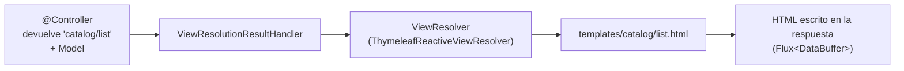

# 2. Tecnologías para las vistas

> Temario: **Tecnologías para las vistas** · Duración: 50 min
> Referencia oficial: [Spring WebFlux — View Technologies](https://docs.spring.io/spring-framework/reference/web/webflux-view.html) ·
> [Thymeleaf + Spring](https://www.thymeleaf.org/doc/tutorials/3.1/thymeleafspring.html)
>
> Código: `web/CatalogViewController.java`, `web/ProductForm.java`, `src/main/resources/templates/**`
> · Tests: `web/CatalogViewTest`

## 2.1 HTML generado en el servidor con WebFlux

Hasta ahora todos los controladores devolvían **datos** (JSON, NDJSON, SSE) para un cliente que pinta la interfaz
(JavaScript, una app móvil, otro servicio). WebFlux también sabe generar **páginas HTML** en el servidor:



| Tecnología | En WebFlux | Notas |
|---|---|---|
| **Thymeleaf** | ✅ `spring-boot-starter-thymeleaf` | Plantillas HTML "naturales" (se abren en el navegador). Único motor con modo **data-driven** reactivo |
| FreeMarker | ✅ `spring-boot-starter-freemarker` | Plantillas `.ftlh` |
| Mustache | ✅ `spring-boot-starter-mustache` | Sin lógica en la plantilla |
| Script templates | ✅ (`ScriptTemplateConfigurer`) | Motores JavaScript/Kotlin en la JVM (React SSR, Handlebars...) |
| JSP / JSTL | ❌ | Dependen de la API de *servlets* |
| JSON / XML | `HttpMessageWriterView` | Una "vista" que escribe el modelo con un codec |

## 2.2 El controlador: `@Controller` y nombres de vista

```java
@Controller                                    // no @RestController: devuelve NOMBRES DE VISTA
@RequestMapping("/catalog")
public class CatalogViewController {

    @GetMapping
    public String list(@RequestParam(required = false) String category, Model model) {
        model.addAttribute("products", service.findAll(category));   // ¡un Flux en el modelo!
        model.addAttribute("category", category);
        return "catalog/list";                                        // templates/catalog/list.html
    }
}
```

Lo que puede devolver un método de un `@Controller` en WebFlux para renderizar una vista:

| Retorno | Significado |
|---|---|
| `String` / `Mono<String>` | Nombre de la vista (con `Model` como argumento) |
| `"redirect:/ruta"` | Redirección (`RedirectView`, **303 See Other** por defecto en WebFlux) |
| `Rendering` / `Mono<Rendering>` | Vista + atributos + estado + cabeceras en un objeto |
| `void` / `Mono<Void>` | Vista por defecto deducida de la URL (o el método ya escribió la respuesta) |
| Un objeto con `@ModelAttribute` | Se añade al modelo y se usa la vista por defecto |

## 2.3 Modelo reactivo: modo normal ("full")

En WebFlux el `Model` puede contener **`Mono` y `Flux`**. Antes de renderizar, WebFlux **resuelve** esos atributos:
espera al `Mono` y convierte cada `Flux` en una `List`. La plantilla recibe valores normales:

```html
<!-- templates/catalog/list.html — products ya es una List -->
<tr th:each="p : ${products}">
  <td><a th:href="@{/catalog/{id}(id=${p.id})}" th:text="${p.name}">Teclado</a></td>
  <td class="num" th:text="${#numbers.formatDecimal(p.price, 1, 'POINT', 2, 'COMMA')} + ' €'">89,90 €</td>
</tr>
```

> Es una **barrera**: en modo normal Thymeleaf necesita todos los datos para generar la página de una vez. Para un
> listado corto es lo razonable; para uno largo o lento, el modo *data-driven*.

`${p.name}` funciona con un `record`: SpEL resuelve el accesor `name()`. Los fragmentos comunes (cabecera, menú)
están en `templates/fragments.html` y se insertan con `th:replace="~{fragments :: nav}"`.

## 2.4 Modo data-driven: la página llega por trozos

```java
@GetMapping("/live")
public String live(Model model) {
    Flux<Product> slowProducts = service.findAll(null).delayElements(LIVE_DELAY);    // 400 ms por fila (demo)
    model.addAttribute("products", new ReactiveDataDriverContextVariable(slowProducts, 1));
    return "catalog/live";
}
```

Con una `ReactiveDataDriverContextVariable` el `Flux` **no** se resuelve antes. Thymeleaf empieza a escribir la
página (cabecera, `<table>`...) y, cada vez que llega un producto, procesa la iteración de `th:each` y **envía** ese
trozo (*chunked transfer encoding*). El `1` es el tamaño del buffer: se envía cada elemento.

```text
t=0 ms     <!DOCTYPE html> ... <h1>Catálogo (modo data-driven)</h1> ... <tbody>     ← llega enseguida
t=400 ms   <tr>...Teclado mecánico...</tr>
t=800 ms   <tr>...Ratón inalámbrico...</tr>
...
t=2000 ms  <tr>...Auriculares...</tr></tbody></table><p>Fin del catálogo.</p></html>
```

| | Modo normal | Modo data-driven |
|---|---|---|
| El `Flux` | Se resuelve a `List` antes de renderizar | Dirige el renderizado elemento a elemento |
| Primer byte al navegador | Cuando llegan **todos** los datos | Inmediatamente |
| Memoria | Toda la lista | Solo el buffer |
| Límite | — | **Una** variable data-driven por plantilla |

Propiedades de Boot: `spring.thymeleaf.reactive.max-chunk-size` (tamaño máximo de cada trozo), `chunked-mode-view-names`
y `full-mode-view-names` (forzar un modo por nombre de vista).

📄 `CatalogViewTest.liveRendersTheTableInChunksAsProductsArrive`: mide cuándo llega cada línea del HTML; la primera
en menos de 1 s y el total por encima de 1,8 s (5 filas × 400 ms).

> 🔬 Demo: abre <http://localhost:8080/catalog/live> con DevTools → *Network*: la petición sigue abierta mientras
> aparecen las filas. Compárala con <http://localhost:8080/catalog>.

## 2.5 `Rendering`: vista, modelo y estado en un objeto

```java
@GetMapping("/{id}")
public Mono<Rendering> detail(@PathVariable String id) {
    return service.findById(id)
            .map(product -> Rendering.view("catalog/detail")
                    .modelAttribute("product", product)
                    .modelAttribute("priceWithVat", ProductV2.from(product).priceWithVat())
                    .build());
}

/** Error en una PÁGINA: se responde con otra página (404), no con el ProblemDetail JSON de la API. */
@ExceptionHandler
public Rendering notFound(ProductNotFoundException ex) {
    return Rendering.view("catalog/not-found")
            .modelAttribute("productId", ex.getProductId())
            .status(HttpStatus.NOT_FOUND)
            .build();
}
```

Un `@ExceptionHandler` del propio controlador tiene **prioridad** sobre el `@RestControllerAdvice` global: la API
sigue devolviendo `ProblemDetail` y las páginas, HTML. `Rendering.redirectTo("/ruta")` es la versión "objeto" de
`"redirect:/ruta"`.

## 2.6 Formularios: *binding*, validación y Post/Redirect/Get

```java
@GetMapping("/new")
public String newProduct(Model model) {
    model.addAttribute("product", new ProductForm());
    return "catalog/form";
}

@PostMapping
public Mono<String> create(@Valid @ModelAttribute("product") ProductForm form, BindingResult result) {
    if (result.hasErrors()) {
        return Mono.just("catalog/form");                              // se repinta con errores
    }
    return service.create(form.toRequest())
            .map(product -> "redirect:/catalog/" + product.id());       // 303 -> GET de la ficha
}
```

```html
<form th:action="@{/catalog}" th:object="${product}" method="post" novalidate>
  <input th:field="*{name}" type="text">
  <span class="error" th:if="${#fields.hasErrors('name')}" th:errors="*{name}">obligatorio</span>
  ...
</form>
```

- `@ModelAttribute` enlaza los campos del formulario (`application/x-www-form-urlencoded`) con el objeto.
- `BindingResult` **justo detrás** recoge los errores (de conversión y de `@Valid`) en lugar de lanzar
  `WebExchangeBindException` (que en la API da 400).
- `th:field` genera `id`, `name` y `value`, y conserva lo que escribió el usuario; `th:errors` muestra los mensajes.
- **Post/Redirect/Get**: tras un `POST` correcto se redirige; recargar la página no reenvía el formulario.

> ¿Por qué `ProductForm` (JavaBean) y no el `record ProductRequest`? Un formulario tiene que poder **repintarse** con
> valores a medias o no válidos, y `th:field` lee y escribe propiedades con *getters* y *setters*.

> Sin Spring Security no hay protección CSRF. Con ella, Thymeleaf añade el campo oculto `_csrf` a los formularios
> `th:action` automáticamente (ver [día 3, 1.7](../day-03/01-seguridad-web.md#17-csrf)).

## 2.7 Thymeleaf y el *event loop*

Thymeleaf **lee las plantillas del disco de forma síncrona**. Con `spring.thymeleaf.cache=true` (el valor por defecto
y lo que se usa en producción) solo ocurre la primera vez que se usa cada plantilla; en el ejemplo está a `false`
para ver los cambios al recargar, así que se lee en cada petición. BlockHound lo detecta (ver
[4.7](04-pruebas.md#47-blockhound-encontrar-el-bloqueo-escondido)). Es un coste pequeño y acotado, pero es la razón
por la que el test de BlockHound de la aplicación cubre la API JSON y no las vistas.

## 2.8 ¿Vistas en el servidor o API + SPA?

| | Vistas en el servidor (Thymeleaf) | API + SPA (React, Angular...) |
|---|---|---|
| Equipo | Un solo equipo Java | *Frontend* y *backend* separados |
| Primera carga, SEO | Muy buena | Necesita SSR para igualarla |
| Interactividad | Recarga de página (o htmx, SSE, WebSocket) | Total |
| Estado | En el servidor | En el cliente |
| Caso típico | Paneles internos, back-office, formularios | Aplicaciones muy interactivas, varios clientes (web + móvil) |

## Referencias para ampliar

- Spring WebFlux — View Technologies: <https://docs.spring.io/spring-framework/reference/web/webflux-view.html>
- Spring WebFlux — FreeMarker, Script Views, JSON/XML: <https://docs.spring.io/spring-framework/reference/web/webflux-view.html#webflux-view-freemarker>
- Spring Boot — Reactive Web (Template Engines): <https://docs.spring.io/spring-boot/reference/web/reactive.html>
- Thymeleaf + Spring (incluye formularios y `th:field`): <https://www.thymeleaf.org/doc/tutorials/3.1/thymeleafspring.html>

➡️ Siguiente: [3. WebSockets](03-websockets.md)
