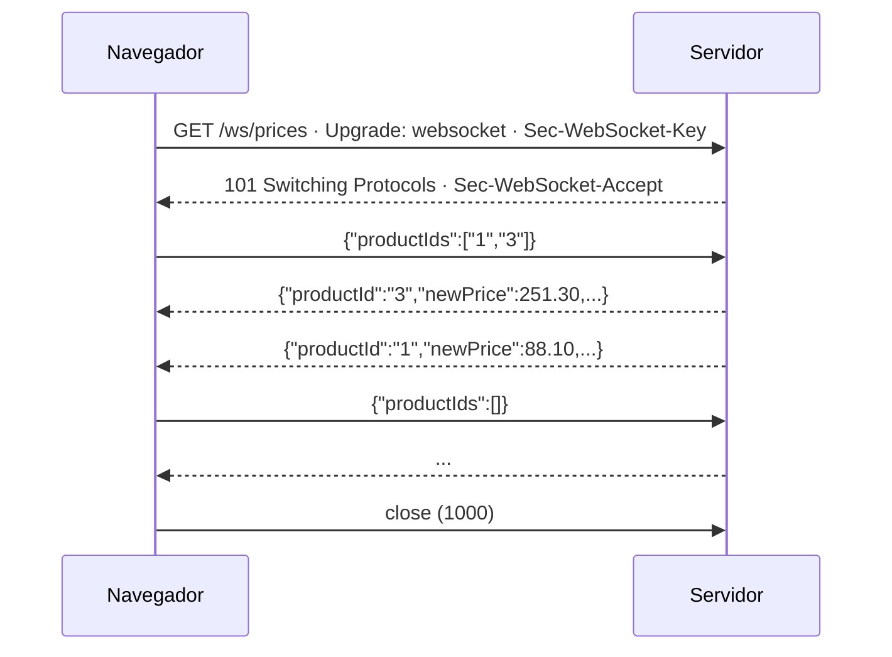

# 3. WebSockets

> Temario: **WebSockets** · Duración: 50 min
> Referencia oficial: [Spring WebFlux — WebSockets](https://docs.spring.io/spring-framework/reference/web/webflux-websocket.html)
>
> Código: `ws/WebSocketConfig.java`, `ws/EchoWebSocketHandler.java`, `ws/PriceWebSocketHandler.java`,
> `ws/ChatWebSocketHandler.java`, `catalog/PriceFeed.java`, `static/ws.html`
> · Tests: `ws/WebSocketTest`, `ws/PriceWatchTest`

## 3.1 Qué es un WebSocket

Un WebSocket ([RFC 6455](https://www.rfc-editor.org/rfc/rfc6455)) empieza como una petición HTTP normal con
`Upgrade: websocket`; si el servidor acepta (`101 Switching Protocols`), la conexión TCP deja de hablar HTTP y pasa
a transportar **mensajes en los dos sentidos**, cuando cada lado quiera, hasta que uno la cierra.



## 3.2 WebSocket frente a SSE

El día 1 enviamos precios con **Server-Sent Events**. ¿Cuándo compensa un WebSocket?

| | SSE (`text/event-stream`) | WebSocket |
|---|---|---|
| Dirección | Servidor → cliente | **Bidireccional** |
| Protocolo | HTTP normal (pasa por proxies, HTTP/2) | Protocolo propio tras el *upgrade* |
| Reconexión automática | Sí (`EventSource`, con `Last-Event-ID`) | No: hay que programarla |
| Formato | Texto (eventos con `data:`, `id:`, `event:`) | Texto o binario, sin formato definido |
| En WebFlux | Un `Flux` en un controlador | Un `WebSocketHandler` + `HandlerMapping` |
| Caso típico | Notificaciones, cotizaciones, progreso | Chat, juegos, edición colaborativa, el cliente cambia la suscripción |

> Regla práctica: si el cliente solo **escucha**, SSE es más sencillo. Si el cliente también **habla** con
> frecuencia por la misma conexión, WebSocket.

## 3.3 La API reactiva: `WebSocketHandler` y `WebSocketSession`

En WebFlux no hay anotaciones para WebSocket (`@MessageMapping` es de Spring MVC con STOMP o de RSocket). Se
implementa una interfaz con **un** método:

```java
public interface WebSocketHandler {
    Mono<Void> handle(WebSocketSession session);
}
```

| Método de la sesión | Tipo | Significado |
|---|---|---|
| `receive()` | `Flux<WebSocketMessage>` | Lo que envía el cliente; completa cuando cierra |
| `send(Publisher<WebSocketMessage>)` | `Mono<Void>` | Enviar un flujo de mensajes; completa cuando se han enviado todos |
| `textMessage(String)` / `binaryMessage(...)` | `WebSocketMessage` | Crear un mensaje |
| `closeStatus()` | `Mono<CloseStatus>` | Se emite cuando la sesión se cierra |
| `getHandshakeInfo()` | `HandshakeInfo` | URI, cabeceras, principal, subprotocolo del *handshake* |

El `Mono<Void>` que devuelve `handle` marca la **vida de la sesión**: cuando termina, se cierra la conexión.

```java
// ws/EchoWebSocketHandler.java — la salida SE CONSTRUYE a partir de la entrada
@Override
public Mono<Void> handle(WebSocketSession session) {
    return session.send(session.receive()
            .map(WebSocketMessage::getPayloadAsText)          // leer el texto AQUÍ: el buffer se libera después
            .map(text -> session.textMessage("eco: " + text)));
}
```

## 3.4 Registrar los *handlers*

```java
// ws/WebSocketConfig.java
@Bean
public HandlerMapping webSocketMapping(EchoWebSocketHandler echo, PriceWebSocketHandler prices,
                                       ChatWebSocketHandler chat) {
    return new SimpleUrlHandlerMapping(Map.of(
            "/ws/echo", echo,
            "/ws/prices", prices,
            "/ws/chat", chat), -1);          // orden -1: antes que los controladores anotados
}
```

Es el mismo `DispatcherHandler` del día 1: un `HandlerMapping` más, y un `WebSocketHandlerAdapter` (que ya declara la
configuración de WebFlux) que hace el *handshake* y llama a `handle`. `WebSocketService` y
`RequestUpgradeStrategy` adaptan el *upgrade* a cada servidor (Reactor Netty, Jetty o cualquier contenedor con la API estándar de WebSocket de Jakarta, como Tomcat).

> **Seguridad y CORS**: el navegador envía la cabecera `Origin` en el *handshake*, pero la política CORS no se aplica
> a WebSocket. Con Spring Security, las rutas `/ws/**` se protegen como cualquier otra en `SecurityWebFilterChain`
> (el *handshake* es una petición HTTP) y el usuario está en `session.getHandshakeInfo().getPrincipal()`.

## 3.5 Entrada y salida: tres patrones

### a) La salida depende de la entrada: eco

Ver 3.3. Un único flujo: `receive()` → transformar → `send()`.

### b) El cliente envía comandos que cambian lo que recibe: precios con filtro

```java
// ws/PriceWebSocketHandler.java
@Override
public Mono<Void> handle(WebSocketSession session) {
    Flux<Set<String>> commands = session.receive()
            .map(WebSocketMessage::getPayloadAsText)
            .handle(this::parse);                           // JSON -> Set<String>; los no válidos se ignoran

    Flux<WebSocketMessage> output = watch(commands, feed.changes())
            .map(json::writeValueAsString)                  // Jackson 3: JsonMapper de Spring Boot
            .map(session::textMessage)
            .takeUntilOther(session.closeStatus());         // al cerrar: dejar de escuchar el ticker

    return session.send(output);
}

static Flux<PriceChange> watch(Flux<Set<String>> commands, Flux<PriceChange> changes) {
    return commands.switchMap(ids -> changes.filter(change -> ids.isEmpty() || ids.contains(change.productId())));
}
```

- **`switchMap`**: con cada comando nuevo se **cancela** la suscripción anterior al feed y se abre otra con el nuevo
  filtro. No hay un `Set` mutable compartido que proteger: el "estado" de la sesión es el último comando.
- **`takeUntilOther(session.closeStatus())`**: sin él, la suscripción al ticker podría seguir viva tras cerrar.
- WebSocket **no define formato**: aquí, JSON con el `JsonMapper` que configura Boot.

### c) Entrada y salida independientes: chat entre sesiones

```java
// ws/ChatWebSocketHandler.java
private final Sinks.Many<String> messages = Sinks.many().multicast().directBestEffort();

@Override
public Mono<Void> handle(WebSocketSession session) {
    String name = nameOf(session);                                         // ?name=Ana del handshake
    Mono<Void> input = session.receive()
            .map(WebSocketMessage::getPayloadAsText)
            .doOnNext(text -> messages.emitNext(name + ": " + text, RETRY_ON_CONTENTION))
            .then();
    Mono<Void> output = session.send(messages.asFlux().map(session::textMessage));
    return Mono.zip(input, output).then();                                 // patrón de la documentación
}
```

Un **`Sinks.Many`** es un *publisher* caliente en el que se puede emitir "desde fuera". Es el punto de encuentro
entre sesiones:

| Opción | Efecto |
|---|---|
| `multicast()` | Varios suscriptores (uno por sesión abierta) |
| `directBestEffort()` | Sin buffer; si un cliente va lento, **solo él** pierde mensajes |
| `directAllOrNothing()` | Si uno no puede recibir, no lo recibe nadie |
| `onBackpressureBuffer()` | Guarda mensajes para quien va lento (y para el primer suscriptor) |
| `replay().limit(n)` | Los nuevos suscriptores reciben los últimos *n* (historial) |

> ⚠️ Varias sesiones emiten **a la vez**, cada una desde su hilo. `tryEmitNext` fallaría con
> `FAIL_NON_SERIALIZED`; `emitNext(valor, EmitFailureHandler.busyLooping(Duration))` reintenta hasta conseguirlo.

> Con varias instancias de la aplicación, cada una tiene su propio `Sinks`: un mensaje llega solo a los clientes
> conectados a la misma instancia. Para difundir entre instancias hace falta un *broker* (Redis Pub/Sub, Kafka...).

## 3.6 Un ticker compartido: de frío a caliente

`ProductService.priceTicker()` es un *publisher* **frío**: con 100 clientes (SSE o WebSocket) habría 100 tickers
modificando precios. `PriceFeed` lo publica **en caliente**:

```java
// catalog/PriceFeed.java
this.changes = service.priceTicker().share();      // = publish().refCount(1)
```

- el primer suscriptor arranca el ticker; los siguientes se enganchan al mismo;
- cuando se va el último, se cancela (y el siguiente lo vuelve a arrancar).

SSE (`GET /api/products/prices`) y WebSocket (`/ws/prices`) usan ahora el mismo `PriceFeed`.

## 3.7 El cliente WebSocket de WebFlux

`WebSocketClient` (implementaciones para Reactor Netty, Tomcat, Jetty y la API estándar de Jakarta WebSocket) ejecuta un `WebSocketHandler`
**en el lado del cliente**: la misma API a ambos lados.

```java
WebSocketClient client = new ReactorNettyWebSocketClient();

Mono<Void> conversation = client.execute(URI.create("ws://localhost:8080/ws/echo"), session -> session
        .send(Flux.just("hola", "adiós").map(session::textMessage))
        .thenMany(session.receive().map(WebSocketMessage::getPayloadAsText).take(2))
        .doOnNext(System.out::println)
        .then());                                    // cuando termina el handler, el cliente cierra
```

Sirve para consumir WebSockets de otro servicio y para los tests (📄 `WebSocketTest`).

## 3.8 Probarlo

- Navegador: <http://localhost:8080/ws.html> (DevTools → *Network* → *WS* → *Messages*). Abre el chat en dos
  pestañas.
- Línea de comandos (si tienes [websocat](https://github.com/vi/websocat)): `websocat ws://localhost:8080/ws/echo`.

📄 Tests:

| Test | Qué comprueba |
|---|---|
| `WebSocketTest.echoReturnsEveryMessage` | Envía 2 mensajes y recibe los 2 ecos |
| `WebSocketTest.pricesArePushedAfterAWatchCommand` | Tras `{"productIds":[]}` llegan cambios de precio en JSON |
| `WebSocketTest.chatBroadcastsToEverySession` | Lo que envía Ana le llega a Luis |
| `WebSocketTest.unknownPathFailsTheHandshake` | Sin *handler* en la URL, el *handshake* recibe 404 |
| `PriceWatchTest` | La lógica de `watch` con `TestPublisher`: filtro, `switchMap` cancela la suscripción anterior, sin fugas al cancelar |

## Referencias para ampliar

- Spring WebFlux — WebSockets: <https://docs.spring.io/spring-framework/reference/web/webflux-websocket.html>
- RFC 6455 — The WebSocket Protocol: <https://www.rfc-editor.org/rfc/rfc6455>
- MDN — WebSockets API: <https://developer.mozilla.org/en-US/docs/Web/API/WebSockets_API>
- MDN — Server-sent events: <https://developer.mozilla.org/en-US/docs/Web/API/Server-sent_events>
- Reactor — Sinks: <https://projectreactor.io/docs/core/release/reference/coreFeatures/sinks.html>
- Spring Framework — RSocket (mensajería reactiva bidireccional con *backpressure*): <https://docs.spring.io/spring-framework/reference/rsocket.html>

➡️ Siguiente: [4. Pruebas](04-pruebas.md)
