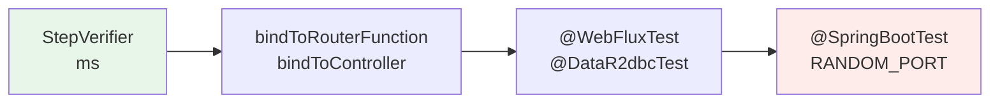

# 4. Pruebas

> Temario: **Pruebas** · Duración: 50 min
> Referencia oficial: [Spring WebFlux — Testing](https://docs.spring.io/spring-framework/reference/web/webflux-test.html) ·
> [WebTestClient](https://docs.spring.io/spring-framework/reference/testing/webtestclient.html) ·
> [Reactor — Testing](https://projectreactor.io/docs/core/release/reference/testing.html)
>
> Código (todo en `src/test`): `testing/*`, `orders/OrderServiceTest`, `data/*`, `ws/PriceWatchTest`,
> `interop/InteropTest`, `reactor/ContextTest`, `pom.xml` (surefire)

## 4.1 El mapa: qué herramienta para qué

Llevamos tres días escribiendo tests (`StepVerifier` desde el día 1, `WebTestClient` con servidor desde el día 1,
un servidor Reactor Netty falso el día 3). Hoy los ordenamos de más rápido y aislado a más completo:

| Nivel | Herramienta | Arranca | Ejemplo |
|---|---|---|---|
| Lógica reactiva | `StepVerifier`, `TestPublisher`, `PublisherProbe` | Nada | `OrderServiceTest`, `PriceWatchTest`, `StepVerifierAdvancedTest` |
| Endpoint funcional | `WebTestClient.bindToRouterFunction(...)` | Solo el `RouterFunction` | `OrderRoutesUnitTest` |
| Un controlador | `WebTestClient.bindToController(...)` | WebFlux mínimo + ese controlador | `InteropTest` |
| Capa web | `@WebFluxTest` + `@MockitoBean` | *Slice* web de Spring (sin servicios ni BD) | `ProductControllerSliceTest` |
| Capa de datos | `@DataR2dbcTest` | *Slice* R2DBC (BD embebida) | `ProductRepositoryTest`, `OrderPersistenceTest` |
| Aplicación | `@SpringBootTest(RANDOM_PORT)` + `WebTestClient` | Todo, con servidor HTTP real | `ProductControllerTest`, `CatalogViewTest`, `WebSocketTest` |
| Bloqueos | BlockHound | — (agente) | `BlockHoundTest`, `ApiDoesNotBlockTest` |



Cuanto más a la izquierda, más rápido y más fácil saber qué ha fallado; cuanto más a la derecha, más cerca de la
realidad. Una buena batería tiene muchos de la izquierda y unos pocos de la derecha.

## 4.2 Dobles de prueba de componentes reactivos

Con el repositorio convertido en interfaz (R2DBC), `OrderServiceTest` pasa a ser un test **unitario** con Mockito:

```java
products = mock(ProductRepository.class);
// thenAnswer: el Mono se crea en CADA llamada, como haría el repositorio real
when(products.findById(anyString()))
        .thenAnswer(call -> Mono.justOrEmpty(CATALOG.get(call.getArgument(0, String.class))).delayElement(LATENCY));
when(products.reserveStock(anyString(), anyInt())).thenReturn(Mono.just(1));
// sin BD no hay transacción: el operador devuelve el mismo pipeline
when(transactions.transactional(any(Mono.class))).thenAnswer(call -> call.getArgument(0));
```

Reglas:

- Un doble de un método reactivo **nunca** devuelve `null`: `Mono.empty()`, `Mono.just(...)`, `Mono.error(...)`.
- `thenReturn(mono)` reutiliza el **mismo** `Mono` en todas las llamadas; `thenAnswer` crea uno nuevo cada vez (y,
  con tiempo virtual, lo crea cuando el reloj virtual ya está instalado).
- `verify(mock).metodo()` dice que se **llamó** al método, no que se **ejecutara** lo que devuelve (4.3).

## 4.3 `PublisherProbe`: ¿se suscribió alguien?

En un pipeline, llamar a un método que devuelve un `Mono` no ejecuta nada: se ejecuta al suscribirse. `then(x)`
evalúa su argumento al montar el pipeline:

```java
.concatMap(indexed -> reserve(...))
.then(orders.save(order))          // save() se LLAMA aquí, al montar... pero su Mono solo se suscribe si todo va bien
```

```java
save = PublisherProbe.of(Mono.just(savedOrder));
when(orders.save(any())).thenReturn(save.mono());

// la reserva del producto 3 pierde la carrera
when(products.reserveStock("3", 1)).thenReturn(Mono.just(0));
StepVerifier.create(service.create(request)).expectError(OrderRejectedException.class).verify();

verify(orders).save(any());          // se llamó al método...
save.assertWasNotSubscribed();       // ...pero NO se ejecutó ningún INSERT
```

`PublisherProbe` también sirve para comprobar **qué rama** de un `switchIfEmpty` o `onErrorResume` se tomó.

## 4.4 `StepVerifier` avanzado

📄 `StepVerifierAdvancedTest`, `PriceWatchTest`, `CatalogViewTest`, `ContextTest`:

| Técnica | Para qué | Ejemplo |
|---|---|---|
| `withVirtualTime(() -> ...)` | Probar el tiempo sin esperar: 1 hora de *ticks* en milisegundos | `priceTickerInVirtualTime` |
| `expectNoEvent(d)` / `thenAwait(d)` | "No pasa nada durante d" / avanzar el reloj virtual | ídem |
| `create(publisher, 0)` + `thenRequest(n)` | El test hace de suscriptor lento: controla la **demanda** | `theSubscriberControlsTheDemand` |
| `thenCancel()` | Terminar un flujo infinito | ticker, WebSocket |
| `recordWith` / `consumeRecordedWith` | Guardar los elementos y comprobarlos juntos al final | `liveRendersTheTableInChunksAsProductsArrive` |
| `verifyThenAssertThat()` | Comprobar la ejecución: duración, elementos o errores descartados | `assertionsAboutTheVerificationItself` |
| `expectAccessibleContext()`, `withInitialContext` | Aportar y comprobar el `Context` de Reactor | `ContextTest` |
| `verify(Duration)` | Límite en tiempo **real**: evita tests que se cuelgan | todos los de tiempo virtual |

```java
// Un flujo infinito basado en Flux.interval: sin tiempo virtual, este test tardaría UNA HORA
StepVerifier.withVirtualTime(() -> service.priceTicker())
        .expectSubscription()
        .expectNoEvent(Duration.ofMillis(999))
        .thenAwait(Duration.ofMillis(1))
        .assertNext(change -> assertThat(change.productId()).isEqualTo("1"))
        .thenAwait(Duration.ofHours(1))
        .expectNextCount(3600)
        .thenCancel()
        .verify(Duration.ofSeconds(5));
```

### `TestPublisher`: el test decide qué se emite y cuándo

```java
// ws/PriceWatchTest — la lógica del WebSocket de precios sin WebSocket
TestPublisher<Set<String>> commands = TestPublisher.create();
TestPublisher<PriceChange> changes = TestPublisher.create();

StepVerifier.create(PriceWebSocketHandler.watch(commands.flux(), changes.flux()))
        .then(() -> changes.assertNoSubscribers())             // sin comando no se escucha el feed
        .then(() -> commands.next(Set.of("1")))
        .then(() -> changes.next(change("2"), change("1")))
        .expectNext(change("1"))                               // el 2 se filtra
        .then(() -> commands.next(Set.of("2")))                // switchMap
        .then(() -> changes.assertSubscribers(1))              // la suscripción anterior se canceló
        ...
        .thenCancel()
        .verify();
changes.assertNoSubscribers();                                 // sin fugas
```

> Separar la lógica (`watch`, una función de `Flux` a `Flux`) de la infraestructura (`WebSocketSession`) es lo que
> permite probarla así. Es el mismo consejo que para cualquier código: funciones puras en el centro.

### Depurar: `checkpoint()`

En un pipeline, la traza de un error apunta a clases de Reactor, no a tu código. `checkpoint("descripción")` añade
al error una excepción "suprimida" con el punto donde se montó ese tramo:

```java
StepVerifier.create(service.findById("x").checkpoint("ProductService.findById desde el test"))
        .expectErrorSatisfies(error -> assertThat(error.getSuppressed()[0].getMessage())
                .contains("checkpoint", "ProductService.findById desde el test"))
        .verify();
```

Alternativas globales: `Hooks.onOperatorDebug()` (captura la traza de montaje de **todos** los operadores; cara, solo
en desarrollo) y `ReactorDebugAgent` de `reactor-tools` (`spring.reactor.debug-agent.enabled`), apta para producción.

## 4.5 `WebTestClient` sin servidor: `bindTo...`

```java
// testing/OrderRoutesUnitTest — un RouterFunction sin Spring
var validator = new SpringValidatorAdapter(Validation.buildDefaultValidatorFactory().getValidator());
var routes = new OrderRouter().orderRoutes(new OrderHandler(service, validator));   // service: Mockito
WebTestClient client = WebTestClient.bindToRouterFunction(routes).build();

// interop/InteropTest — un controlador + su @ControllerAdvice
WebTestClient client = WebTestClient.bindToController(new InteropController(service))
        .controllerAdvice(new GlobalExceptionHandler())
        .build();
```

| Método | Qué monta |
|---|---|
| `bindToServer()` | Cliente HTTP real contra un servidor en marcha (URL) |
| `bindToApplicationContext(ctx)` | La configuración WebFlux de un contexto de Spring |
| `bindToController(...)` | WebFlux mínimo con esos controladores (+ `controllerAdvice`, `webFilter`, configuración...) |
| `bindToRouterFunction(...)` | Solo ese `RouterFunction` |
| `bindToWebHandler(...)` | Un `WebHandler` cualquiera |

Sin red: `WebTestClient` pasa la petición directamente al `WebHandler` (`HttpHandlerConnector`). Son tests de
milisegundos que comprueban rutas, predicados, estados, cabeceras, JSON y errores.

## 4.6 *Slices* de Spring Boot: `@WebFluxTest` y `@DataR2dbcTest`

```java
@WebFluxTest(ProductController.class)        // org.springframework.boot.webflux.test.autoconfigure
class ProductControllerSliceTest {

    @Autowired WebTestClient client;

    @MockitoBean ProductService service;       // org.springframework.test.context.bean.override.mockito
    @MockitoBean ProductImageStore images;
    @MockitoBean PriceFeed priceFeed;

    @Test
    void invalidBodyNeverReachesTheService() {
        client.post().uri("/api/products")
                .bodyValue(new ProductRequest("", "video", new BigDecimal("-1"), 1))
                .exchange()
                .expectStatus().isBadRequest();
        verifyNoInteractions(service);
    }
}
```

| *Slice* | Incluye | No incluye |
|---|---|---|
| `@WebFluxTest` | Controladores indicados, `@ControllerAdvice`, `WebFluxConfigurer`, `WebFilter`, `Converter`, Jackson, validación, `WebTestClient` | `@Service`, `@Repository`, `@Configuration` propias, R2DBC, servidor |
| `@DataR2dbcTest` | `ConnectionFactory` (BD embebida), `schema.sql`/`data.sql`, repositorios de Spring Data, transacciones | Web, servicios, componentes propios (se añaden con `@Import`) |

> **Boot 4**: `@MockBean`/`@SpyBean` de Spring Boot ya no existen; se usan `@MockitoBean`/`@MockitoSpyBean` de
> Spring Framework (6.2+). Los *slices* están en módulos de test propios: `spring-boot-starter-webflux-test`,
> `spring-boot-starter-data-r2dbc-test`...

## 4.7 BlockHound: encontrar el bloqueo escondido

Reactor ya impide `block()` en un hilo del *event loop* (día 3). Pero el bloqueo suele estar **escondido** dentro de
una biblioteca: un driver JDBC, un SDK síncrono, un `Files.readAllBytes`, un `synchronized` que espera...
[BlockHound](https://github.com/reactor/BlockHound) es un agente que instrumenta los métodos bloqueantes del JDK y
lanza `BlockingOperationError` si se llaman desde un hilo **no bloqueante** (`parallel`, `single`, los *event loops*
de Netty):

```java
@Tag("blockhound")
class BlockHoundTest {

    @BeforeAll
    static void install() { BlockHound.install(); }

    @Test
    void blockingCallOnANonBlockingThreadIsDetected() {
        Mono<String> hidden = Mono.fromCallable(BlockHoundTest::legacySynchronousApi)   // Thread.sleep dentro
                .subscribeOn(Schedulers.parallel());
        StepVerifier.create(hidden)
                .expectErrorSatisfies(e -> assertThat(e).isInstanceOf(BlockingOperationError.class)
                        .hasMessageContaining("java.lang.Thread.sleep"))
                .verify(Duration.ofSeconds(2));
    }

    @Test
    void boundedElasticIsAllowedToBlock() {       // la solución: aislar en boundedElastic
        StepVerifier.create(Mono.fromCallable(BlockHoundTest::legacySynchronousApi)
                        .subscribeOn(Schedulers.boundedElastic()))
                .expectNext("respuesta lenta")
                .verifyComplete();
    }
}
```

`ApiDoesNotBlockTest` instala BlockHound y recorre la **API real** (catálogo con R2DBC, pedidos con transacción): si
algún cambio futuro introdujese una llamada bloqueante, la petición fallaría con 500 y el test lo detectaría.

> 🔬 **Lo que encontró BlockHound al preparar el curso**: la API JSON (incluido H2 vía R2DBC) pasa limpia, pero al
> renderizar las **vistas Thymeleaf** salta `Blocking call! java.io.FileInputStream#readBytes`: Thymeleaf lee las
> plantillas del disco de forma síncrona en el *event loop* (ver [2.7](02-vistas.md#27-thymeleaf-y-el-event-loop)).
> Se puede permitir con `BlockHound.install(builder -> builder.allowBlockingCallsInside(clase, método))`, pero hay
> que conocer los métodos internos de Thymeleaf y cambian entre versiones. Por eso ese test cubre solo la API.

### Configuración en Maven

BlockHound se instala para **toda la JVM** y no se puede desinstalar, y en Java 13+ necesita un *flag*. El `pom.xml`
ejecuta sus tests en una segunda tanda de surefire:

```xml
<plugin>
    <groupId>org.apache.maven.plugins</groupId>
    <artifactId>maven-surefire-plugin</artifactId>
    <configuration>
        <excludedGroups>blockhound</excludedGroups>                 <!-- tanda normal: sin BlockHound -->
    </configuration>
    <executions>
        <execution>
            <id>blockhound</id>
            <goals><goal>test</goal></goals>
            <configuration>
                <excludedGroups combine.self="override"/>
                <groups>blockhound</groups>                           <!-- solo @Tag("blockhound") -->
                <argLine>-XX:+AllowRedefinitionToAddDeleteMethods</argLine>
            </configuration>
        </execution>
    </executions>
</plugin>
```

```bash
./mvnw test                                   # las dos tandas: 93 tests + 4 con BlockHound
./mvnw test-compile surefire:test@blockhound  # solo BlockHound
```

## 4.8 Buenas prácticas

- Prueba la **lógica reactiva** sin Spring (`StepVerifier` + dobles). Reserva `@SpringBootTest` para la integración.
- Siempre `verify(Duration)` en tests con tiempo virtual o flujos que podrían no terminar.
- No asertes valores que otro test puede cambiar en un contexto compartido (el ticker cambia precios: los tests de
  vistas comprueban nombres, no precios).
- `@DataR2dbcTest` no hace *rollback*: datos propios por test.
- `block()` en un test está permitido (el hilo de JUnit no es del *event loop*), pero `StepVerifier` da mejores
  mensajes y comprueba también la terminación.

## Referencias para ampliar

- Spring WebFlux — Testing: <https://docs.spring.io/spring-framework/reference/web/webflux-test.html>
- Spring Framework — WebTestClient: <https://docs.spring.io/spring-framework/reference/testing/webtestclient.html>
- Spring Framework — `@MockitoBean`: <https://docs.spring.io/spring-framework/reference/testing/annotations/integration-spring/annotation-mockitobean.html>
- Spring Boot — Testing Spring Boot Applications (*slices*): <https://docs.spring.io/spring-boot/reference/testing/spring-boot-applications.html>
- Spring Boot — Lista de *slices* y su autoconfiguración: <https://docs.spring.io/spring-boot/appendix/test-auto-configuration/slices.html>
- Reactor — Testing (`StepVerifier`, `TestPublisher`, `PublisherProbe`): <https://projectreactor.io/docs/core/release/reference/testing.html>
- Reactor — Debugging (`checkpoint`, `onOperatorDebug`, `ReactorDebugAgent`): <https://projectreactor.io/docs/core/release/reference/debugging.html>
- BlockHound: <https://github.com/reactor/BlockHound> · [Quick start](https://github.com/reactor/BlockHound/blob/master/docs/quick_start.md)

➡️ Siguiente: [5. Bibliotecas reactivas (II): interoperabilidad y `Context`](05-bibliotecas-reactivas-ii.md)
