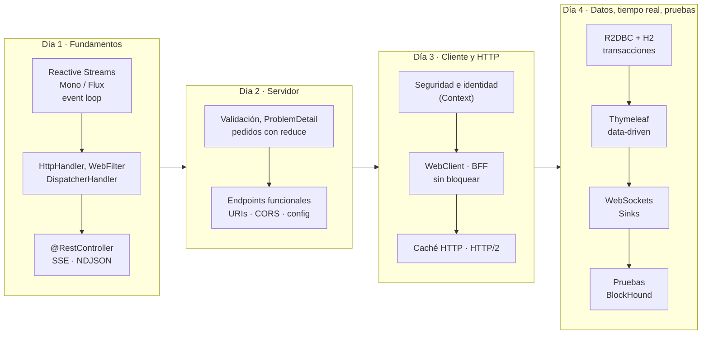

# 7. Cierre del curso

> Duración: 30 min · Repaso general, evaluación final y siguientes pasos
>
> Todo el curso sobre un único dominio: `examples/day-01` → `day-02` → `day-03` → `day-04`.

## 7.1 El recorrido en una imagen



La aplicación final, de principio a fin, **sin un solo hilo bloqueado**:

```text
Navegador ── HTTP/1.1 · h2 · SSE · WebSocket ──► Reactor Netty (event loop)
                                                 │ WebFilter: tiempos, X-Request-Id -> Context
                                                 ▼
                                       DispatcherHandler
             ┌───────────────┬───────────────────┼─────────────────┬──────────────────┐
     @RestController   RouterFunction      @Controller +      WebSocketHandler   @RestController
     catálogo (JSON,   pedidos (funcional,  Thymeleaf         eco, precios,      BFF
     NDJSON, SSE)      ProblemDetail)       (vistas)          chat               │ WebClient / @HttpExchange
             └───────────────┴───────┬───────────┘                               ▼
                              servicios (Mono/Flux, reduce,                 otros microservicios
                              flatMapSequential, Sinks)                     (timeout, retry, degradación)
                                     │ R2DBC + TransactionalOperator
                                     ▼
                                    H2
```

## 7.2 Las ideas que hay que llevarse

1. **Nada ocurre hasta que alguien se suscribe.** Los métodos *describen* un pipeline; WebFlux se suscribe al
   escribir la respuesta. Por eso un `subscribe()` o un `block()` dentro del código casi siempre es un error.
2. **Nunca bloquees el *event loop*.** Pocos hilos atienden a todos. Lo bloqueante, aislado en `boundedElastic`; y
   BlockHound para encontrar lo que se esconde.
3. **Compón, no esperes.** Lo que depende de otra cosa, dentro de `flatMap`; lo independiente, en paralelo
   (`flatMap`/`flatMapSequential`/`zip`) con concurrencia limitada.
4. **No materialices sin motivo.** `reduce` con un acumulador inmutable en lugar de `collectList`; *streaming*
   (NDJSON, SSE, *data-driven*) cuando el cliente puede consumir por partes. Si hay una barrera, que la justifique
   una regla de negocio.
5. **Los errores también son señales.** `onErrorResume` para degradar, `onErrorMap` para traducir,
   `ProblemDetail` para contarlo al cliente.
6. **El `Context` sustituye al `ThreadLocal`**: identidad, correlación, transacciones.
7. **Frío o caliente**: cada suscriptor su flujo (`Flux.interval`, una consulta) o un flujo compartido (`share()`,
   `Sinks`).
8. **Pruebas a varios niveles**: `StepVerifier` y dobles para la lógica, *slices* para capas, `@SpringBootTest` para
   la integración.

## 7.3 ¿Cuándo WebFlux y cuándo no?

| Usa WebFlux cuando... | Mejor Spring MVC cuando... |
|---|---|
| Hay mucha E/S concurrente y lenta (llamadas a otros servicios, *gateways*, BFF) | La aplicación es un CRUD sobre JDBC/JPA con carga moderada |
| Necesitas *streaming* (SSE, NDJSON, WebSocket) y *backpressure* | Las dependencias clave son bloqueantes (JDBC, SDKs síncronos) |
| La pila completa puede ser no bloqueante (R2DBC, clientes reactivos) | El equipo no conoce Reactor y el plazo es corto |
| Composición compleja de llamadas con *timeouts*, reintentos y cancelación | Depuración y trazas sencillas pesan más que la escalabilidad |

**¿Y los hilos virtuales (Java 21)?** Con `spring.threads.virtual.enabled=true`, Spring MVC atiende cada petición en
un hilo virtual: el código bloqueante escala en E/S casi como el reactivo, y se escribe y depura de forma
imperativa. Para muchas aplicaciones CRUD es hoy la opción más sencilla. WebFlux sigue aportando lo que los hilos
virtuales no dan por sí solos: *streaming* con *backpressure*, operadores con tiempo (`timeout`, `retryWhen`,
`interval`), cancelación que se propaga y composición declarativa de flujos. No son excluyentes: `WebClient`
también se usa desde Spring MVC.

## 7.4 WebFlux en producción: lista de comprobación

- [ ] Ninguna llamada bloqueante en el *event loop* (BlockHound en los tests; `boundedElastic` para lo inevitable).
- [ ] *Timeouts* en **todas** las llamadas salientes (`spring.http.clients.*`, `timeout()` de negocio).
- [ ] Reintentos solo para errores transitorios, con *backoff*, y con idempotencia.
- [ ] Concurrencia limitada en `flatMap` hacia otros servicios.
- [ ] Errores como `ProblemDetail`, sin detalles internos.
- [ ] Pool de conexiones de R2DBC dimensionado (`spring.r2dbc.pool.*`) y consultas con índices.
- [ ] `spring.http.codecs.max-in-memory-size` acorde con los cuerpos esperados.
- [ ] Observabilidad: Actuator, métricas de Reactor Netty, trazas con Micrometer Tracing y
      `spring.reactor.context-propagation=auto` para el MDC.
- [ ] Seguridad reactiva (`SecurityWebFilterChain`), CORS explícito y cabeceras.
- [ ] Caché HTTP (`ETag`, `Cache-Control`) donde tenga sentido.
- [ ] *Heartbeat* en conexiones largas (SSE, WebSocket) y difusión entre instancias con un *broker*.

## 7.5 Evaluación final

Veinte preguntas de opción única sobre los cuatro días. Respuestas al final.

1. ¿Qué ocurre al llamar a un método que devuelve `Mono<Product>` construido con operadores, si nadie se suscribe?
   a) Se ejecuta en segundo plano · b) No se ejecuta nada · c) Se ejecuta y se guarda en caché · d) Lanza una excepción
2. ¿Qué garantiza el *backpressure* de Reactive Streams?
   a) Que no se pierdan mensajes · b) Que el consumidor controle cuántos elementos recibe · c) Que todo vaya en un hilo · d) Que los errores se reintenten
3. En WebFlux sobre Reactor Netty, ¿cuántos hilos atienden normalmente las peticiones?
   a) Uno por petición · b) 200 · c) Aproximadamente uno por núcleo de CPU · d) Uno por usuario
4. ¿Dónde se ejecuta un `WebFilter` respecto al `DispatcherHandler`?
   a) Después · b) Antes, para controladores anotados y funcionales · c) Solo en endpoints funcionales · d) Solo en `@RestController`
5. Un `@RestController` devuelve `Flux<Product>` y el cliente envía `Accept: application/x-ndjson`. ¿Qué recibe?
   a) Un array JSON al final · b) Un JSON por línea, según se emiten · c) Un error 406 · d) Eventos SSE
6. ¿Qué significa `@RequestBody Mono<OrderRequest>` frente a `@RequestBody OrderRequest`?
   a) Nada, es lo mismo · b) El método se invoca sin esperar al cuerpo; el cuerpo se lee al suscribirse · c) El cuerpo se lee dos veces · d) Desactiva la validación
7. ¿Por qué `OrderService.create` usa `reduce(OrderValidation.empty(), OrderValidation::add)`?
   a) Porque `collectList` no existe · b) Para acumular válidas y errores al vuelo sin lista intermedia ni doble recorrido · c) Para ordenar · d) Para bloquear
8. En un endpoint funcional, ¿cómo se validan los datos del cuerpo?
   a) Con `@Valid` · b) Invocando el `Validator` manualmente · c) No se pueden validar · d) Con `@Validated` en la clase
9. `@ControllerAdvice`, ¿se aplica a los `RouterFunction`?
   a) Sí · b) No: se usan `onError` o filtros del propio `RouterFunction` · c) Solo a los GET · d) Solo con `@Order`
10. ¿Dónde guarda Spring Security reactivo el usuario autenticado?
    a) `ThreadLocal` · b) Sesión HTTP siempre · c) `Context` de Reactor · d) Una variable estática
11. En el BFF, ¿por qué `timeout()` va **antes** de `retryWhen()`?
    a) Da igual · b) Para limitar cada intento y no el total · c) Para no reintentar · d) Porque `retryWhen` no admite *timeouts*
12. ¿Qué diferencia hay entre `flatMap` y `concatMap`?
    a) Ninguna · b) `flatMap` se suscribe a varios a la vez; `concatMap` de uno en uno, en orden · c) `concatMap` es paralelo · d) `flatMap` bloquea
13. `Cache-Control: no-cache` significa...
    a) No guardar nunca · b) Guardar, pero revalidar antes de usar · c) Guardar 1 hora · d) Solo en el navegador
14. ¿Qué devuelve una consulta `@Modifying @Query("UPDATE ...")` de Spring Data R2DBC declarada como `Mono<Integer>`?
    a) La entidad · b) El número de filas modificadas · c) Nada · d) El id
15. ¿Por qué la reserva de stock usa `UPDATE ... WHERE stock >= :quantity`?
    a) Por rendimiento · b) Para que comprobar y descontar sean una operación atómica · c) Porque R2DBC no admite `SELECT` · d) Para el `ETag`
16. Con `TransactionalOperator`, ¿qué pasa si dentro del servicio se hace `otroMono.subscribe()`?
    a) Participa en la transacción · b) Se ejecuta fuera de la transacción (otra suscripción, otro `Context`) · c) Bloquea · d) Hace *rollback*
17. En Thymeleaf, ¿qué aporta `ReactiveDataDriverContextVariable`?
    a) Caché de la plantilla · b) Renderizar y enviar la página por trozos según emite el `Flux` · c) Validación · d) Internacionalización
18. ¿Cuándo es preferible WebSocket a SSE?
    a) Para notificaciones de solo lectura · b) Cuando el cliente también envía mensajes con frecuencia por la misma conexión · c) Siempre · d) Nunca
19. ¿Qué hace `share()` sobre el ticker de precios?
    a) Lo duplica · b) Lo convierte en caliente: un solo ticker para todos los suscriptores · c) Lo hace síncrono · d) Guarda todos los precios
20. ¿Qué detecta BlockHound?
    a) *Memory leaks* · b) Llamadas bloqueantes en hilos no bloqueantes · c) Consultas lentas · d) Errores de compilación

<details>
<summary>Respuestas</summary>

| # | Respuesta | Por qué |
|---|---|---|
| 1 | b | Publisher frío: se ejecuta al suscribirse (día 1) |
| 2 | b | `request(n)`: el consumidor marca el ritmo (día 1) |
| 3 | c | *Event loop*: pocos hilos no bloqueantes (día 1) |
| 4 | b | `WebFilter` rodea al `DispatcherHandler` (día 1) |
| 5 | b | NDJSON en *streaming* (día 1) |
| 6 | b | El cuerpo es un `Mono`: se decodifica y valida al suscribirse (día 2) |
| 7 | b | Acumulador inmutable, sin materializar (día 2) |
| 8 | b | No hay `@Valid` en endpoints funcionales (día 2) |
| 9 | b | `onError` / filtros del `RouterFunction` (día 2) |
| 10 | c | `ReactiveSecurityContextHolder` lee el `Context` (día 3) |
| 11 | b | Cada reintento tiene su propio límite (día 3) |
| 12 | b | Concurrencia frente a orden y secuencia (días 2-3) |
| 13 | b | Revalidar con `If-None-Match` (día 3) |
| 14 | b | Filas afectadas (día 4) |
| 15 | b | Evita la sobreventa entre peticiones concurrentes (día 4) |
| 16 | b | La transacción viaja en el `Context` de la suscripción (día 4) |
| 17 | b | Modo *data-driven* (día 4) |
| 18 | b | Bidireccional (día 4) |
| 19 | b | `publish().refCount(1)` (día 4) |
| 20 | b | `BlockingOperationError` en `parallel`, `single`, *event loop* (día 4) |

Orientación: 17–20 domina el modelo; 12–16 buena base, repasar los temas fallados con los tests de cada día; menos
de 12, rehacer los laboratorios de los días 1 y 2 (el modelo reactivo es la base de todo lo demás).
</details>

## 7.6 Siguientes pasos

| Tema | Por qué | Dónde |
|---|---|---|
| Spring Cloud Gateway | La *gateway* reactiva del día 3, hecha producto | <https://spring.io/projects/spring-cloud-gateway> |
| RSocket | Mensajería reactiva bidireccional con *backpressure* entre servicios | <https://docs.spring.io/spring-framework/reference/rsocket.html> |
| Observabilidad | Métricas y trazas en pipelines reactivos | <https://docs.spring.io/spring-framework/reference/integration/observability.html> |
| Kotlin + corrutinas | WebFlux con código de aspecto imperativo | <https://docs.spring.io/spring-framework/reference/languages/kotlin/coroutines.html> |
| Reactor a fondo | Operadores, `Sinks`, depuración | <https://projectreactor.io/docs/core/release/reference/> |

Ejercicios para seguir practicando con el proyecto del día 4:

1. Terminar el **proyecto integrador** (reseñas) si no dio tiempo en clase.
2. Añadir `If-Match` al `PUT /api/products/{id}`: si el `ETag` no coincide con la versión actual, 412
   *Precondition Failed* (concurrencia optimista de extremo a extremo, uniendo los días 3 y 4).
3. Proteger la API con Spring Security (laboratorio del día 3, parte A2) y comprobar que las vistas Thymeleaf
   añaden el campo `_csrf`.
4. Sustituir H2 por PostgreSQL con Testcontainers (`r2dbc-postgresql` + `@ServiceConnection`) sin tocar el código.

## Referencias

- Guía del curso y matriz de cobertura del temario: [docs/README.md](../README.md)
- Spring Framework — Web on Reactive Stack: <https://docs.spring.io/spring-framework/reference/web-reactive.html>
- Spring Boot — Reactive Web Applications: <https://docs.spring.io/spring-boot/reference/web/reactive.html>
- Project Reactor — Reference Guide: <https://projectreactor.io/docs/core/release/reference/>

⬅️ [Índice del día 4](README.md) · [Guía del curso](../README.md)
