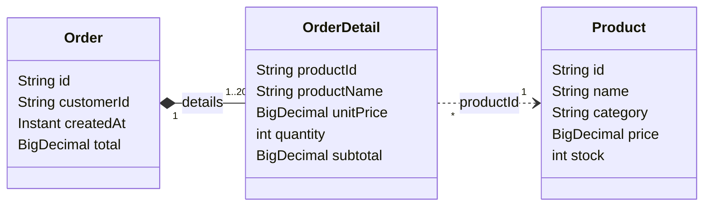

# Día 2 — Catálogo y pedidos reactivos (Spring WebFlux)

Proyecto de ejemplo del [día 2](../../docs/day-02/README.md). Parte del catálogo del día 1 y añade:

- **Controladores anotados (II)** sobre el catálogo: *data binding*, conversión de tipos, validación,
  errores `ProblemDetail` (RFC 9457), multipart, Jackson y *API versioning*.
- **Un dominio nuevo: pedidos** (`Order` → `OrderDetail` → `Product`) expuesto con **endpoints
  funcionales**, con la validación de negocio escrita de forma **reactiva** para compararla con la
  versión imperativa de Spring MVC.
- **URIs**, **CORS** y **configuración de WebFlux** (`WebFluxConfigurer`).

**Stack:** Java 17 · Spring Boot 4.1.1 · Spring Framework 7.0.9 · Reactor 3.8.7 · Reactor Netty · Jackson 3

## Ejecutar

```bash
./mvnw test                 # Windows: mvnw.cmd test  (35 tests)
./mvnw spring-boot:run      # http://localhost:8080
```

- <http://localhost:8080>: precios en tiempo real (SSE, igual que el día 1) y enlaces a los endpoints nuevos.
- <http://127.0.0.1:8080/cors.html>: demo de CORS en el navegador (`127.0.0.1` es **otro origen** distinto
  de `localhost`).
- [`requests.http`](requests.http): todas las peticiones del día listas para lanzar.

> Lo que era solo del día 1 (`demo/ThreadingDemoController`, `core/RawHttpHandlerServer`,
> `core/DispatcherInfoController` y los tests de Reactor) no se copia: sigue en `examples/day-01`.

## El dominio de pedidos



- `Order` es la raíz del agregado y **contiene** sus líneas (`OrderDetail`).
- `OrderDetail` se relaciona con `Product` **por identificador** (`productId`) y guarda una *foto* del nombre
  y del precio en el momento de la compra: si mañana cambia el precio, el pedido no cambia.
- Al crear un pedido, cada `productId` se **valida contra el catálogo** (¿existe? ¿hay stock?) con
  operadores de Reactor. Explicación completa, con la versión imperativa al lado:
  [02 — Pedidos: validación reactiva vs. imperativa](../../docs/day-02/02-pedidos-validacion-reactiva.md).

```text
POST /api/orders
   │
   ├─ OrderHandler      400  JSON mal formado · Bean Validation (validación ESTRUCTURAL, sin E/S)
   │
   └─ OrderService      422  producto inexistente · stock insuficiente (validación de NEGOCIO, con E/S)
         │                   → se devuelven TODAS las líneas erróneas a la vez
         └─ 201 Created      descuenta stock, guarda el pedido, Location: http://localhost:8080/api/orders/{id}
```

## Estructura

```text
src/main/java/com/curso/webflux/day02/
├── Day02Application.java
├── catalog/                           Controladores anotados (II)
│   ├── Product.java                   record del dominio (+ withStock, hasStock)
│   ├── ProductRequest.java            DTO de entrada con Bean Validation
│   ├── ProductSearch.java             @ModelAttribute: parámetros de la query -> record
│   ├── ProductSort.java               enum con conversión desde "price-desc"
│   ├── ProductV2.java                 representación de la versión 2.0 (anotaciones Jackson)
│   ├── ProductNotFoundException.java  excepción de negocio "pura" (sin HTTP)
│   ├── ProductImageStore.java         imágenes en memoria (FilePart, DataBufferUtils)
│   ├── ProductRepository.java         en memoria; update(id, cambio) atómico
│   ├── ProductService.java            búsqueda, top, ticker de precios
│   └── ProductController.java         search, top, versiones, multipart, @CrossOrigin
├── orders/                            Puntos finales funcionales + validación reactiva
│   ├── Order.java / OrderDetail.java  agregado Pedido -> Líneas (-> Product por id)
│   ├── OrderRequest.java              DTO con validación estructural (@NotEmpty, @AssertTrue...)
│   ├── DetailCheck.java               resultado de validar una línea: Valid | Invalid (interfaz sellada)
│   ├── OrderService.java              create() acumula errores · createFailFast() para al primero
│   ├── OrderRepository.java           en memoria
│   ├── OrderRejectedException.java    422 (ErrorResponseException con ProblemDetail)
│   ├── InvalidOrderException.java     400 (validación manual)
│   ├── OrderNotFoundException.java    404
│   ├── OrderHandler.java              HandlerFunctions: ServerRequest -> Mono<ServerResponse>
│   └── OrderRouter.java               RouterFunction: rutas anidadas, filtro, onError
├── error/
│   ├── GlobalExceptionHandler.java    @RestControllerAdvice + ResponseEntityExceptionHandler
│   └── Problems.java                  construcción homogénea de ProblemDetail
├── config/
│   ├── WebConfig.java                 WebFluxConfigurer: formatters, CORS, API versioning
│   └── StringToProductSortConverter   Converter<String, ProductSort>
└── core/TimingWebFilter.java          WebFilter del día 1 (cabecera X-Response-Time)
src/main/resources/
├── application.properties             Jackson estricto, límites de codecs y multipart
└── static/index.html, cors.html

src/test/java/com/curso/webflux/day02/
├── catalog/ProductControllerTest      ProblemDetail, binding, validación, versiones, multipart
├── orders/OrderServiceTest            StepVerifier: acumular vs fail-fast, paralelo vs secuencial (tiempo virtual)
├── orders/OrderRoutesTest             WebTestClient: 201, 400, 404, 422 en endpoints funcionales
├── config/CorsTest                    preflight, orígenes permitidos y rechazados
└── uri/UriBuildingTest                UriComponentsBuilder, codificación, UriBuilderFactory
```

## Endpoints

| Método | Ruta | Modelo | Descripción |
|---|---|---|---|
| GET | `/api/products[?category=]` | anotado | Lista (JSON o NDJSON según `Accept`) |
| GET | `/api/products/search?category=&maxPrice=&sort=` | anotado | *Data binding* a `ProductSearch` (400 si no es válido) |
| GET | `/api/products/top?limit=` | anotado | Los más caros; `limit` entre 1 y 10 |
| GET | `/api/products/{id}` | anotado | v1.0 por defecto; `API-Version: 2.0` → `ProductV2` |
| GET | `/api/products/count` | anotado | Número de productos |
| POST | `/api/products` | anotado | Crea (201 + `Location` absoluta; 400 `ProblemDetail`) |
| PUT / DELETE | `/api/products/{id}` | anotado | Actualiza / borra (404 `ProblemDetail`) |
| GET | `/api/products/prices` | anotado | SSE: cambios de precio cada segundo |
| POST | `/api/products/{id}/image` | anotado | Multipart (`file`); 415 si no es imagen, 413 si > 256 KB |
| GET | `/api/products/{id}/image` | anotado | Descarga la imagen |
| GET | `/api/orders[?customerId=]` | funcional | Lista de pedidos |
| GET | `/api/orders/{id}` | funcional | Un pedido o 404 `ProblemDetail` |
| POST | `/api/orders` | funcional | Crea (201 / 400 / 422) |
| GET | `/actuator/mappings` | — | Rutas de ambos modelos |

## Notas de Spring Boot 4 / Spring Framework 7

- **API versioning** es nuevo en Spring Framework 7: `WebFluxConfigurer.configureApiVersioning` o las
  propiedades `spring.webflux.apiversion.*`, y el atributo `version` de `@GetMapping`.
- `HttpStatus.UNPROCESSABLE_CONTENT` (422) y `CONTENT_TOO_LARGE` (413) sustituyen a los nombres antiguos
  `UNPROCESSABLE_ENTITY` y `PAYLOAD_TOO_LARGE` (RFC 9110).
- Jackson 3: el núcleo está en `tools.jackson.*`, pero las **anotaciones** siguen en
  `com.fasterxml.jackson.annotation`.
- `validator.validateObject(record)` no resuelve rutas anidadas de records (`details[0].quantity`):
  en `OrderHandler` se usa `DirectFieldBindingResult`.
